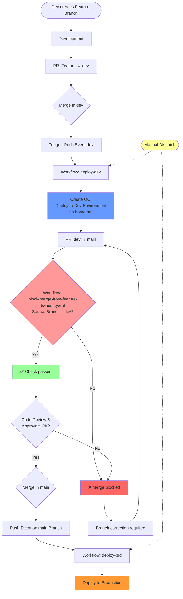

# Branching Strategy for the Frickeldave Project

This document describes the branching strategy and workflow for the Frickeldave repository. The goal is to create a clear structure for collaboration and ensure the quality of content.

## Table of Contents

- [Branching Strategy for the Frickeldave Project](#branching-strategy-for-the-frickeldave-project)
  - [Table of Contents](#table-of-contents)
  - [Introduction](#introduction)
    - [Core Principles](#core-principles)
  - [Branch Types](#branch-types)
    - [Main Branches](#main-branches)
    - [Supporting Branches](#supporting-branches)
  - [Contribution Workflow](#contribution-workflow)
    - [1. Preparation](#1-preparation)
    - [2. Create Feature Branch](#2-create-feature-branch)
    - [3. Make Changes and Commit](#3-make-changes-and-commit)
    - [4. Create Pull Request](#4-create-pull-request)
  - [Pull Request Guidelines](#pull-request-guidelines)
  - [Quality Checks](#quality-checks)
  - [Roles and Responsibilities](#roles-and-responsibilities)
  - [Common Use Cases](#common-use-cases)
    - [Adding New Content](#adding-new-content)
    - [Fixing Bugs](#fixing-bugs)
  - [Help and Support](#help-and-support)

## Introduction

The Frickeldave repository serves as a central platform for content development and maintenance. To ensure smooth collaboration, we follow a structured branching strategy.

### Core Principles

1. **No direct changes** to main branches (`main` and `dev`).
2. **All changes** are made via feature branches and pull requests.
3. **Automated checks** ensure that content quality is maintained.
4. **Regular updates** to branches to avoid conflicts.

## Branch Types

### Main Branches

- **`main`**: Contains the stable and published version of the content.
- **`dev`**: Serves as an integration branch for new features and changes.

### Supporting Branches

- **`feature/*`**: For new content or major changes.
- **`fix/*`**: For bug fixes and minor corrections.
- **`docs/*`**: For documentation updates.
- **`chore/*`**: For maintenance work and technical adjustments.

## Contribution Workflow




### 1. Preparation

1. **Clone the repository**:
   ```bash
   git clone https://github.com/Frickeldave/frickeldave.github.io.git
   cd frickeldave.github.io
   ```

2. **Add upstream remote**:
   ```bash
   git remote add upstream https://github.com/Frickeldave/frickeldave.github.io.git
   ```

### 2. Create Feature Branch

1. **Synchronize with the latest version**:
   ```bash
   git checkout develop
   git pull upstream develop
   ```

2. **Create a new branch**:
   ```bash
   git checkout -b feature/new-feature
   ```

### 3. Make Changes and Commit

1. Make changes and add files:
   ```bash
   git add .
   ```

2. Write commit message:
   ```bash
   git commit -m "feat: add new feature"
   ```

### 4. Create Pull Request

1. Push changes:
   ```bash
   git push origin feature/new-feature
   ```

2. Create a pull request in the GitHub interface and assign reviewers.

## Pull Request Guidelines

- **Description**: Provide a clear description of the changes.
- **Reviewer**: Assign at least one reviewer.
- **Checks**: Ensure all automated checks have passed.

## Quality Checks

- **Formatting**: Check consistency of formatting (e.g., with Prettier).
- **Spelling**: Use tools like Vale to avoid errors.
- **Links**: Test all internal and external links.

## Roles and Responsibilities

- **Contributors**: Create content and submit pull requests.
- **Reviewer**: Review changes for content and technical correctness.
- **Maintainer**: Manage the repository and merge approved pull requests.

## Common Use Cases

### Adding New Content

1. Create a feature branch:
   ```bash
   git checkout -b feature/new-content
   ```

2. Add content and commit:
   ```bash
   git add .
   git commit -m "feat: add new content"
   ```

3. Create and merge pull request.

### Fixing Bugs

1. Create a fix branch:
   ```bash
   git checkout -b fix/bug-fixed
   ```

2. Make changes and commit:
   ```bash
   git add .
   git commit -m "fix: fix bug"
   ```

3. Create pull request.

## Help and Support

If you have questions or problems:

1. **Check documentation**: Read the existing guides.
2. **GitHub Discussions**: Ask questions in the community.
3. **Create issue**: Report problems directly in the repository.

Thank you for your contribution to the Frickeldave project!