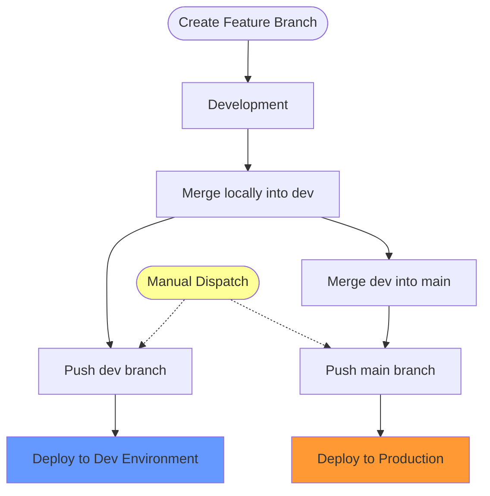

# Branching and Naming Strategy

This document defines the branching strategy and standardized naming conventions for the Frickeldave
repository. Following these practices ensures consistency and enables automated CI/CD deployments.

## Table of Contents

- [Branching and Naming Strategy](#branching-and-naming-strategy)
  - [Introduction](#introduction)
    - [Core Principles](#core-principles)
  - [Branch Types](#branch-types)
    - [Main Branches](#main-branches)
    - [Supporting Branches](#supporting-branches)
  - [Naming Convention](#naming-convention)
    - [Format](#format)
    - [Best Practices](#best-practices)
  - [Contribution Workflow](#contribution-workflow)
    - [1. Preparation](#1-preparation)
    - [2. Create Feature Branch](#2-create-feature-branch)
    - [3. Make Changes and Commit](#3-make-changes-and-commit)
    - [4. Merge and Deploy](#4-merge-and-deploy)
  - [Common Use Cases](#common-use-cases)
  - [Help and Support](#help-and-support)

## Introduction

The Frickeldave repository uses a structured branching strategy to maintain a clean history and
ensure that only verified changes reach production.

### Core Principles

1. **Work in branches** to keep `main` and `dev` clean.
2. **Local merges** instead of Pull Requests for a faster solo workflow.
3. **Automated checks** still run on push to ensure quality.
4. **Descriptive naming** for all supporting branches.

## Branch Types

### Main Branches

- **`main`**: Contains the stable and published version of the content.
- **`dev`**: Serves as an integration branch for new features and changes.

### Supporting Branches

Supporting branches are used for developing features, fixing bugs, or updating documentation. They
are merged into `dev` or `main` once completed.

| Type       | Purpose                         | Example                       |
| ---------- | ------------------------------- | ----------------------------- |
| `feat`     | New feature or functionality    | `feat/user-authentication`    |
| `fix`      | Bug fix                         | `fix/sidebar-scrolling-issue` |
| `docs`     | Documentation updates           | `docs/update-branching-guide` |
| `style`    | Code style changes (formatting) | `style/format-components`     |
| `refactor` | Code restructuring              | `refactor/simplify-utils`     |
| `perf`     | Performance improvements        | `perf/optimize-images`        |
| `test`     | Test additions/updates          | `test/add-component-tests`    |
| `ci`       | CI/CD configuration             | `ci/github-actions-security`  |
| `chore`    | Maintenance, dependencies       | `chore/update-dependencies`   |

## Naming Convention

### Format

All supporting branches MUST follow this format:

```
<type>/<optional-ticket-id>-<description>
```

**Examples:**

- `feat/dark-mode-support`
- `fix/gh-456-button-alignment`
- `docs/add-contribution-guide`

### Best Practices

1. **Use lowercase** letters only.
2. **Use hyphens** to separate words (kebab-case).
3. **Keep it short** (max 50 characters).
4. **Be descriptive** about the branch's purpose.
5. **Match commit type**: The branch type should correspond to the
   [Conventional Commits](./11-commit-messages.md) type.

## Contribution Workflow



### 1. Preparation

1. **Clone the repository**:

   ```bash
   git clone https://github.com/Frickeldave/frickeldave.github.io.git
   cd frickeldave.github.io
   ```

2. **Add upstream remote**:
   ```bash
   git remote add upstream https://github.com/Frickeldave/frickeldave.github.io.git
   ```

### 2. Create Feature Branch

1. **Synchronize with the latest version**:

   ```bash
   git checkout dev
   git pull upstream dev
   ```

2. **Create a new branch**:
   ```bash
   git checkout -b feat/new-feature
   ```

### 3. Make Changes and Commit

1. Make changes and add files:

   ```bash
   git add .
   ```

2. Write commit message (see [Commit Guidelines](./11-commit-messages.md)):
   ```bash
   git commit -m "feat: add new feature"
   ```

### 4. Merge and Deploy

1. **Merge into `dev`**:

   ```bash
   git checkout dev
   git merge feat/new-feature
   ```

2. **Push to deploy to Dev**:

   ```bash
   git push origin dev
   ```

3. **Verify and merge to `main`**:
   ```bash
   git checkout main
   git merge dev
   git push origin main
   ```

## Common Use Cases

### Adding New Content

1. `git checkout -b feat/new-content`
2. Add content and commit.
3. Merge into `dev`, then `main`.

### Fixing Bugs

1. `git checkout -b fix/bug-description`
2. Fix bug and commit.
3. Merge and push.

## Help and Support

If you have questions or problems:

1. **Check documentation**: Read the existing guides.
2. **GitHub Discussions**: Ask questions in the community.
3. **Create issue**: Report problems directly in the repository.

Thank you for your contribution to the Frickeldave project!
