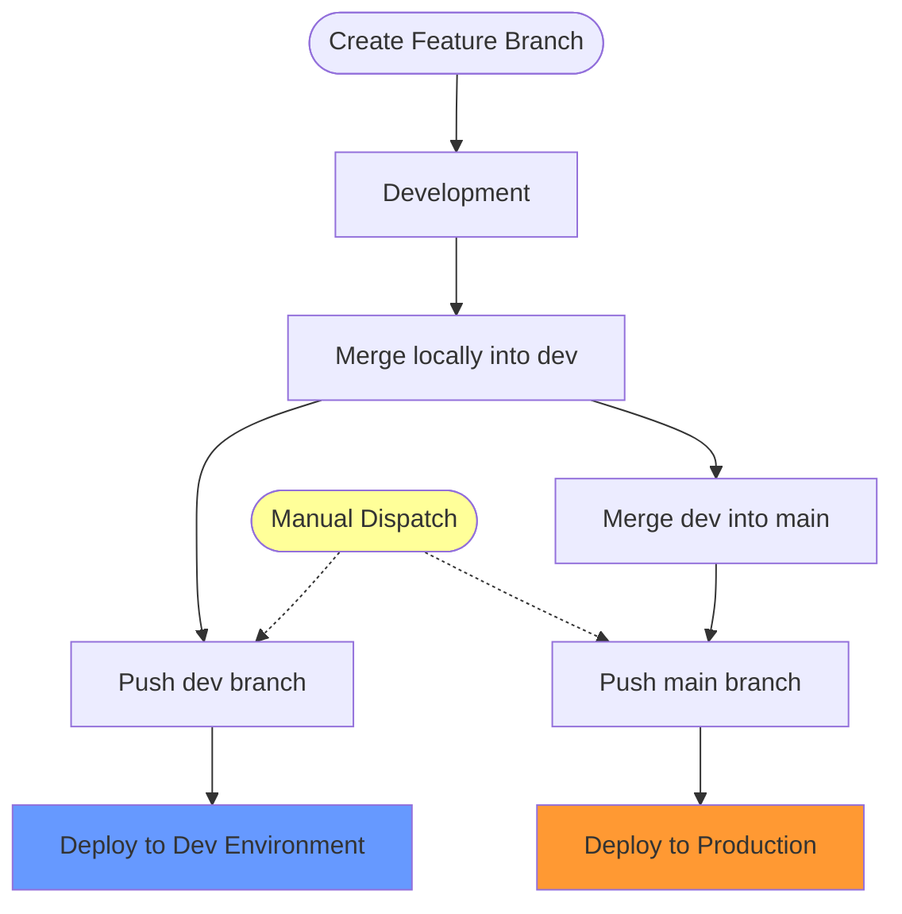

# Branching- und Naming-Strategie

Dieses Dokument beschreibt die Branching-Strategie und die standardisierten Namenskonventionen fuer
das Frickeldave-Repository. Die Einhaltung dieser Regeln sorgt fuer Konsistenz und passt zum
automatisierten CI/CD- und Deployment-Ablauf.

## Inhaltsverzeichnis

- [Branching- und Naming-Strategie](#branching--und-naming-strategie)
  - [Inhaltsverzeichnis](#inhaltsverzeichnis)
  - [Einleitung](#einleitung)
    - [Grundprinzipien](#grundprinzipien)
  - [Branch-Typen](#branch-typen)
    - [Haupt-Branches](#haupt-branches)
    - [Unterstuetzende Branches](#unterstuetzende-branches)
  - [Namenskonvention](#namenskonvention)
    - [Format](#format)
    - [Empfehlungen](#empfehlungen)
  - [Beitrags-Workflow](#beitrags-workflow)
    - [1. Vorbereitung](#1-vorbereitung)
    - [2. Feature-Branch anlegen](#2-feature-branch-anlegen)
    - [3. Aenderungen vornehmen und committen](#3-aenderungen-vornehmen-und-committen)
    - [4. Mergen und deployen](#4-mergen-und-deployen)
  - [Typische Anwendungsfaelle](#typische-anwendungsfaelle)
    - [Neue Inhalte hinzufuegen](#neue-inhalte-hinzufuegen)
    - [Fehler beheben](#fehler-beheben)
  - [Hilfe und Support](#hilfe-und-support)

## Einleitung

Das Frickeldave-Repository verwendet eine strukturierte Branching-Strategie, um eine saubere
Historie zu bewahren und sicherzustellen, dass nur gepruefte Aenderungen in die Produktion gelangen.

### Grundprinzipien

1. **In Branches arbeiten**, damit `main` und `dev` sauber bleiben.
2. **Lokale Merges** statt Pull Requests fuer einen schnellen Solo-Workflow.
3. **Automatisierte Pruefungen** laufen weiterhin bei Pushes, um die Qualitaet zu sichern.
4. **Beschreibende Namen** fuer alle unterstuetzenden Branches.

## Branch-Typen

### Haupt-Branches

- **`main`**: Enthaelt die stabile und veroeffentlichte Version.
- **`dev`**: Dient als Integrations-Branch fuer neue Features und Aenderungen.

### Unterstuetzende Branches

Unterstuetzende Branches werden fuer Feature-Entwicklung, Fehlerbehebungen oder
Dokumentationsaenderungen verwendet. Nach Abschluss werden sie in `dev` oder direkt in den lokalen
Arbeitsablauf zur Auslieferung integriert.

| Typ        | Zweck                            | Beispiel                      |
| ---------- | -------------------------------- | ----------------------------- |
| `feat`     | Neues Feature oder neue Funktion | `feat/user-authentication`    |
| `fix`      | Fehlerbehebung                   | `fix/sidebar-scrolling-issue` |
| `docs`     | Dokumentationsaenderungen        | `docs/update-branching-guide` |
| `style`    | Stil-Aenderungen am Code         | `style/format-components`     |
| `refactor` | Umstrukturierung von Code        | `refactor/simplify-utils`     |
| `perf`     | Performance-Verbesserungen       | `perf/optimize-images`        |
| `test`     | Tests ergaenzen oder anpassen    | `test/add-component-tests`    |
| `ci`       | CI/CD-Konfiguration              | `ci/github-actions-security`  |
| `chore`    | Wartung, Abhaengigkeiten         | `chore/update-dependencies`   |

## Namenskonvention

### Format

Alle unterstuetzenden Branches MUESSEN diesem Format folgen:

```
<type>/<optional-ticket-id>-<description>
```

**Beispiele:**

- `feat/dark-mode-support`
- `fix/gh-456-button-alignment`
- `docs/add-contribution-guide`

### Empfehlungen

1. **Nur Kleinbuchstaben** verwenden.
2. **Bindestriche** zur Worttrennung nutzen (kebab-case).
3. **Kurz halten** (maximal 50 Zeichen).
4. **Beschreibend formulieren**, damit der Zweck des Branches klar ist.
5. **Zum Commit-Typ passend benennen**: Der Branch-Typ sollte zu den
   [Conventional Commits](./12-dev-messages.md) passen.

## Beitrags-Workflow



### 1. Vorbereitung

1. **Repository klonen**:

   ```bash
   git clone https://github.com/Frickeldave/frickeldave.github.io.git
   cd frickeldave.github.io
   ```

2. **Optional einen `upstream`-Remote hinzufuegen**:
   ```bash
   git remote add upstream https://github.com/Frickeldave/frickeldave.github.io.git
   ```

Wenn du direkt im Haupt-Repository arbeitest, ist dieser Schritt in der Regel nicht noetig.

### 2. Feature-Branch anlegen

1. **Mit dem aktuellen Stand synchronisieren**:

   ```bash
   git checkout dev
   git pull origin dev
   ```

2. **Neuen Branch anlegen**:
   ```bash
   git checkout -b feat/new-feature
   ```

### 3. Aenderungen vornehmen und committen

1. Aenderungen vornehmen und Dateien vormerken:

   ```bash
   git add .
   ```

2. Commit-Message schreiben (siehe [Commit-Richtlinien](./12-dev-messages.md)):
   ```bash
   git commit -m "feat: add new feature"
   ```

### 4. Mergen und deployen

1. **In `dev` mergen**:

   ```bash
   git checkout dev
   git merge feat/new-feature --no-ff
   ```

2. **Push ausfuehren, um das Dev-Deployment zu starten**:

   ```bash
   git push origin dev
   ```

3. **Nach Verifikation nach `main` mergen**:
   ```bash
   git checkout main
   git pull origin main
   git merge dev
   git push origin main
   git checkout dev
   ```

Alternativ kann dafuer die VS-Code-Task [Deploy to Main](../.vscode/tasks.json) verwendet werden.

## Typische Anwendungsfaelle

### Neue Inhalte hinzufuegen

1. `git checkout -b feat/new-content`
2. Inhalte hinzufuegen und committen.
3. In `dev` mergen, pruefen und anschliessend nach `main` uebernehmen.

### Fehler beheben

1. `git checkout -b fix/bug-description`
2. Fehler beheben und committen.
3. Mergen und pushen.

## Hilfe und Support

Wenn Fragen oder Probleme auftreten:

1. **Dokumentation pruefen**: Lies die vorhandenen Anleitungen.
2. **GitHub Discussions**: Stelle Fragen in der Community.
3. **Issue erstellen**: Melde Probleme direkt im Repository.

Danke fuer deinen Beitrag zum Frickeldave-Projekt.
