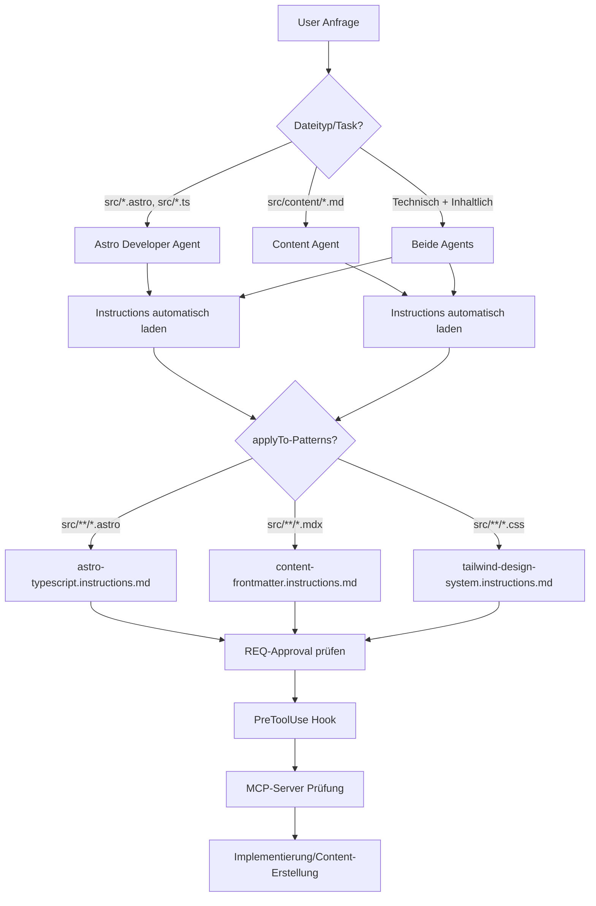

# Requirement Engineer Gatekeeping — Setup & Dokumentation

Dieses Dokument beschreibt das Requirement Engineer (RE) Gatekeeping-System des
`frickeldave.github.io`-Projekts. Es ist so aufgebaut, dass es in anderen Projekten nachgebaut
werden kann.

## Warum existiert der RE-Agent?

Bei der Arbeit mit KI-Assistenten (GitHub Copilot, Cursor, etc.) besteht das Risiko, dass Code- oder
Datei-Änderungen ungeprüft vorgenommen werden. Das RE-Gatekeeping-System schafft eine
Sicherheitsstufe:

1. **Jede** geplante Änderung wird zuerst vom Requirement Engineer Agent geprüft
2. Änderungen werden als GitHub Issue erfasst und mit dem User überarbeitet
3. **Keine** Code-Änderung ohne explizite Freigabe des RE-Agenten
4. Der PreToolUse-Hook verhindert technische Umgehung

## System-Architektur



## Wie Instructions automatisch geladen werden

Die Instruction-Dateien in `.github/instructions/` werden **automatisch** vom Copilot-Agent-System
geladen, wenn ihre `applyTo`-Patterns mit den bearbeiteten Dateien übereinstimmen. Es ist **nicht
notwendig**, die Agenten manuell auf die richtigen Instructions hinzuweisen.

### Funktionsweise von `applyTo`-Patterns

Jede Instruction-Datei hat im YAML-Frontmatter ein `applyTo`-Feld, das Glob-Patterns enthält:

```yaml
---
description: "Verwenden beim Schreiben von Tailwind-CSS-Klassen..."
applyTo: ["src/**/*.astro", "src/**/*.tsx", "src/**/*.css", "src/styles/**"]
---
```

**Beispiele für `applyTo`-Patterns im Projekt:**

| Instruction-Datei                       | applyTo-Patterns                                                                 | Wird geladen bei...                          |
| --------------------------------------- | -------------------------------------------------------------------------------- | ------------------------------------------- |
| `astro-typescript.instructions.md`      | `src/**/*.{astro,ts,tsx,mts,cts}`                                                | Jede Datei in `src/` mit Code-Endungen      |
| `content-frontmatter.instructions.md`   | `src/content/**/*.md`, `src/content/**/*.mdx`, `_drafts/**/*.md`                 | Alle Markdown/MDX-Dateien unter `src/content/` |
| `tailwind-design-system.instructions.md`| `src/**/*.astro`, `src/**/*.tsx`, `src/**/*.css`, `src/styles/**`               | Alle Styling-Dateien                        |
| `image-handling.instructions.md`        | (kein `applyTo` — immer geladen bei Bild-Operationen)                           | Bei Bild-Referenzierung                     |
| `commit-and-branch.instructions.md`     | (kein `applyTo` — immer geladen bei Git-Operationen)                            | Bei Git/Commit-Operationen                  |

### Was das für die Agenten bedeutet

**Astro Developer Agent:**
- Wird automatisch `astro-typescript.instructions.md` erhalten, wenn er `src/components/` bearbeitet
- Wird automatisch `tailwind-design-system.instructions.md` erhalten, wenn er Styling-Änderungen macht

**Content Agent:**
- Wird automatisch `content-frontmatter.instructions.md` erhalten, wenn er Markdown-Dateien erstellt
- Wird automatisch `image-handling.instructions.md` erhalten, wenn er Bilder referenziert

**Requirement Engineer Agent:**
- Liest Dateien, um Kontext zu verstehen — Instructions werden automatisch geladen

### Best Practices

✅ **Richtig:**
- Instruction-Dateien mit klaren `applyTo`-Patterns erstellen
- Patterns so spezifisch wie möglich halten (nicht `**/*`)
- Description-Feld mit Trigger-Wörtern füllen (für manuelle Invocation)

❌ **Falsch:**
- Agenten anweisen, "bitte beachte die tailwind instructions" — sie sind bereits im Kontext
- `applyTo: "**/*"` verwenden — das lädt die Instruction bei **jeder** Datei und brennt Token
- Instructions manuell im Prompt referenzieren — unnötig und redundant

**Konflikt-Resolution:**
- Wenn Instructions widersprüchlich sind, gilt die **spezifischste** Regel
- Beispiel: `tailwind-design-system.instructions.md` (bereichsspezifisch) hat Vorrang vor
  generischen Tailwind-Regeln

## Komponenten im Detail

### 1. Requirement Engineer Agent

Der RE-Agent ist unter `.github/agents/requirement-engineer.agent.md` definiert. Er ist der
Gatekeeper für jede Änderung und darf selbst KEINE Dateien bearbeiten.

**Rolle:**

- Anforderungen verstehen und dokumentieren
- GitHub Issues erstellen und überarbeiten
- Auf Freigabe warten, bevor Implementierung erlaubt wird
- Qualität sichern (vollständig, konsistent, konventionskonform)

**Wichtig:** Der RE-Agent darf NIEMALS `create_file`, `replace_string_in_file` oder ähnliche
Operationen direkt ausführen.

### 2. PreToolUse Hook

Der PreToolUse-Hook ist die technische Sicherheitsebene. Er wird VOR jeder File-Edit-Operation
ausgeführt und prüft, ob ein gültiges Approval existiert.

**Dateien:**

- `.github/hooks/validate-code-change.mjs` — Node.js-Skript (plattformübergreifend)
- `.github/hooks/validate-code-change.json` — Hook-Konfiguration
- `.github/hooks/approvals/current` — Approval-File (wird vom RE-Agent erstellt)

**Geblockte Tool-Kategorien:**

| Kategorie              | Tools                                                                                                        |
| ---------------------- | ------------------------------------------------------------------------------------------------------------ |
| File-Edit-Operationen  | `replace_string_in_file`, `multi_replace_string_in_file`, `create_file`, `edit_notebook_file`, `delete_file` |
| Browser-Investigations | `navigate_page`, `open_browser_page`, `screenshot_page`, `read_page`                                         |

Durch das Blockieren der Browser-Investigationstools wird verhindert, dass das LLM ohne Approval
überhaupt mit der Analyse eines Problems beginnt — nicht erst wenn es Dateien ändern will.

**Verhalten:**

| Situation                            | Entscheidung                         |
| ------------------------------------ | ------------------------------------ |
| Kein Approval-File                   | `deny` — Mit blockierender Nachricht |
| Approval ohne Issue-Referenz         | `deny` — Mit Warnung                 |
| Approval abgelaufen                  | `deny` — Mit Hinweis auf Erneuerung  |
| Approval mit gültigem Issue (GH-XXX) | `allow` — Alle Operationen erlaubt   |

#### MCP-Server Prüfung

Seit neuestem prüft der Hook zusätzlich, ob alle erforderlichen MCP-Server verfügbar sind:

1. **Konfiguration**: Die erforderlichen Server werden in `validate-code-change.json` unter `mcpServers` definiert
2. **Befehlsausführung**: Die Startbefehle werden aus `.vscode/mcp.json` gezogen
3. **Verfügbarkeit**: Wenn ein Server nicht verfügbar ist, wird der Benutzer informiert
4. **Starten**: In zukünftigen Versionen wird der Hook versuchen, nicht laufende Server zu starten

### 3. copilot-instructions.md

Die Datei `.github/copilot-instructions.md` definiert die Trigger-Liste, die bestimmt, wann ein
REQ-Approval erforderlich ist.

**Trigger-Kategorien:**

- Refactoring
- Testing
- Config
- Dependencies
- Deployment
- Process (einschließlich RE-Gatekeeping-System selbst)
- Content-Changes (mit Ausnahme für Multi-Prompt Markdown-Verarbeitung)

### 4. GitHub Issue als Ticket

Alle Änderungen werden als GitHub Issue erfasst. Das garantiert:

- Nachvollziehbarkeit jeder Änderung
- Diskussion und Iteration vor der Implementierung
- Verknüpfung mit Pull Requests
- Automatisches Tracking via GitHub API

## Workflow im Detail

```
1. User schlägt Änderung vor
         │
         ▼
2. Prompt-Instructions prüfen Trigger-Liste
         │
    ┌────┴────┐
    │         │
    ▼         ▼
 Trigger?   Nein
    │         │
    ▼         ▼
3. RE-Agent  4. Direkt
   prüft     implementieren
   Vorschlag
    │
    ▼
5. Offene Fragen
   klären
    │
    ▼
6. GitHub Issue
   erstellen
   (#251)
    │
    ▼
7. RE-Agent
   freigegeben?
    │     │
    │     ▼
    │   ❌ Blockiert
    │     mit Begründung
    │
    ▼
8. ✅ Freigegeben
    │
    ▼
9. RE-Agent erstellt
   Approval-File
    │
    ▼
10. PreToolUse Hook
    prüft Approval
    und MCP-Server
    │
    ▼
11. Implementierung
```

## Multi-Prompt Markdown-Verarbeitung

Für längere Dokumentationen oder Blog-Posts gilt eine Besonderheit:

Der User arbeitet oft über mehrere Prompts hinweg an einem Dokument. In diesem Fall:

1. Der User sagt explizit, dass er an einem Dokument arbeitet
2. Copilot DARF File-Edit-Operationen für Markdown/MDX-Dateien OHNE REQ-Approval durchführen
3. Diese Ausnahme gilt NICHT für:
   - Neue, völlig neue Seiten/Sections
   - Änderungen an existing Templates/Komponenten
   - Änderungen an bestehenden Docs ohne expliziten Fortsetzungskontext

## Nachbau in eigenen Projekten

### Schritt-für-Schritt

1. **RE-Agent erstellen**: Kopiere `.github/agents/requirement-engineer.agent.md` in dein Projekt
2. **PreToolUse-Hook einrichten**: Kopiere `.github/hooks/validate-code-change.mjs` und
   `.github/hooks/validate-code-change.json`
3. **Approval-Verzeichnis erstellen**: `.github/hooks/approvals/` mit README.md
4. **copilot-instructions.md erstellen**: `.github/copilot-instructions.md` mit deinen
   Trigger-Regeln
5. **MCP-Server konfigurieren**: `.vscode/mcp.json` mit deinen Server-Konfigurationen
6. **MCP-Server-Validierung einrichten**: Aktualisiere `.github/hooks/validate-code-change.json` mit
   den erforderlichen Servernamen im `mcpServers`-Array
7. **Doku erstellen**: `.github/hooks/approvals/README.md` mit deinem Workflow

### Voraussetzungen

- GitHub Copilot mit Agent-Support
- GitHub MCP Server konfiguriert (siehe `.vscode/mcp.json` für die Konfiguration)
- Node.js für den PreToolUse-Hook

## FAQ

**Q: Was passiert, wenn der Hook fehlt?** A: Die Prompt-Instructions sind die erste
Verteidigungslinie. Ohne Hook kann der LLM ungeprüft editieren — aber das RE-Agent-System sagt ihm
explizit, dass er es NICHT tun darf.

**Q: Kann der Hook umgangen werden?** A: Nur durch manuelles Editieren von Dateien außerhalb von
Copilot. Der Hook blockiert alle File-Edit-Operationen und Browser-Investigationstools innerhalb von
Copilot. Ein LLM kann also ohne Approval weder Dateien ändern noch eine Seite im Browser öffnen oder
untersuchen.

**Q: Was, wenn ich eine sofortige Änderung brauche?** A: Der Workflow kann beschleunigt werden — der
RE-Agent erstellt schnell ein Issue und gibt es frei. Das Approval-File wird erstellt, und die
Implementierung kann sofort starten.

**Q: Was passiert, wenn ein MCP-Server nicht verfügbar ist?** A: Der PreToolUse-Hook blockiert
File-Edit-Operationen und informiert den Benutzer, dass die erforderlichen MCP-Server gestartet
werden müssen. In zukünftigen Versionen wird der Hook versuchen, die Server automatisch zu starten.
