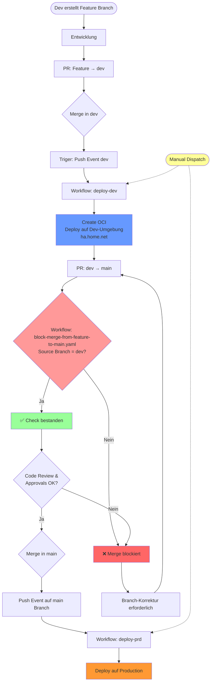

# Branching-Strategie für das Frickeldave-Projekt

Dieses Dokument beschreibt die Branching-Strategie und den Workflow für das Frickeldave-Repository. Ziel ist es, eine klare Struktur für die Zusammenarbeit zu schaffen und die Qualität der Inhalte sicherzustellen.

## Inhaltsverzeichnis

- [Branching-Strategie für das Frickeldave-Projekt](#branching-strategie-für-das-frickeldave-projekt)
  - [Inhaltsverzeichnis](#inhaltsverzeichnis)
  - [Einführung](#einführung)
    - [Grundprinzipien](#grundprinzipien)
  - [Branch-Typen](#branch-typen)
    - [Haupt-Branches](#haupt-branches)
    - [Unterstützende Branches](#unterstützende-branches)
  - [Workflow für Beiträge](#workflow-für-beiträge)
    - [1. Vorbereitung](#1-vorbereitung)
    - [2. Feature-Branch erstellen](#2-feature-branch-erstellen)
    - [3. Änderungen vornehmen und committen](#3-änderungen-vornehmen-und-committen)
    - [4. Pull Request erstellen](#4-pull-request-erstellen)
  - [Pull-Request-Richtlinien](#pull-request-richtlinien)
  - [Qualitätskontrollen](#qualitätskontrollen)
  - [Rollen und Verantwortlichkeiten](#rollen-und-verantwortlichkeiten)
  - [Häufige Anwendungsfälle](#häufige-anwendungsfälle)
    - [Neue Inhalte hinzufügen](#neue-inhalte-hinzufügen)
    - [Fehler beheben](#fehler-beheben)
  - [Hilfe und Support](#hilfe-und-support)

## Einführung

Das Frickeldave-Repository dient als zentrale Plattform für die Entwicklung und Pflege von Inhalten. Um eine reibungslose Zusammenarbeit zu gewährleisten, folgen wir einer strukturierten Branching-Strategie.

### Grundprinzipien

1. **Keine direkten Änderungen** an den Haupt-Branches (`main` und `dev`).
2. **Alle Änderungen** erfolgen über Feature-Branches und Pull Requests.
3. **Automatische Prüfungen** stellen sicher, dass die Qualität der Inhalte gewahrt bleibt.
4. **Regelmäßige Updates** der Branches, um Konflikte zu vermeiden.

## Branch-Typen

### Haupt-Branches

- **`main`**: Enthält die stabile und veröffentlichte Version der Inhalte.
- **`dev`**: Dient als Integrations-Branch für neue Features und Änderungen.

### Unterstützende Branches

- **`feature/*`**: Für neue Inhalte oder größere Änderungen.
- **`fix/*`**: Für Fehlerbehebungen und kleinere Korrekturen.
- **`docs/*`**: Für Dokumentationsaktualisierungen.
- **`chore/*`**: Für Wartungsarbeiten und technische Anpassungen.

## Workflow für Beiträge




### 1. Vorbereitung

1. **Repository klonen**:
   ```bash
   git clone https://github.com/Frickeldave/frickeldave.github.io.git
   cd frickeldave.github.io
   ```

2. **Upstream-Remote hinzufügen**:
   ```bash
   git remote add upstream https://github.com/Frickeldave/frickeldave.github.io.git
   ```

### 2. Feature-Branch erstellen

1. **Mit dem neuesten Stand synchronisieren**:
   ```bash
   git checkout develop
   git pull upstream develop
   ```

2. **Neuen Branch erstellen**:
   ```bash
   git checkout -b feature/neues-feature
   ```

### 3. Änderungen vornehmen und committen

1. Änderungen durchführen und Dateien hinzufügen:
   ```bash
   git add .
   ```

2. Commit-Nachricht schreiben:
   ```bash
   git commit -m "feat: neues Feature hinzugefügt"
   ```

### 4. Pull Request erstellen und Mergen

#### Option A: Automatisiert via Script (Empfohlen)

Das Projekt verfügt über ein automatisiertes Merge-Script, das PRs erstellt und merged:

```bash
# Automatische Target-Erkennung (Feature → dev, dev → main)
npm run merge

# Explizit zu dev mergen
npm run merge:dev

# Explizit zu main mergen
npm run merge:main
```

**Features des Scripts:**
- Erstellt automatisch PR via GitHub CLI
- Prüft vorab ob Auto-Merge möglich ist
- **Merge-Strategy bei Feature → dev**: Feature Branch gewinnt bei Konflikten
- **Merge-Strategy bei dev → main**: dev Branch gewinnt bei Konflikten
- Interaktive Konfliktauflösung bei Bedarf (Browser-basiert)

**Alternative: VS Code Tasks**
- Öffne Command Palette (`Ctrl+Shift+P`)
- Wähle "Tasks: Run Task"
- Wähle z.B. "Merge: Auto → dev/main"

#### Option B: Manuell via GitHub CLI

1. Änderungen pushen:
   ```bash
   git push origin feature/neues-feature
   ```

2. PR erstellen und mergen:
   ```bash
   gh pr create --base dev --fill
   gh pr merge --auto --merge
   ```

#### Option C: GitHub Web-Interface

1. Änderungen pushen
2. Pull Request im GitHub-Interface erstellen und Reviewer zuweisen

## Pull-Request-Richtlinien

- **Beschreibung**: Geben Sie eine klare Beschreibung der Änderungen an.
- **Reviewer**: Weisen Sie mindestens einen Reviewer zu (bei Solo-Projekten optional).
- **Checks**: Stellen Sie sicher, dass alle automatischen Prüfungen bestanden wurden.

### Merge-Strategien

Das Projekt verwendet unterschiedliche Merge-Strategien je nach Workflow:

| Workflow | Strategy | Beschreibung |
|----------|----------|--------------|
| `feature/*` → `dev` | `ours` (Feature gewinnt) | Feature-Änderungen haben Priorität |
| `dev` → `main` | `ours` (dev gewinnt) | dev-Änderungen haben Priorität |

Bei Merge-Konflikten, die nicht automatisch gelöst werden können:
1. Script öffnet PR im Browser
2. GitHub Conflict-Editor zur manuellen Auflösung nutzen
3. Nach Auflösung PR manuell mergen

## Qualitätskontrollen

- **Formatierung**: Überprüfen Sie die Konsistenz der Formatierung (z. B. mit Prettier).
- **Rechtschreibung**: Nutzen Sie Tools wie Vale, um Fehler zu vermeiden.
- **Links**: Testen Sie alle internen und externen Links.

## Rollen und Verantwortlichkeiten

- **Mitwirkende**: Erstellen Inhalte und reichen Pull Requests ein.
- **Reviewer**: Überprüfen Änderungen auf inhaltliche und technische Korrektheit.
- **Maintainer**: Verwalten das Repository und führen genehmigte Pull Requests zusammen.

## Häufige Anwendungsfälle

### Neue Inhalte hinzufügen

1. Feature-Branch erstellen:
   ```bash
   git checkout -b feature/neuer-inhalt
   ```

2. Inhalte hinzufügen und committen:
   ```bash
   git add .
   git commit -m "feat: neuer Inhalt hinzugefügt"
   ```

3. Pull Request erstellen und mergen.

### Fehler beheben

1. Fix-Branch erstellen:
   ```bash
   git checkout -b fix/fehler-behoben
   ```

2. Änderungen vornehmen und committen:
   ```bash
   git add .
   git commit -m "fix: Fehler behoben"
   ```

3. Pull Request erstellen.

## Hilfe und Support

Bei Fragen oder Problemen:

1. **Dokumentation prüfen**: Lesen Sie die vorhandenen Anleitungen.
2. **GitHub Discussions**: Stellen Sie Fragen in der Community.
3. **Issue erstellen**: Melden Sie Probleme direkt im Repository.

Vielen Dank für Ihren Beitrag zum Frickeldave-Projekt!