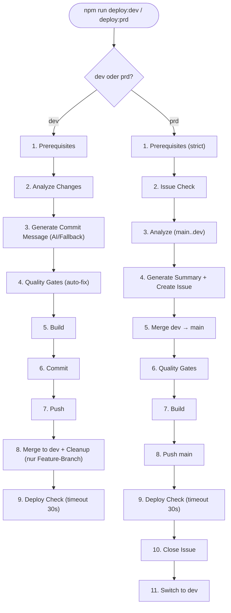

# FR006: Automatisierte Deployment-Workflows

Dieses Dokument beschreibt die automatisierten Deployment-Workflows: `npm run deploy:dev` zum
Deployen lokaler Änderungen in den `dev`-Branch, und `npm run deploy:prd` zum Promoten von `dev` in
die Produktion auf `main`.

- [FR006: Automatisierte Deployment-Workflows](#fr006-automatisierte-deployment-workflows)
  - [Übersicht](#übersicht)
  - [Architektur](#architektur)
  - [Voraussetzungen](#voraussetzungen)
  - [deploy:dev — Workflow-Schritte](#deploydev--workflow-schritte)
  - [deploy:prd — Workflow-Schritte](#deployprd--workflow-schritte)
  - [CLI-Parameter](#cli-parameter)
    - [deploy:dev](#deploydev)
    - [deploy:prd](#deployprd)
  - [Fehlerbehandlung \& Rollback](#fehlerbehandlung--rollback)
  - [Output-Design](#output-design)

## Übersicht

Beide Deployment-Modi werden über ein einziges Script gesteuert:

- **`npm run deploy:dev`** — Committet und pusht lokale Änderungen nach `dev`. Führt Quality Gates
  mit Auto-Fix durch, generiert per Copilot CLI (oder Fallback) eine Commit-Message, und gibt den
  Link zum GitHub Actions Deployment aus.
- **`npm run deploy:prd`** — Mergt `dev` in `main` für ein Produktions-Deployment. Verwaltet GitHub
  Issues (erstellen + schließen) zur Release-Dokumentation.

Die gesamte Logik liegt in einem Script: [deploy.mjs](../../scripts/workflows/ci/deploy.mjs)

## Architektur

Das Script ersetzt die vorherige Architektur aus 23 Einzelscripts mit geteiltem State-File. Die neue
Lösung:

- **Ein Script, zwei Modi** — `deploy.mjs dev` oder `deploy.mjs prd`
- **Kein State-File** — Alle Daten werden im Speicher gehalten (kein `.state/`-Ordner)
- **Copilot CLI optional** — Falls `copilot` nicht verfügbar ist, wird eine Commit-Message
  automatisch aus der Diff-Statistik generiert
- **Quality Gates mit Auto-Fix** — `npm run format` und `npm run lint` statt nur Check
- **Minimale Ausgabe** — Eine Zeile pro Schritt bei Erfolg, Details nur im Fehlerfall
- **Rollback bei Fehler** — Bei `deploy:prd` wird `main` automatisch zurückgesetzt, wenn nach dem
  Merge ein Fehler auftritt (sofern noch nicht gepusht wurde)
- **Kein Shell-Escaping** — Commit-Messages werden via `execFileSync` übergeben (keine
  Injection-Gefahr)



## Voraussetzungen

Beide Workflows erfordern:

- **Node.js**: >= 24.x
- **Git**: Korrekt konfiguriert mit Benutzer-Credentials
- **GitHub CLI (`gh`)**: Authentifiziert am Repository
- **GitHub Copilot CLI** (optional): Wird für KI-generierte Commit-Messages verwendet. Bei
  Nichtverfügbarkeit wird eine automatische Commit-Message aus dem Diff generiert.

## deploy:dev — Workflow-Schritte

| Schritt                | Beschreibung                                                                                                              |
| :--------------------- | :------------------------------------------------------------------------------------------------------------------------ |
| **1. Prerequisites**   | Prüft `npm`, `git`, `gh` und Git-Repo-Validität. `copilot` wird als optional geprüft.                                     |
| **2. Analyze**         | Liest `git status` und `git diff HEAD` ein. Bricht ab, wenn keine Änderungen vorhanden sind.                              |
| **3. Commit Message**  | Nutzt Copilot CLI zur Analyse der Änderungen. Fallback: `chore: update N files` aus Diff-Statistik.                       |
| **4. Quality Gates**   | Führt `npm run format` und `npm run lint` aus (mit Auto-Fix). `npm run prose` wird optional ausgeführt.                   |
| **5. Build**           | `npm run build` — Output wird nur im Fehlerfall angezeigt.                                                                |
| **6. Commit**          | `git add .` (temp-Files ausgeschlossen), Commit mit `--no-verify` via `execFileSync`.                                     |
| **7. Push**            | `git push -u origin <branch>`                                                                                             |
| **8. Merge + Cleanup** | Nur bei Feature-Branches: Merge in `dev` mit `--no-ff --no-verify`, Push, optionale Branch-Löschung mit `--auto-cleanup`. |
| **9. Deploy Check**    | Pollt den `deploy-dev.yml` Workflow-Run (max. 30s). Bei Erfolg/Fehler: Status anzeigen. Sonst: Link und weiter.           |

## deploy:prd — Workflow-Schritte

| Schritt                | Beschreibung                                                                                                            |
| :--------------------- | :---------------------------------------------------------------------------------------------------------------------- |
| **1. Prerequisites**   | Wie dev + zusätzlich: Branch muss `dev` sein, Working Tree sauber, `dev` in Sync mit `origin/dev`.                      |
| **2. Issue Check**     | Prüft `--issue-id` oder fragt interaktiv ab. `--skip-issue` überspringt den Prompt.                                     |
| **3. Analyze**         | `git diff origin/main..dev` — Diff-Statistik und Commit-Log.                                                            |
| **4. Summary + Issue** | Copilot CLI generiert Titel und Body (Fallback: automatisch). Erstellt Issue, falls keines angegeben.                   |
| **5. Merge**           | `git checkout main && git pull && git merge dev --no-ff --no-verify`. Bei Konflikt: automatischer Rollback und Abbruch. |
| **6. Quality Gates**   | Format + Lint auf `main`. Änderungen werden automatisch committet.                                                      |
| **7. Build**           | `npm run build` auf `main`.                                                                                             |
| **8. Push**            | `git push origin main` — triggert `deploy-prd.yml` GitHub Actions Workflow.                                             |
| **9. Deploy Check**    | Pollt den `deploy-prd.yml` Workflow-Run (max. 30s). Bei Erfolg/Fehler: Status anzeigen. Sonst: Link und weiter.         |
| **10. Close Issue**    | Schließt das zugehörige GitHub Issue.                                                                                   |
| **11. Switch to dev**  | Wechselt zurück auf den `dev`-Branch.                                                                                   |

## CLI-Parameter

### deploy:dev

| Parameter        | Beschreibung                                                               |
| :--------------- | :------------------------------------------------------------------------- |
| `--auto-cleanup` | Feature-Branch nach erfolgreichem Merge automatisch löschen (kein Prompt). |

```bash
npm run deploy:dev
npm run deploy:dev -- --auto-cleanup
```

### deploy:prd

| Parameter         | Beschreibung                                                      |
| :---------------- | :---------------------------------------------------------------- |
| `--issue-id <id>` | Eine bestehende GitHub-Issue-ID angeben.                          |
| `--skip-issue`    | Issue-Abfrage überspringen (non-interactive Mode für Automation). |

```bash
npm run deploy:prd -- --issue-id 123
npm run deploy:prd -- --skip-issue
```

> **Wichtig:** Immer den doppelten Bindestrich `--` vor den Argumenten verwenden, damit sie korrekt
> an das zugrunde liegende Script weitergegeben werden!

## Fehlerbehandlung & Rollback

- **deploy:dev**: Bei Fehler wird der aktuelle Zustand belassen. Kein automatischer Rollback nötig,
  da noch nichts Destruktives passiert ist (lokale Commits können reverted werden).
- **deploy:prd**: Bei Fehler **nach** dem Merge in `main` aber **vor** dem Push wird automatisch
  `git reset --hard origin/main` ausgeführt und zurück auf `dev` gewechselt. Falls `main` bereits
  gepusht wurde, ist manuelles Eingreifen nötig.

## Output-Design

Das Script gibt eine kompakte Fortschrittsanzeige aus:

```
─── deploy:dev ───

[1/9] Prerequisites... ✓
[2/9] Analyze changes... ✓
[3/9] Generate commit message... ✓
[4/9] Quality gates (format, lint)... ✓
[5/9] Build... ✓
[6/9] Commit... ✓
[7/9] Push... ✓
[8/9] Deploy check...  Run: https://github.com/Frickeldave/frickeldave.github.io/actions/runs/...
  Status: ✓ success
 ✓

─── Done ───
Branch:  dev
Commit:  a1b2c3d
```

Der **Deploy-Check** pollt bis zu 30 Sekunden auf Abschluss des Workflows:
- **Bei Erfolg (< 30s)**: `Status: ✓ success`
- **Bei Fehler (< 30s)**: `Status: ✗ <conclusion>` + Error-Log (letzte 15 Zeilen)
- **Nach 30s Timeout**: `Status: ▶ in_progress (timeout after 30s)` + Monitor-Link
  - Die Action läuft weiter, wird aber nicht mehr gewartet
  - Link zum manuellen Überwachen wird ausgegeben

Bei Fehlern werden die letzten 30 Zeilen der Ausgabe angezeigt.
