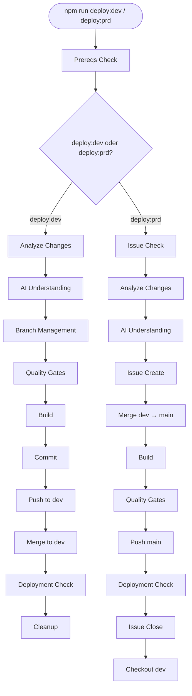

# FR006: Automatisierte Deployment-Workflows

Dieses Dokument beschreibt beide automatisierten Deployment-Workflows: `npm run deploy:dev` zum
Deployen lokaler Änderungen in den `dev`-Branch, und `npm run deploy:prd` zum Promoten von `dev`
in die Produktion auf `main`.

- [FR006: Automatisierte Deployment-Workflows](#fr006-automatisierte-deployment-workflows)
  - [Übersicht](#übersicht)
  - [Workflow-Diagramm](#workflow-diagramm)
  - [Voraussetzungen](#voraussetzungen)
  - [deploy:dev — Workflow-Schritte](#deploydev--workflow-schritte)
    - [1. Voraussetzungen prüfen](#1-voraussetzungen-prüfen)
    - [2. Analyse \& KI-Auswertung](#2-analyse--ki-auswertung)
    - [3. Branch-Verwaltung](#3-branch-verwaltung)
    - [4. Quality Gates \& Build](#4-quality-gates--build)
    - [5. Commit \& Push](#5-commit--push)
    - [6. Merge \& Deployment-Check](#6-merge--deployment-check)
    - [7. Aufräumen](#7-aufräumen)
  - [deploy:prd — Workflow-Schritte](#deployprd--workflow-schritte)
    - [1. Voraussetzungen prüfen](#1-voraussetzungen-prüfen-1)
    - [2. Issue-Verwaltung](#2-issue-verwaltung)
    - [3. Analyse \& KI-Auswertung](#3-analyse--ki-auswertung)
    - [4. Merge dev → main](#4-merge-dev--main)
    - [5. Build \& Quality Gates](#5-build--quality-gates)
    - [6. Push \& Deployment-Check](#6-push--deployment-check)
    - [7. Issue schließen](#7-issue-schließen)
  - [CLI-Parameter](#cli-parameter)
    - [deploy:dev](#deploydev)
    - [deploy:prd](#deployprd)

## Übersicht

Je nach Deployment-Ziel stehen zwei Befehle zur Verfügung:

- **`npm run deploy:dev`** — Committet und pusht lokale Änderungen nach `dev`. Führt Quality Gates
  durch, nutzt die GitHub Copilot CLI zur Generierung einer Commit-Message und verifiziert das
  GitHub Actions Deployment. GitHub Issues werden dabei nicht erstellt oder verändert.
- **`npm run deploy:prd`** — Mergt `dev` in `main`, um ein Produktions-Deployment auszulösen.
  Verwaltet GitHub Issues (erstellen + schließen), um den Release zu dokumentieren.

Die Kernlogik liegt in
[update-dev-branch.mjs](../../scripts/workflows/ci/update-dev-branch.mjs) und
[update-prd-branch.mjs](../../scripts/workflows/ci/update-prd-branch.mjs).

## Workflow-Diagramm



## Voraussetzungen

Beide Workflows erfordern die folgenden installierten und konfigurierten Werkzeuge:

- **Node.js**: >= 20.x
- **Git**: Korrekt konfiguriert mit Benutzer-Credentials.
- **GitHub CLI (`gh`)**: Authentifiziert am Repository.
- **GitHub Copilot CLI**: Wird zur Analyse der Änderungsabsicht und zur Nachrichtengenerierung
  verwendet.

---

## deploy:dev — Workflow-Schritte

### 1. Voraussetzungen prüfen

Überprüft, ob alle benötigten Tools (`npm`, `git`, `gh`, `copilot`) installiert sind und der
Nutzer authentifiziert ist.

- Zuständiges Script:
  [update-dev-branch-prereqs.mjs](../../scripts/workflows/ci/update-dev-branch-prereqs.mjs)

### 2. Analyse & KI-Auswertung

Analysiert alle staged und unstaged Änderungen (`git diff HEAD`). Die GitHub Copilot CLI generiert
daraus einen Branch-Namen und eine aussagekräftige Commit-Message.

- Zuständige Scripts:
  [update-dev-branch-analyze.mjs](../../scripts/workflows/ci/update-dev-branch-analyze.mjs),
  [update-dev-branch-understand.mjs](../../scripts/workflows/ci/update-dev-branch-understand.mjs)

### 3. Branch-Verwaltung

Bestimmt den Ziel-Branch für das Deployment:

- **Auf `dev` oder `main`**: Bleibt direkt auf dem Branch. Änderungen werden direkt committet und
  gepusht.
- **Auf einem anderen Branch**: Bleibt auf dem aktuellen Feature-Branch. Der Workflow committet
  dort und mergt später in `dev`.

- Zuständiges Script:
  [update-dev-branch-branch-mgmt.mjs](../../scripts/workflows/ci/update-dev-branch-branch-mgmt.mjs)

### 4. Quality Gates & Build

Führt automatisierte Prüfungen durch, um die Codequalität vor dem Commit sicherzustellen:

- **Prettier**: Prüft die korrekte Code-Formatierung.
- **ESLint**: Prüft auf Code-Qualitätsprobleme.
- **Vale**: Validiert Dokumentation und Schreibstil.
- **Build**: Führt `npm run build` aus, um sicherzustellen, dass das Projekt korrekt kompiliert.

- Zuständige Scripts:
  [update-branch-quality.mjs](../../scripts/workflows/ci/update-branch-quality.mjs),
  [update-branch-build.mjs](../../scripts/workflows/ci/update-branch-build.mjs)

### 5. Commit & Push

Committet die Änderungen mit der KI-generierten Message und pusht zum Remote-Repository (`origin`).

- Zuständige Scripts:
  [update-dev-branch-commit.mjs](../../scripts/workflows/ci/update-dev-branch-commit.mjs),
  [update-dev-branch-push.mjs](../../scripts/workflows/ci/update-dev-branch-push.mjs)

### 6. Merge & Deployment-Check

Bei Ausführung von einem Feature-Branch wird in `dev` gemergt. Ist man bereits auf `dev`, wird
dieser Schritt übersprungen. Der Push nach `dev` löst den GitHub Actions Workflow aus. Das Script
pollt anschließend den Workflow-Run, um ein erfolgreiches Deployment zu bestätigen.

- Zuständige Scripts:
  [update-dev-branch-merge.mjs](../../scripts/workflows/ci/update-dev-branch-merge.mjs),
  [update-dev-branch-deploy-check.mjs](../../scripts/workflows/ci/update-dev-branch-deploy-check.mjs)

### 7. Aufräumen

Entfernt temporäre State-Dateien. Bei einem Merge von einem Feature-Branch wird optional
angeboten, den lokalen und Remote-Feature-Branch zu löschen.

- Zuständiges Script:
  [update-branch-cleanup.mjs](../../scripts/workflows/ci/update-branch-cleanup.mjs)

---

## deploy:prd — Workflow-Schritte

### 1. Voraussetzungen prüfen

Überprüft alle benötigten Tools und erzwingt zusätzliche Produktionsbedingungen: Der aktuelle
Branch muss `dev` sein, der Working Tree muss sauber sein, und `dev` muss vollständig nach
`origin` gepusht sein.

- Zuständiges Script:
  [update-prd-branch-prereqs.mjs](../../scripts/workflows/ci/update-prd-branch-prereqs.mjs)

### 2. Issue-Verwaltung

Prüft, ob eine GitHub-Issue-ID über `--issue-id` angegeben wurde. Falls nicht, wird interaktiv
nachgefragt. Mit `--skip-issue` wird der prompt übersprungen.

**Wichtig**: Wenn keine Issue-ID angegeben wird (weder per Flag noch interaktiv), wird
**automatisch ein neues GitHub Issue erstellt**. Titel und Body werden dabei aus der KI-Analyse
(Schritt 3) generiert. `--skip-issue` überspringt nur den interaktiven Prompt — die automatische
Issue-Erstellung findet trotzdem statt.

- Zuständige Scripts:
  [update-branch-issue-check.mjs](../../scripts/workflows/ci/update-branch-issue-check.mjs),
  [update-branch-issue-create.mjs](../../scripts/workflows/ci/update-branch-issue-create.mjs)

### 3. Analyse & KI-Auswertung

Analysiert den vollständigen Diff zwischen `origin/main` und `dev`. Die GitHub Copilot CLI
generiert daraus eine Deployment-Zusammenfassung, die als Issue-Body und Release-Beschreibung
verwendet wird.

- Zuständige Scripts:
  [update-prd-branch-analyze.mjs](../../scripts/workflows/ci/update-prd-branch-analyze.mjs),
  [update-prd-branch-understand.mjs](../../scripts/workflows/ci/update-prd-branch-understand.mjs)

### 4. Merge dev → main

Checkt `main` aus, pullt die neuesten Änderungen und mergt `dev` mit einem No-Fast-Forward
Merge-Commit.

- Zuständiges Script:
  [update-prd-branch-merge.mjs](../../scripts/workflows/ci/update-prd-branch-merge.mjs)

### 5. Build & Quality Gates

Führt den vollständigen Build und alle Quality-Checks auf dem `main`-Branch durch, um
sicherzustellen, dass der gemergete Stand produktionsreif ist.

- Zuständige Scripts:
  [update-branch-build.mjs](../../scripts/workflows/ci/update-branch-build.mjs),
  [update-branch-quality.mjs](../../scripts/workflows/ci/update-branch-quality.mjs)

### 6. Push & Deployment-Check

Pusht `main` nach `origin`, wodurch der `deploy-prd.yml` GitHub Actions Workflow ausgelöst wird.
Das Script pollt den Workflow-Run, um ein erfolgreiches Produktions-Deployment zu bestätigen.

- Zuständige Scripts:
  [update-prd-branch-push.mjs](../../scripts/workflows/ci/update-prd-branch-push.mjs),
  [update-prd-branch-deploy-check.mjs](../../scripts/workflows/ci/update-prd-branch-deploy-check.mjs)

### 7. Issue schließen

Schließt das zugehörige GitHub Issue und wechselt zurück auf den `dev`-Branch.

- Zuständiges Script:
  [update-branch-issue-close.mjs](../../scripts/workflows/ci/update-branch-issue-close.mjs)

---

## CLI-Parameter

### deploy:dev

| Parameter        | Beschreibung                                                              |
| :--------------- | :------------------------------------------------------------------------ |
| `--auto-cleanup` | Feature-Branch nach erfolgreichem Merge automatisch löschen (skip prompt). |

> **Wichtig:** Immer den doppelten Bindestrich `--` vor den Argumenten verwenden, damit sie
> korrekt an das zugrunde liegende Script weitergegeben werden!

```bash
npm run deploy:dev -- --auto-cleanup
```

### deploy:prd

| Parameter         | Beschreibung                                                              |
| :---------------- | :------------------------------------------------------------------------ |
| `--issue-id <id>` | Eine bestehende GitHub-Issue-ID angeben.                                  |
| `--skip-issue`    | Issue-Abfrage überspringen (non-interactive Mode für Automation).         |

```bash
npm run deploy:prd -- --issue-id 123
npm run deploy:prd -- --skip-issue
```
