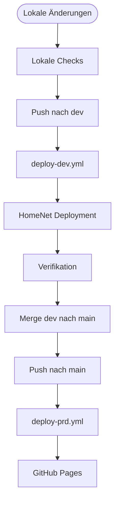

# FR006: Automatisierte Deployment-Workflows

Dieses Dokument beschreibt den aktuellen automatisierten Deployment-Ablauf des Repositories.

Die früher dokumentierten npm-Skripte `deploy:dev` und `deploy:prd` existieren nicht mehr. Die
Automatisierung läuft heute über GitHub Actions und branch-basierte Workflows.

## Übersicht

Es gibt zwei operative Deployment-Wege:

- **`dev`-Deployment**: Ein Push auf `dev` triggert
  [.github/workflows/deploy-dev.yml](../../.github/workflows/deploy-dev.yml).
- **Produktions-Deployment**: Ein Push auf `main` triggert
  [.github/workflows/deploy-prd.yml](../../.github/workflows/deploy-prd.yml).

Die lokale Vorbereitung des Merges erfolgt derzeit manuell per Git oder mit
[scripts/merge-branches.mjs](../../scripts/merge-branches.mjs). In VS Code steht zusätzlich die Task
`Deploy to Main` aus [.vscode/tasks.json](../../.vscode/tasks.json) zur Verfügung.

## Architektur

Die Deployments sind heute bewusst aufgeteilt:

- `deploy-dev.yml` stößt nach einem Push auf `dev` ein nachgelagertes HomeNet-Deployment an.
- `deploy-prd.yml` baut die Astro-Site auf `main` und veröffentlicht sie über GitHub Pages.
- Die Validierung vor dem Push bleibt lokal: `npm run build`, `npm run lint:check` und optional
  `npm run prose`.
- Der Branch-Merge von `dev` nach `main` ist ein eigener bewusst sichtbarer Schritt.


```mermaid
flowchart TD
  start([Lokale Änderungen]) --> verify[Lokale Checks]
  verify --> pushDev[Push nach dev]
  pushDev --> devWorkflow[deploy-dev.yml]
  devWorkflow --> homenet[HomeNet Deployment]
  homenet --> verifyDev[Verifikation]
  verifyDev --> mergeMain[Merge dev nach main]
  mergeMain --> pushMain[Push nach main]
  pushMain --> prdWorkflow[deploy-prd.yml]
  prdWorkflow --> githubPages[GitHub Pages]
```

## Voraussetzungen

Für beide Wege gilt:

- **Node.js**: >= 24.x
- **Git**: korrekt konfiguriert mit Benutzer-Credentials
- **Clean working tree** vor dem finalen `dev` → `main` Merge
- **Lokale Qualitätschecks** vor dem Push, mindestens `npm run build` und `npm run lint:check`
- **GitHub CLI (`gh`)** nur dann, wenn du mit `scripts/merge-branches.mjs` oder GitHub-Operationen
  arbeitest

## Dev-Deployment

1. Änderungen lokal prüfen und committen.
2. Auf `dev` pushen.
3. GitHub Actions startet [deploy-dev.yml](../../.github/workflows/deploy-dev.yml).
4. Der Workflow dispatcht das HomeNet-Repository mit dem Tag `fd` und der Source-Branch-Information.
5. Anschließend die Zielumgebung verifizieren.

## Produktions-Deployment

1. Sicherstellen, dass `dev` den gewünschten Stand enthält.
2. Lokal nach `main` mergen, entweder manuell oder über die VS Code Task `Deploy to Main`.
3. `main` nach GitHub pushen.
4. GitHub Actions startet [deploy-prd.yml](../../.github/workflows/deploy-prd.yml).
5. Der Workflow baut die Astro-Site und veröffentlicht sie über GitHub Pages.

## Lokale Einstiegspunkte

### Manuell mit Git

```bash
git checkout dev
git push origin dev

git checkout main
git pull origin main
git merge dev --no-ff -m "Deploy dev to main"
git push origin main
git checkout dev
```

### VS Code Task

Die Task `Deploy to Main` in [.vscode/tasks.json](../../.vscode/tasks.json) führt den lokalen
`dev` → `main` Merge inklusive Push in einem Schritt aus.

### Interaktiv mit Skript

```bash
node scripts/merge-branches.mjs dev
node scripts/merge-branches.mjs main
```

Details dazu stehen in [scripts/README.md](../../scripts/README.md).

## Fehlerbehandlung

- Schlägt `deploy-dev.yml` fehl, prüfe zuerst den Workflow-Run und das nachgelagerte HomeNet-Dispatch.
- Schlägt `deploy-prd.yml` fehl, prüfe Build-Fehler, GitHub Pages Deployment und den letzten Push auf
  `main`.
- Vor jedem Produktions-Deployment sollten lokale Checks grün sein, damit Fehler nicht erst im
  Workflow auffallen.

## Siehe auch

- [Usage Guide](../11-dev-usage.md)
- [Branching and Naming Strategy](../13-dev-branch-naming-strategy.md)
- [Scripts Overview](../../scripts/README.md)
