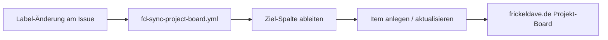

# FR007: Projekt-Board-Synchronisierung (Labels ↔ frickeldave.de Projekt)

Dieses Dokument beschreibt die Synchronisierung der GitHub-Labels mit dem
frickeldave.de Projekt-Board (GitHub Projects V2).

Die Labels sind die Quelle der Wahrheit („state machine"). Das Board ist eine
Einweg-Projektion, die den Zustand visualisiert. Änderungen auf dem Board werden
**nicht** automatisch auf Labels zurückgespielt.

## Übersicht

- Projekt-Board: <https://github.com/users/Frickeldave/projects/2>
- Skript: [scripts/sync-project-board.mjs](../../scripts/sync-project-board.mjs)
- Workflow: [.github/workflows/fd-sync-project-board.yml](../../.github/workflows/fd-sync-project-board.yml)

Der Workflow reagiert auf Label-Änderungen (`labeled`, `unlabeled`, `closed`,
`reopened`) und verschiebt das Issue auf dem Board in die passende Spalte. Über
`workflow_dispatch` lässt sich zusätzlich ein vollständiger Re-Sync aller offenen
Issues auslösen.



## Spalten-Zuordnung

| Board-Spalte     | Label-Zustand                          |
| ---------------- | -------------------------------------- |
| Done             | Issue geschlossen                      |
| In Progress      | `go:yes` + `squad:{member}`            |
| Ready            | `go:yes` (ohne `squad:{member}`)       |
| Needs Research   | `go:needs-research`                    |
| Backlog          | alles andere (`go:no` / noch kein Vote) |

Das Board sollte daher die folgenden Status-Optionen enthalten:
`Backlog`, `Needs Research`, `Ready`, `In Progress`, `Done`.

## Voraussetzungen

1. **Personal Access Token (PAT)** mit dem Scope `project`. Ohne diesen Scope
   kann weder das Skript noch ein GitHub-Actions-Workflow auf das Board
   zugreifen. Das eingebaute `GITHUB_TOKEN` von Actions kann Projects V2 nicht
   ansprechen.
2. Der PAT muss als Repository-Secret `SQUAD_PROJECT_TOKEN` hinterlegt sein
   (Repository → Settings → Secrets and variables → Actions).
3. Die Status-Spalten (siehe oben) müssen auf dem Board existieren.

### PAT anlegen

1. <https://github.com/settings/tokens> → „Generate new token (classic)".
2. Scope `project` aktivieren (zusätzlich `repo`, falls das Token auch für
   andere Workflows genutzt wird).
3. Token kopieren und als Secret `SQUAD_PROJECT_TOKEN` im Repository speichern.

> Hinweis: Da es sich um ein **User-Projekt** handelt, muss der PAT vom
> Projekt-Besitzer (`Frickeldave`) stammen.

### Board-Spalten anlegen

Falls die Spalten fehlen, in den Board-Einstellungen
(`/settings/fields`) unter dem Status-Feld anlegen oder per CLI:

```bash
gh auth refresh -s project
gh project field-list 2 --owner Frickeldave
gh project field-create 2 --owner Frickeldave \
  --name "Status" --data-type "SINGLE_SELECT" \
  --single-select-options "Backlog,Needs Research,Ready,In Progress,Done"
```

## Nutzung

### Manueller Re-Sync

```bash
SQUAD_PROJECT_TOKEN=<pat> node scripts/sync-project-board.mjs --all
```

Dry-Run ohne Änderungen:

```bash
SQUAD_PROJECT_TOKEN=<pat> node scripts/sync-project-board.mjs --all --dry-run
```

Ein einzelnes Issue synchronisieren:

```bash
SQUAD_PROJECT_TOKEN=<pat> node scripts/sync-project-board.mjs --issue 272
```

### Über den Workflow

- Label-Änderungen an Issues stoßen den Sync automatisch an.
- `workflow_dispatch` („Run workflow") mit der Option `dry_run` führt einen
  vollständigen Re-Sync ohne Schreibzugriffe aus.

## Einschränkungen

- **Kein Board→Label-Sync**: GitHub sendet für User-Projekte keine
  `projects_v2_item`-Webhooks. Ein automatisches Zurückspielen von
  Board-Änderungen auf Labels ist daher nicht möglich. Das entspricht der
  Squad-Doku: Labels sind maßgeblich, das Board ist eine Projektion.
- Der Re-Sync verarbeitet maximal die ersten 100 offenen Issues.
- Das Skript bricht ab, wenn eine benötigte Spalte fehlt (Fail-Fast mit klarer
  Meldung), damit Setup-Lücken sichtbar bleiben.

## Siehe auch

- [Squad Project Boards (Feature-Doku)](https://bradygaster.github.io/squad/docs/features/project-boards/)
- [Work Routing](../../.squad/routing.md)
- [Squad Label Sync Workflow](../../.github/workflows/squad-sync-squad-labels.yml)
