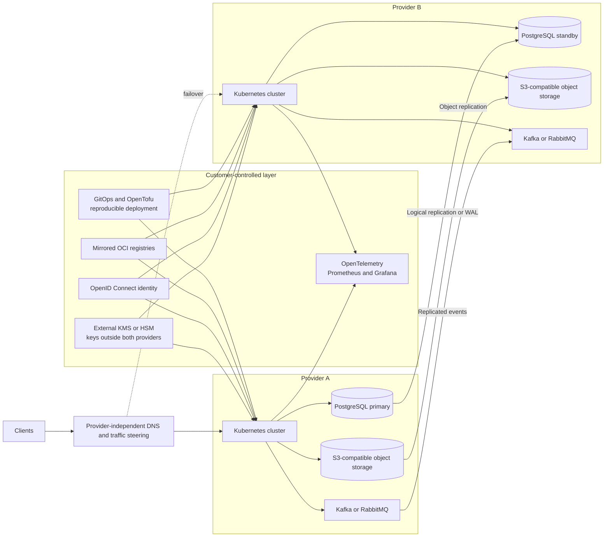

import { Image } from "astro:assets";
import sjvcw001 from "@assets/blog/it/2026-08-23-souveränität-jenseits-cloud-washing/sjvcw-001.png";
import sjvcw002 from "@assets/blog/it/2026-08-23-souveränität-jenseits-cloud-washing/sjvcw-002.png";
import sjvcw003 from "@assets/blog/it/2026-08-23-souveränität-jenseits-cloud-washing/sjvcw-003.png";
import sjvcw004 from "@assets/blog/it/2026-08-23-souveränität-jenseits-cloud-washing/sjvcw-004.png";

Kaum hat ein großer Cloud-Anbieter Schnupfen, ruft die LinkedIn Community nach einer europäischen Cloud. Als
würde ein Serverrack in Brandenburg automatisch einen Reisepass kontrollieren und danach souverän booten.

Mich stört nicht der Wunsch nach europäischen Anbietern. Im Gegenteil. Mehr europäische Rechenleistung,
Software und Fachwissen sind bitter nötig. Mich stört diese magische Gleichung:

> Europäischer Anbieter + deutsches Rechenzentrum + DSGVO-Aufkleber = Souveränität

Ein Anbieter kann seinen Hauptsitz in Gütersloh, Paris oder auf Borkum haben und mich trotzdem
dermaßen in seine Plattform einschweißen, dass ein Umzug ungefähr so realistisch is, als würde Stuttgart
21 pünktlich fertiggestellt werden.

Souveränität entsteht nicht dadurch, dass der Anbieter wechselt. Souveränität entsteht, wenn **ich jederzeit wechseln kann**.

Das [Zentrum für Digitale Souveränität der Öffentlichen Verwaltung, kurz ZenDiS](https://www.zendis.de/),
beschreibt digitale Souveränität als Fähigkeit, digitale Infrastrukturen selbstbestimmt zu gestalten, zu
betreiben und weiterzuentwickeln – ohne unkontrollierbare Abhängigkeit von einem Anbieter oder Drittstaat.
Dazu gehören rechtliche, technologische und operative Kontrolle sowie Transparenz und Wechselfähigkeit. Ein
Standortversprechen allein reicht nicht.

Alles andere ist Beiwerk: die Flagge am Rechenzentrum, die Farbe des Anbieterlogos –
und der nächste „Sovereign"-Tarif, den mir der Vertrieb mit 47 Seiten Leistungsbeschreibung und einem
Mindestumsatz bis 2038 auf den Tisch legt.

## Souverän ist nicht, wer den richtigen Anbieter gewählt hat

Souverän ist, wer handlungsfähig bleibt, wenn der Anbieter morgen:

- seine Preise verdoppelt,
- einen Dienst einstellt,
- die Programmierschnittstelle ändert,
- meinen Vertrag kündigt,
- von einem anderen Konzern gekauft wird,
- von einer Regierung unter Druck gesetzt wird
- oder schlicht für ein paar Stunden umfällt.

Dabei geht es nicht um völlige Unabhängigkeit. Die gibt es nicht. Selbst mein eigener Rechner hängt an
Prozessoren, Firmware, Lieferketten, Strom, Glasfaser, Betriebssystemen und Menschen, die hoffentlich
wissen, welche Schraube sie gerade drehen.

Souveränität heißt also nicht, alles selbst zu bauen. Die Kunst ist, Abhängigkeiten zu **kennen, zu
begrenzen und austauschbar zu halten**.

Die passende Cloud ergibt sich aus dem Schutzbedarf der Anwendung, nicht aus der
Lieblingsfarbe des Einkaufs. Europäische Anbieter, private Plattformen und kontrollierte
Varianten der großen Clouds sind hier natürlich legitime Bausteine, die ich bei der Planung meiner 
Architektur betrachten sollte. Aber die Analogie der Bausteine trifft es hier sehr gut: Ich bin
in der Verantwortung, mein Klemmsteinobjekt so zu bauen, dass es jederzeit auseinandernehmen kann
und kritische Komponenten wechselbar sind. 

Oder etwas direkter:

> Ein Anbieter kann mir souveränere Bausteine verkaufen. Meine Souveränität verkauft er mir nicht.
> Die muss ich mir schon selber bauen.

## Wie wir uns selbst in diese Lage gebracht haben

Das übliche Vorgehen der vergangenen ~zehn Jahre war ungefähr dieses:

**Schritt 1:** „Liebes Team, hier ist die Kreditkarte. Geht mal in die Cloud. Aber flott!"

**Schritt 2:** „Oh, das ist teuer. Aber guck mal, diese proprietäre Datenbank ist
billiger als unser bisheriger Betrieb."

**Schritt 3:** „Wenn wir jetzt noch das herstellereigene Nachrichtensystem, die Identitätsverwaltung, die
Überwachung, die KI-Plattform und 38 ereignisgesteuerte Funktionen dazunehmen, wird alles einfacher."

**Schritt 4:** „Der Anbieter hat die Preise erhöht, aber wir haben einen tollen Rahmenvertrag mit Mindestabnahme 
abgeschlossen, der uns die Preise für die nächsten 5 Jahre garantieren wird. Wir sind jetzt also sicher."

**Schritt 5:** „Warum können wir eigentlich nicht mehr wechseln?"

<figure>
  <Image src={sjvcw001} alt="Die 5 Schritte in die Abhängigkeit" />
  <figcaption>*Die 5 Schritte in die Abhängigkeit / KI-generiert mit M365 Copilot*</figcaption>
</figure>

 

Meistens hat halt keiner eine Ausstiegsarchitektur gebaut. Der Architekturplan bestand aus drei
Herstellerlogos und einem Pfeil mit der Beschriftung „Schnittstelle". Jede technische Abkürzung sah für sich
genommen völlig vernünftig aus – bis die Summe dieser Abkürzungen einen goldenen Käfig ergab.

Dazu kam, dass die Organisation den Kompetenzaufbau konsequent vermieden hat. Serverlos, vollständig
verwaltet, keine Betriebsverantwortung. Klingt super. Bis man feststellt, dass „serverlos" nur bedeutet, dass
der Server jemand anderem gehört und dieser Jemand jetzt auch noch mein Betriebsmodell besitzt.

## Jetzt aber Container, dann sind wir souverän?

Ein Teil der Lösung kann sein, möglichst wenig proprietäre Dienste zu nutzen und die notwendigen Anwendung selber 
in Containern zu verpacken. Klingt erstmal teuer und umständlich, über die Zeit sorgt der interne Kompetenzaufbau 
aber für mehr Unabhängigkeit, geringere Wechselkosten, mehr Kontrolle und tatsächlich auch Kostenersparnis weil meine
Mitarbeiter wissen, wie alles funktioniert. 
Leider ist es aber so, dass ein Container nur meine Anwendung verpackt. Er verpackt aber nicht automatisch Daten und 
Identitäten, Schlüssel, Netzwerktopologie, Lastverteilung, Ereignisse, Überwachungsdaten, Sicherungen (die hoffentlich 
nicht nur beim Anbieter liegen), DNS-Einträge und Zertifikate. 
Der Container ist ein toller Umzugskarton der vieles erleichert, aber noch nicht das Umzugsunternehmen.

Wenn ich meine Anwendung in ein OCI-Abbild packe, sie aber an DynamoDB, AWS Lambda, IAM, EventBridge, Secrets
Manager und proprietäre Bedrock-Schnittstellen binde, habe ich keinen portablen Dienst gebaut. Ich habe AWS
mit einer hübschen Schleife drum gebaut.

Dasselbe gilt natürlich für Azure und Google Cloud. Ein Kubernetes-Cluster allein hilft auch wenig, wenn die
Anwendung an Azure Functions, Entra ID, Cosmos DB, Service Bus und Azure Monitor festgenagelt wurde. Dann kann
ich zwar meine Pods umziehen. Nur funktionieren sie danach nicht mehr.

Containerisierung ist trotzdem ein guter Anfang. Anwendungen in selbst gebauten und reproduzierbaren
Abbildern, standardisierte Laufzeitschnittstellen und deklarative Bereitstellung senken die Wechselkosten
erheblich. Aber erst gemeinsam mit portablen Daten, offenen Protokollen, unabhängigen Identitäten und einem
getesteten Ausstiegsweg wird daraus Souveränität.

## Der große Souveränitäts-Bauchladen von AWS, Microsoft und Google

Die Hyperscaler haben verstanden, dass „Souveränität" kaufentscheidend wird. Also steht das Wort
inzwischen ungefähr so oft in den Produktbeschreibungen wie früher „Cloud-native". Bevor ich die Fakten
aufzähle, die offene Frage vorweg: Ob die organisatorische und technische Trennung das Risiko aus dem
CLOUD Act tatsächlich beseitigt, hängt daran, ob eine US-Stelle noch „possession, custody or control"
über die angefragten Daten begründen kann. Das lässt sich nicht per Werbebroschüre entscheiden und genau
dieser Punkt bleibt bis zu einem echten Konfliktfall offen.

<figure>
  <Image src={sjvcw002} alt="Die souveräne Cloud der Hyperscaler" />
  <figcaption>*Die souveräne Cloud der Hyperscaler / KI-generiert mit M365 Copilot*</figcaption>
</figure>

 

### AWS European Sovereign Cloud

AWS betreibt eine physisch und logisch getrennte Cloud-Umgebung für Europa – die AWS European Sovereign Cloud.
Die erste Region in Brandenburg ist seit dem 15. Januar 2026 allgemein verfügbar. Nach Angaben von AWS sollen
Kundendaten und kundenerzeugte Metadaten in der EU bleiben. Die Umgebung verfügt über eigene Identitäts-, Abrechnungs-
und Namenssysteme und wird über europäische Gesellschaften nach deutschem Recht verwaltet. AWS
spricht außerdem von einem Betrieb durch in der EU ansässiges Personal.

Der Artikel [„AWS verspricht die European Sovereign
Cloud"](https://blog.securecloud.de/aws-verspricht-die-european-sovereign-cloud) ordnet diese Versprechen ein.

Das ist deutlich mehr als ein neues Schild am Rechenzentrum. Es reduziert reale betriebliche Risiken und
trennt Systeme, Personal, Metadaten und Verwaltungswege.

### Microsoft Sovereign Cloud

Mehr Kontrolle bedeutet weniger Bequemlichkeit – wer das eine will, muss beim anderen Federn lassen. Bei
Microsoft lässt sich dieser Zielkonflikt besonders gut an den eigenen Sovereign-Angeboten beobachten.

Microsoft bietet mehrere Varianten seiner [Microsoft Sovereign
Cloud](https://learn.microsoft.com/de-de/azure/azure-sovereign-clouds/microsoft-sovereign-cloud) an.

Die öffentliche Variante ergänzt die normale Azure-Infrastruktur um Mechanismen für
Datenresidenz, überwachte administrative Zugriffe, externe Schlüsselverwaltung, vertrauliche
Datenverarbeitung und zusätzliche Protokollierung. Daneben gibt es private beziehungsweise
lokal betriebene Varianten sowie nationale Partnerangebote.

Interessant ist, was Microsoft selbst dazu schreibt: Die lokalen und privaten Varianten liefern die stärksten
Kontrollmöglichkeiten, weil dort Hardware, Software, Daten, Standort und Verwaltung stärker durch den Kunden
oder einen ausgewählten Betreiber kontrolliert werden. Gleichzeitig bieten sie nicht denselben Funktionsumfang
und dieselbe Skalierung wie die öffentliche Cloud.

Das ist trotzdem nicht verkehrt: Externe Schlüsselverwaltung und kontrollierte administrative Zugriffe
reduzieren reale Risiken.

### Google Cloud und Thales

Cloud-Washing beginnt dort, wo aus einem Fortschritt ein Endzustand gemacht wird. Das Google-Thales-Projekt
zeigt zwei Seiten: einen Fortschritt – und das Risiko, ihn als Endzustand zu verkaufen.

Laut dem Bericht [„Google Cloud: Souveräne Cloud in Deutschland bis Ende
2026"](https://www.heise.de/news/Google-Cloud-Souveraene-Cloud-in-Deutschland-bis-Ende-2026-11338334.html)
soll eine dedizierte Google-Cloud-Umgebung entstehen, deren lokaler Betrieb stärker von Google getrennt wird.
Eine vollständig von Thales kontrollierte deutsche Gesellschaft soll Betrieb und Unterstützung auf dedizierter
Infrastruktur übernehmen. Der lokale Betreiber soll Identitäten, Authentifizierung und kryptografische
Vertrauensanker kontrollieren. Aktualisierungen müssen kontrolliert in die Umgebung übertragen werden.
Google-Mitarbeiter sollen keinen direkten Zugriff auf Kundendaten erhalten.

Das ist ein ernsthafteres Trennungsmodell als „unsere Server stehen jetzt auch in Frankfurt". Nur bleibt
Google-Technologie Google-Technologie. 

### Sind Cloudstacks jetzt deswegen souverän

Nein, grundsätzlich wird die Frage der souveränität hier auch nur als ein Baustein der Architektur beantwortet. 
Wer seine Anwendung tief in Hyperscaler-eigenen Systeme einbaut, bleibt technisch von diesem abhängig. Das ist
im Prinzip nicht falsch, solange die Abhängigkeit bewusst eingegangen wird und die Risiken bekannt sind.

## Die Rechtslage: ein Knäuel, kein Freifahrtschein

Jetzt zum besonders beliebten Teil der Diskussion: CLOUD Act, FISA 702 und DSGVO werden gern in einen Mixer
geworfen, einmal kräftig durchgeschüttelt und anschließend als Rechtsgutachten auf LinkedIn serviert.

Das ist nämlich alles nicht so einfach, wie sich das auf LinkedIn anhört.

### CLOUD Act

Der CLOUD Act hat den amerikanischen Stored Communications Act geändert. Anbieter unter
US-Gerichtsbarkeit müssen Daten in ihrem „possession, custody or control" herausgeben, unabhängig davon,
ob diese Daten innerhalb oder außerhalb der USA liegen.

Entscheidend ist also nicht nur der Speicherort, sondern ob der adressierte Anbieter tatsächlich Zugriff oder Kontrolle besitzt.

Der CLOUD Act ist dabei kein magischer Knopf, mit dem irgendein Beamter morgens alle europäischen Kundendaten
herunterlädt. Für Inhaltsdaten braucht es ein rechtliches Verfahren. Anbieter können Anordnungen unter
bestimmten Bedingungen anfechten. Das Problem ist trotzdem real: Die Pflicht nach US-Recht kann mit den
Pflichten nach europäischem Recht kollidieren.

Artikel 48 DSGVO sagt, dass eine Anordnung eines Drittstaats nicht allein deshalb in Europa anerkannt oder
vollstreckt wird, weil dort ein Gericht oder eine Behörde sie erlassen hat. Dafür braucht es grundsätzlich
eine internationale Übereinkunft, wobei andere Übermittlungsgründe aus Kapitel V der DSGVO unberührt bleiben.

Der Europäische Datenschutzausschuss stellt entsprechend klar: Solche Anordnungen gelten nicht
automatisch. Ohne passendes Abkommen kommen andere Rechtsgrundlagen nur ausnahmsweise und nach
Prüfung des Einzelfalls in Betracht.

Die Aussage „jede amerikanische Cloud ist illegal" ist damit genauso unseriös wie
„EU-Region ausgewählt, Problem gelöst". Auf er andren Seite gibt es regelmäßig Anfragen von US Behörden, die sich auf den CLOUD Act berufen.
siehe [„CLOUD Act: US-Behörden können auf Daten in der Cloud zugreifen"](https://www.microsoft.com/en-us/corporate-responsibility/reports/government-requests/customer-data).

### FISA Section 702

FISA Section 702 ist ein anderes Instrument. Es dient der Auslandsaufklärung und erlaubt die Überwachung von
Nicht-US-Personen außerhalb der USA, ohne für jede Zielperson eine eigene richterliche Anordnung einzuholen.
Die Kommunikation von US-Personen kann dabei mit erfasst und später durchsucht werden.

Der Beitrag [„FISA 702, CLOUD Act & Co.: US-Überwachung killt europäischen
Datenschutz"](https://www.it-finanzmagazin.de/fisa-702-cloud-act-us-ueberwachung-killt-europaeischen-datenschutz-229640/)
zeigt, warum die Frage nicht allein über den Standort des Rechenzentrums beantwortet werden kann.

### EU-US Data Privacy Framework

Das EU-US Data Privacy Framework schafft eine Grundlage für bestimmte Datenübermittlungen in die USA. Es ist
aber kein Ersatz für eine technische Risikobewertung und auch kein Architekturprinzip.

Rechtliche Rahmenbedingungen ändern sich. Das haben Safe Harbor und Privacy Shield bereits vorgeführt. Wer
eine auf zehn oder zwanzig Jahre ausgelegte Plattform ausschließlich darauf aufbaut, dass ein
Angemessenheitsbeschluss für immer hält, verwechselt eine Rechtsgrundlage mit einem Naturgesetz.

Verträge und Angemessenheitsbeschlüsse sind relevant. Sie ersetzen trotzdem weder Datenminimierung noch
Verschlüsselung, Schlüsselkontrolle oder einen Ausstiegsweg.

### Und dann kommt OVHcloud

Wer jetzt denkt, mit einem französischen Anbieter sei die Rechtsfrage endgültig erledigt,
sollte sich den Fall OVHcloud ansehen.

Laut dem Heise-Bericht [„Kanadisches Gericht: OVHcloud aus Frankreich muss Nutzerdaten
herausgeben"](https://www.heise.de/news/Kanadisches-Gericht-OVHcloud-aus-Frankreich-muss-Nutzerdaten-herausgeben-11092024.html)
wurde OVHcloud von einem kanadischen Gericht zur Herausgabe von Daten verpflichtet, obwohl diese nicht
zwingend in Kanada gespeichert waren.

Der Fall liefert die Pointe gleich mit:

> Auch ein europäischer Anbieter schützt nicht automatisch vor extraterritorialen Ansprüchen, wenn er weltweit
> tätig ist und sich anderen Rechtsordnungen unterwirft.

Der Sitz des Anbieters ist wichtig. Seine Konzernstruktur ebenso, und die weltweiten Niederlassungen machen
das Bild auch nicht einfacher. Aber mein stärkster Schutz bleibt eine Architektur, in der der Anbieter
möglichst wenig Klartext besitzt, keine alleinige Schlüsselgewalt hat und ich ihn austauschen kann.

### Der EU Data Act

Der EU Data Act enthält Vorgaben, die einen Wechsel zwischen Anbietern von
Datenverarbeitungsdiensten erleichtern sollen. Technische, vertragliche und organisatorische
Wechselhindernisse müssen abgebaut werden. Plattform- und Softwaredienste sollen Schnittstellen
sowie Exporte in gängigen, maschinenlesbaren Formaten bereitstellen.

> „… beseitigen Anbieter von Datenverarbeitungsdiensten kommerzielle, technische, vertragliche und
> organisatorische Hindernisse, die Kunden davon abhalten …“
> — Verordnung (EU) 2023/2854 (Data Act), Art. 23 Abs. 1

> „Anbieter von Datenverarbeitungsdiensten stellen offene Schnittstellen zur Verfügung und führen Daten
> zumindest in einem gängigen und maschinenlesbaren Format aus.“
> — Verordnung (EU) 2023/2854 (Data Act), Art. 25 Abs. 2

Das klingt erstmal gut und wer in den vergangenen Jahren versucht hat, Daten aus einer Cloud zu exportieren, weiß,
wie überfällig so eine Regelung ist.

Nur erzeugt ein gesetzlicher Anspruch auf Wechsel noch keine wechselbare Anwendung. Der Data Act schreibt mir
nicht die Datenbankmigration. Er baut keine Ereignisse aus EventBridge nach Kafka um und ersetzt keine
proprietären Identitäten.

Der Data Act gibt mir also immerhin ein gesetzliches Recht auf Wechsel. Ob ich wechseln kann, entscheidet
weiterhin meine Architektur: Das Gesetz migriert weder meine Datenbank noch meine Ereignisse. 

## Wie eine souveräne Architektur tatsächlich aussieht (Skizze)

Nehmen wir eine Schadenplattform einer Versicherung. Sie verarbeitet Vertragsdaten, Bilder, Gutachten,
Zahlungen und Kommunikation. Die Plattform soll heute bei Anbieter A laufen und innerhalb eines festgelegten
Zeitfensters zu Anbieter B wechseln können.

Nicht irgendwann, nicht „nach einem Transformationsprogramm", sondern getestet.

Die Anwendung läuft in OCI-Containern auf Kubernetes. Dabei bleibt man möglichst bei den offenen
Kubernetes-Schnittstellen. Anbieterspezifische Erweiterungen verschwinden nicht, sie werden aber in
getrennten Infrastrukturmodulen gekapselt.

Für Anbieter A gibt es ein Modul, für Anbieter B ein anderes. Die Behauptung, dass dieselbe
Infrastrukturdefinition unverändert auf jeder Cloud funktioniert, gehört nämlich ebenfalls ins Märchenbuch.

Die Abbilder liegen in mindestens zwei Registrierungen. Der Quellcode, die Bereitstellungsdefinitionen und die
Signaturen der Artefakte befinden sich nicht ausschließlich beim primären Anbieter. 

Die Anwendungsdaten liegen in PostgreSQL. Diese Wahl macht Sinn, weil Protokoll, Datenformat, Sicherungsverfahren 
und Betriebswissen breit verfügbar sind. Wer einen verwalteten PostgreSQL-Dienst nutzt, prüft trotzdem Erweiterungen, Rollenmodelle, Sicherungsformate und
Replikationsverfahren. „Spricht SQL" ist noch lange kein Portabilitätsnachweis.

Objekte wie Bilder und Dokumente werden über eine S3-kompatible Schnittstelle angesprochen und zwischen
getrennten Speichern repliziert. Auch hier gilt: Die Schnittstelle allein genügt nicht. Versionierung,
Aufbewahrungsregeln, Metadaten, Berechtigungen und Prüfsummen müssen mit umziehen.

Für Ereignisse läuft Kafka oder RabbitMQ, etwa über einen Kubernetes-Operator. Alternativ kann ein verwalteter
Dienst genutzt werden, solange das Domänenmodell nicht direkt von dessen proprietärer Ereignissemantik
abhängt. Anbieteradapter übersetzen an der Grenze. Sie gehören auf gar keinen Fall mitten in die Fachlogik.

Die Identität hängt an OpenID Connect und liegt außerhalb beider Cloud-Konten. Die Verschlüsselungsschlüssel
werden in einem eigenen oder von einer unabhängigen europäischen Stelle betriebenen HSM verwaltet. Ein
mitgebrachter Schlüssel, den der Cloud-Anbieter im eigenen Schlüsselverwaltungsdienst jederzeit verwenden
kann, ist besser als nichts, aber wirkliche Schlüsselgewalt sieht natürlich anders aus.

Die Überwachung basiert auf OpenTelemetry, Prometheus und Grafana. Das bedeutet nicht, dass niemals CloudWatch
oder Azure Monitor verwendet werden darf. Es bedeutet, dass die geschäftskritische Sicht auf das System nicht
nur dort existiert. Sonst sieht man beim Umzug exakt nichts.

Und ganz wichtig: Multi-Cloud heißt nicht, dass jede Anwendung dauerhaft auf zwei Plattformen aktiv laufen
muss. Das verdoppelt Kosten, Komplexität und gelegentlich auch die Zahl der Fehler.

Für viele Systeme reicht ein vorbereiteter Zweitbetrieb mit replizierten Daten und regelmäßigem Wiederanlauf.
Entscheidend sind klare Ziele für Wiederanlaufzeit, maximalen Datenverlust und vollständigen Ausstieg.

## Kein bestandener Ausstiegstest, keine Souveränität

Ich würde für eine kritische Anwendung mindestens folgende Nachweise verlangen:

- Ein neues Zielkonto lässt sich aus Quellcode und Konfiguration heraus aufbauen.
- Anwendung, Daten, Metadaten, Berechtigungen und Protokolle lassen sich vollständig exportieren.
- Sicherungen werden regelmäßig außerhalb des primären Anbieters wiederhergestellt.
- Der alternative Betrieb funktioniert ohne Identitäts-, Schlüssel- oder DNS-Dienst des bisherigen Anbieters.
- Es gibt einen benannten Verantwortlichen, ein Zeitfenster und ein Budget für den Ausstieg.
- Der Wechsel wird regelmäßig praktisch geübt.

## Nicht jeder proprietäre Dienst ist verboten

Proprietäre Dienste sind in Ordnung, wenn die Abhängigkeit bewusst eingegangen wird. Der Nutzen muss höher
sein als Wechselkosten und Risiko. Dafür braucht jede Architekturentscheidung eine Einstufung:

| Klasse | Beispiel | Umgang |
|---|---|---|
| **Portabel** | OCI-Container, PostgreSQL, OpenID Connect, OpenTelemetry | Frei verwenden, Wechsel regelmäßig testen |
| **Mit Anpassung wechselbar** | Verwaltete Warteschlangen, Objektspeicher, Kubernetes-Dienste | Anbieteradapter, Exportweg und Zielprodukt festlegen |
| **Tiefer Lock-in** | Proprietäre Datenbanken, serverlose Ablaufmodelle, KI-Plattformen mit eigenen Datenformaten | Nur nach bewusster Risikoentscheidung und mit finanziertem Ablöseplan |

Google Pub/Sub statt RabbitMQ oder Kafka kann richtig sein. Aber dann gehört der Umbaupreis in die Entscheidung.

Nutzt ihr Cloud SQL? Na gut. Dann testet den Export zu einem PostgreSQL außerhalb von Google.

Lambda statt OpenFaaS oder Knative? Das geht auch. Dann trenn Fachlogik vom Ausführungsmodell und halte
ein alternatives Laufzeitziel bereit.

Beim S3-Thema: Auch gut — prüfe nicht nur den Dateiabruf, sondern Versionen, Metadaten, Sperren,
Lebenszyklusregeln und den vollständigen Massenauszug.

Lock-in ist nicht automatisch schlecht, sondern nur die unbekannten Elemente der Lösung. Und der Lock-in, der 
anschließend als „strategische Partnerschaft" verkauft wird, verdient wenigstens ein ordentliches Augenrollen.

## Souveränität muss messbar werden

Bauchgefühl ist keine Steuerungsgröße, daher müssen wir Souveränität messbar machen. Dazu gibt ediverse Tools, 
von denen ich drei vorstellen möchte.

<figure>
  <Image src={sjvcw003} alt="Souveränität messbar machen" />
  <figcaption>*Souveränität messbar machen / KI-generiert mit M365 Copilot*</figcaption>
</figure>

 

### Sovereign Cloud Compass

Der [Sovereign Cloud Compass](https://www.sovereigncloudcompass.de/) kann genutzt werden, um Cloud-Angebote anhand
eines konkreten Anwendungsfalls zu vergleichen. Du gewichtest Kriterien, definierst Ausschlussbedingungen
und behandelst fehlende Nachweise als Risiko.

Betrachtet werden unter anderem Eigentum und Rechtsraum, Betriebsmodell, technische Kontrolle und
Abhängigkeiten. Gut daran: Das Werkzeug ruft keinen pauschalen Gesamtsieger aus. 

Das Ergebnis ersetzt natürlich keine juristische oder technische Prüfung. Es zwingt dich aber dazu, deine 
Anforderungen aufzuschreiben, anstatt „souverän" einfach aus der Produktbeschreibung des Anbieters zu übernehmen.

### Souveränitäts-Kompass von Sebastian Kister

Der [Souveränitäts-Kompass von Sebastian Kister](https://sebastiankister.de/) bewertet eine Infrastruktur
entlang mehrerer technischer und organisatorischer Achsen.
Ausgangssituation, vorhandene Maßnahmen und Risiken werden sichtbar gemacht. Die Bewertung hilft dabei,
Schwächen bei Themen wie Schlüsselgewalt, Rechtsraum, Betriebsfähigkeit und Wechselmöglichkeit zu erkennen.

Ein hübscher Mittelwert darf dabei keinen Totalschaden bei einer einzelnen Achse verdecken. Wenn
ausschließlich der Anbieter meine Schlüssel kontrolliert oder niemand im Unternehmen die Plattform betreiben
kann, hilft mir die tolle Punktzahl beim Datenexport nur begrenzt.

### Der Münchner Score für Digitale Souveränität

Die Landeshauptstadt München misst die digitale Souveränität ihrer IT-Infrastruktur mit dem [Score für Digitale 
Souveränität (SDS)](https://muenchen.digital/projekte/digitale-souver%C3%A4nit%C3%A4t.html), einem 5-stufigen Bewertungsindex, der nach Vorbild des Nutri-Scores funktioniert.
Entwickelt wurde das Instrument vom IT-Referat gemeinsam mit der Technischen Universität München (TUM) und wird 
seit September 2025 systematisch angewendet.

Das SDS bewertet 194 kritische städtische Services anhand von vier Dimensionen: Vendor-Lock-in, Abhängigkeit von 
ausländischen Jurisdiktionen (wie dem US CLOUD Act), Verwendung von Open Standards sowie Einflussmöglichkeiten 
auf Betrieb und Daten. Die Ergebnisse zeigen, dass 74 Prozent des analysierten IT-Portfolios als digital souverän 
gelten, während etwa 21 Prozent auf dem kritischsten Niveau (SDS 5) liegen, was oft auf den Einsatz von 
US-Cloud-Diensten zurückzuführen ist.

## Fazit

Ja, gerade bei den letzten Absätzen wird dem einen oder anderen durch den kopf gegangen sein, dass souveräne 
Architektur Geld kostet.

Sie braucht außerdem Leute, die Datenbanken, Netze, Container, Identitäten, Schlüssel und Wiederanlauf nicht
nur aus Herstellerzertifizierungen kennen.

Und ja, der erste Aufbau dauert länger als „Kreditkarte rein und los".

Dafür kauft man sich eben keine theoretische Unabhängigkeit sondern die Möglichkeit, morgen noch was zu sagen 
zu haben.

Wer diesen Preis nicht zahlen will, darf sich bewusst für den Komfort eines Hyperscalers entscheiden. Das ist
eine legitime Geschäftsentscheidung. Dann sollte auf der Folie aber auch „bequeme, akzeptierte
Anbieterabhängigkeit" stehen und nicht „digitale Souveränität".

Die steckt nicht in einer Region, in keinem Zertifikat und schon gar nicht in einem Vertrag mit Mindestabnahme.

Souveränität ist die Fähigkeit, **Nein zu sagen und zu gehen**.

Und wenn du diese Fähigkeit weder bauen, bezahlen noch regelmäßig testen willst, dann hör wenigstens auf,
deinen fehlenden Ausstiegsplan als geopolitisches Schicksal zu verkaufen.

<figure>
  <Image src={sjvcw004} alt="Souveränität ist die Fähigkeit, 'Nein' zu sagen und zu gehen" />
  <figcaption>*Souveränität ist die Fähigkeit, 'Nein' zu sagen und zu gehen / KI-generiert mit M365 Copilot*</figcaption>
</figure>

 

---

## Quellen

### Cloud-Anbieter und deren Souveränitätsversprechen

- [AWS verspricht die European Sovereign Cloud](https://blog.securecloud.de/aws-verspricht-die-european-sovereign-cloud)
- [Microsoft Sovereign Cloud](https://learn.microsoft.com/de-de/azure/azure-sovereign-clouds/microsoft-sovereign-cloud)
- [Google Cloud: Souveräne Cloud in Deutschland bis Ende 2026](https://www.heise.de/news/Google-Cloud-Souveraene-Cloud-in-Deutschland-bis-Ende-2026-11338334.html)
- [Digitale Souveränität im Cloud-Zeitalter](https://www.silicon.de/41722019/digitale-souveraenitaet-im-cloud-zeitalter)

### Recht, Datenschutz und internationale Zugriffe

- [FISA 702, CLOUD Act & Co.: US-Überwachung killt europäischen Datenschutz](https://www.it-finanzmagazin.de/fisa-702-cloud-act-us-ueberwachung-killt-europaeischen-datenschutz-229640/)
- [Kanadisches Gericht: OVHcloud aus Frankreich muss Nutzerdaten herausgeben](https://www.heise.de/news/Kanadisches-Gericht-OVHcloud-aus-Frankreich-muss-Nutzerdaten-herausgeben-11092024.html)
- [Datenschutz-Grundverordnung bei EUR-Lex](https://eur-lex.europa.eu/eli/reg/2016/679/oj?locale=de)
- [EDPB Guidelines 02/2024 zu Artikel 48 DSGVO](https://www.edpb.europa.eu/our-work-tools/our-documents/guidelines/guidelines-022024-article-48-gdpr_en)
- [Cross-Border Data Sharing Under the CLOUD Act](https://www.congress.gov/crs-product/R45173)
- [EU Data Act – Verordnung (EU) 2023/2854 bei EUR-Lex](https://eur-lex.europa.eu/eli/reg/2023/2854/oj)
- [EU-Kommission: Data Act explained](https://digital-strategy.ec.europa.eu/en/policies/data-act-explained)

### Souveränitäts-Washing und Bewertungsmodelle

- [ZenDiS](https://www.zendis.de/)
- [ZenDiS-Whitepaper zum Souveränitäts-Washing](https://www.connect-professional.de/markt/zendis-whitepaper-zum-souveraenitaets-washing-403748.html)
- [München macht digitale Souveränität mit eigenem Score messbar](https://www.heise.de/news/Muenchen-macht-digitale-Souveraenitaet-mit-eigenem-Score-messbar-11164082.html)
- [Sovereign Cloud Compass](https://www.sovereigncloudcompass.de/)
- [Souveränitäts-Kompass von Sebastian Kister](https://sebastiankister.de/)

### Beiträge und Diskussionen auf LinkedIn

- [Peter de Lorenzi: Public Cloud vs. Private Cloud](https://www.linkedin.com/posts/peter-de-lorenzi_public-vs-private-cloud-wo-sollten-eure-ugcPost-7389617845984206849-4Mio)
- [Max Körbächer: Sovereignty und Sovereign Cloud](https://www.linkedin.com/posts/maxkoerbaecher_sovereignty-sovereigncloud-cloud-activity-7396484743191576577-TnPM)
- [Stefan Hessel: Digitale Souveränität, CLOUD Act und Datenschutz](https://www.linkedin.com/posts/stefan-hessel-itsec_digitalesouveraeunitaeut-cloudact-datenschutz-activity-7399445538649034753-ksj9)
