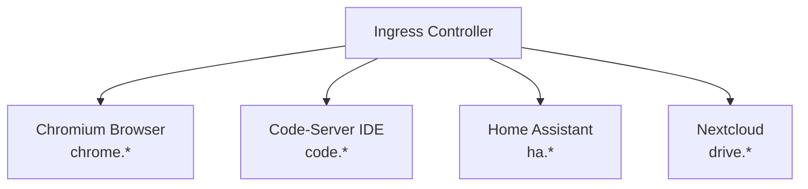

> ⚠️ **PREVIEW** – Dieser Inhalt befindet sich noch in Arbeit und kann noch Änderungen unterliegen.

## Worum geht es?

Diese Schulung vermittelt in zwei Tagen praxisorientiert die Grundlagen von Kubernetes. Der Fokus
liegt nicht auf dem Auswendiglernen von Begriffen, sondern auf dem eigenständigen Aufbau einer
funktionierenden Container-Plattform -- Schritt für Schritt, im eigenen Cluster.

Kubernetes ist die de-facto-Standardplattform für Container-Orchestrierung in der modernen
IT-Infrastruktur. Wer Container-Anwendungen zuverlässig betreiben, skalieren und verwalten möchte,
kommt an Kubernetes nicht vorbei.

## Was entsteht am Ende?

Am Ende der zwei Tage läuft eine vollständige Plattform mit vier echten Anwendungen im eigenen
Kubernetes-Cluster -- alle hinter einem gemeinsamen Ingress-Controller erreichbar:

| Anwendung        | Image                                  | URL                                |
| ---------------- | -------------------------------------- | ---------------------------------- |
| Chromium Browser | `lscr.io/linuxserver/chromium`         | chrome.k8s-training.frickeldave.de |
| Code-Server IDE  | `lscr.io/linuxserver/code-server`      | code.k8s-training.frickeldave.de   |
| Home Assistant   | `lscr.io/linuxserver/homeassistant`    | ha.k8s-training.frickeldave.de     |
| Nextcloud        | `lscr.io/linuxserver/nextcloud`        | drive.k8s-training.frickeldave.de  |

Alle Anwendungen stammen von [linuxserver.io](https://www.linuxserver.io/) -- einer Community, die
standardisierte, gut dokumentierte Docker-Images pflegt. Sie liefern sofort visuelle Web-UIs und
machen Fortschritte im Cluster direkt sichtbar.

## Für wen ist diese Schulung?

Die Schulung richtet sich an IT-Professionals, die Kubernetes im Berufsalltag einsetzen wollen:
Entwickler, DevOps-Engineers und Systemadministratoren mit Linux-Grundkenntnissen und einem
Grundverständnis von Containern (Docker-Basics).

Kubernetes-Vorkenntnisse sind nicht erforderlich -- die Schulung beginnt bei null und baut alle
Konzepte schrittweise auf.

## Wie ist die Schulung aufgebaut?

| Tag   | Schwerpunkt                   | Ergebnis am Tagesende                              |
| ----- | ----------------------------- | -------------------------------------------------- |
| Tag 1 | Grundlagen & erste Schritte   | Chromium und Code-Server laufen im Cluster         |
| Tag 2 | Produktionsreife & Vernetzung | Alle vier Anwendungen laufen hinter Ingress        |

Lernziele und didaktisches Konzept: [02 Ziele / Methoden](/docs/kubernetes-basis/02-ziele-methoden).
