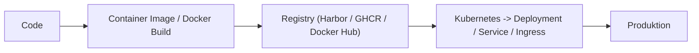

import { Image } from "astro:assets";
import knba10002 from "@assets/docs/kubernetes-basis/knba-10-002.png";
import knba10003 from "@assets/docs/kubernetes-basis/knba-10-003.png";
import knba10004 from "@assets/docs/kubernetes-basis/knba-10-004.png";
import Notice from "@shortcodes/Notice";

## Grundlagen & Einstieg

Willkommen zum ersten Tag der Kubernetes-Schulung. Heute legen wir das Fundament: Ihr lernt die
Architektur kennen, arbeitet euch in `kubectl` ein und deployt zwei echte Anwendungen -- einen
Browser (Chromium) und eine Entwicklungsumgebung (Code-Server) -- direkt im Cluster.

## Zeitplan

| Zeit / Schedule | Block                | Inhalt                                                  |
| --------------- | -------------------- | ------------------------------------------------------- |
| 09:00 – 09:30   | Begrüßung            | Vorstellungsrunde, Ziele, Vorschau Endprodukt           |
| 09:30 – 10:30   | Theorie              | Kubernetes Architektur & Komponenten                    |
| 10:30 – 10:45   | **Pause**            |                                                         |
| 10:45 – 11:30   | Theorie              | Kubernetes-Objekte: Pod, Deployment, Service, Namespace |
| 11:30 – 12:30   | Erste Schritte       | Cluster erkunden, kubectl Basics, Namespace anlegen     |
| 12:30 – 13:30   | **Mittagspause**     |                                                         |
| 13:30 – 14:30   | Chromium deployen    | Erstes Deployment (imperativ), Pods beobachten          |
| 14:30 – 15:15   | Theorie              | YAML-Grundlagen, Imperativ vs. Deklarativ               |
| 15:15 – 15:30   | **Pause**            |                                                         |
| 15:30 – 16:15   | Chromium deklarativ  | Deployment & Service per YAML, /dev/shm-Volume          |
| 16:15 – 17:00   | Code-Server deployen | Deployment & Service per YAML (deklarativ)              |
| 17:00 – 17:30   | Services & Abschluss | NodePort, Port-Forwarding, Ingress, Zusammenfassung     |

---

## Begrüßung

### Was ist Kubernetes?

Kubernetes (K8s) ist eine Open-Source-Plattform zur **Automatisierung von Deployment, Skalierung und
Verwaltung** von Container-Anwendungen. Ursprünglich von Google entwickelt, wird es heute von der
Cloud Native Computing Foundation (CNCF) gepflegt.

### Warum Kubernetes?

Kubernetes wird eingesetzt, um containerisierte Anwendungen zuverlässig, automatisiert und skalierbar
zu betreiben. Statt jeden Container manuell auf einem Server zu starten und bei Ausfällen selbst
einzugreifen, übernimmt Kubernetes die gesamte Orchestrierung: Es verteilt Container intelligent
auf verfügbare Maschinen, startet ausgefallene Container automatisch neu, skaliert Anwendungen bei
Bedarf hoch oder runter und ermöglicht Updates ohne Ausfallzeit. Besonders in Microservice-Architekturen
mit vielen Diensten, die sich gegenseitig beeinflussen, entfaltet Kubernetes seine Stärke -- es
entkoppelt die Teams von der zugrunde liegenden Infrastruktur und schafft einen einheitlichen,
wiederholbaren Betriebsstandard, egal ob on-premises, in der Cloud oder im Hybridbetrieb.

### Wann kein Kubernetes?

<Image src={knba10004} alt="Why not Kubernetes * Erstellt mit Microsoft Copilot" />

Kubernetes ist nicht immer die richtige Wahl. Für einfache Webanwendungen, monolithische Systeme
oder kleine Projekte mit nur einem oder wenigen Containern ist der Betriebsaufwand oft
unverhältnismäßig hoch -- ein einzelner Server mit Docker Compose oder eine Platform-as-a-Service
(PaaS) wie Heroku, Fly.io oder Railway liefern hier schneller und mit weniger Komplexität.
Auch wenn kein Team mit DevOps-Know-how vorhanden ist, kann Kubernetes schnell zur
Wartungsfalle werden: Die Lernkurve ist steil, und die tägliche Administration (Updates,
Troubleshooting, Netzwerk, Storage) erfordert spezialisiertes Wissen. Ebenso wenig geeignet ist
Kubernetes für Stateful-Workloads mit hohen I/O-Anforderungen (z. B. große Datenbanken), bei denen
ein klassischer Bare-Metal-Server oder eine verwaltete Datenbank die bessere Performance und
einfachere Handhabung bietet. Faustregel: Erst ab etwa 5-10 (Micro-)services oder wenn
Automatisierung, Skalierung und Ausfallsicherheit explizite Anforderungen sind, lohnt sich der
Einstieg in Kubernetes.

### Wozu K8s?

- **[Container-Orchestrierung](/docs/kubernetes-basis/90-glossar#container-orchestrierung)** -- Verwaltung hunderter Container über mehrere Server
- **[Self-Healing](/docs/kubernetes-basis/90-glossar#self-healing)** -- Automatischer Neustart ausgefallener Container
- **[Skalierung](/docs/kubernetes-basis/90-glossar#skalierung)** -- Hoch- und Runterskalieren per Befehl oder automatisch
- **[Rolling Updates](/docs/kubernetes-basis/90-glossar#rolling-updates)** -- Anwendungen ohne Ausfallzeit aktualisieren
- **[Service Discovery](/docs/kubernetes-basis/90-glossar#service-discovery)** -- Automatische Namensauflösung zwischen Anwendungen

### DevOps-Workflow

In der Praxis durchläuft jede Anwendung einen klar definierten Weg von der Entwicklung bis zur
Produktion -- Kubernetes übernimmt dabei die Rolle des zentralen Auslieferungssystems:



---

## Grundkonzepte

### Analogie

Um Kubernetes-Konzepte leichter zu verstehen, nutzen wir eine **Analogie zu einem Logistikzentrum**.
Genau wie ein Logistikzentrum Pakete verwaltet -- es entscheidet, wo sie lagern, wie sie
transportiert werden, und sorgt automatisch dafür, dass alles am richtigen Ort ankommt -- übernimmt
Kubernetes diese Aufgaben für Container-Anwendungen.

Bezogen auf den DevOps-Workflow oben: Der Entwickler baut das Paket (`docker build`), legt es ins
Lager (Registry), und das Logistikzentrum (Kubernetes) übernimmt von dort die Auslieferung an den
Empfänger (Produktion) -- zuverlässig, automatisch und mit Self-Healing bei Problemen.

| Kubernetes-Konzept | Analogie                 | Beschreibung                                                              |
| ------------------ | ------------------------ | ------------------------------------------------------------------------- |
| [**Cluster**](/docs/kubernetes-basis/90-glossar#cluster)        | Gesamtes Logistikzentrum | Alle Maschinen und Ressourcen, die zusammenarbeiten                       |
| [**Control Plane**](/docs/kubernetes-basis/90-glossar#control-plane)  | Büro / Zentrale          | Trifft alle Entscheidungen: was läuft wo, was passiert bei Problemen      |
| [**Worker Node**](/docs/kubernetes-basis/90-glossar#worker-node)    | Arbeitsplatz / LKW       | Die Maschine, auf der Container tatsächlich laufen                        |
| [**Pod**](/docs/kubernetes-basis/90-glossar#pod)            | Paket / Liefereinheit    | Kleinste deploybare Einheit, enthält einen oder mehrere Container         |
| [**Deployment**](/docs/kubernetes-basis/90-glossar#deployment)     | Arbeitsanweisung         | Beschreibt den gewünschten Zustand ("2 Chromium-Instanzen sollen laufen") |
| [**Service**](/docs/kubernetes-basis/90-glossar#service)        | Telefonnummer            | Stabile Adresse, über die eine Anwendung erreichbar bleibt                |
| [**Namespace**](/docs/kubernetes-basis/90-glossar#namespace)      | Abteilung                | Logische Trennung innerhalb eines Clusters                                |

### Cluster-Architektur

<Image src={knba10002} alt="Kubernetes Architektur * Erstellt mit Microsoft Copilot" />

Ein Kubernetes-Cluster besteht aus zwei Bereichen: der **Control Plane**, die das gesamte Cluster
steuert, und den **Worker Nodes**, auf denen die Anwendungen tatsächlich laufen. Alle Komponenten
kommunizieren ausschließlich über den API-Server miteinander.

### Control Plane

Die Control Plane ist das Gehirn des Clusters. Sie überwacht den Zustand aller Ressourcen und sorgt
dafür, dass der gewünschte Soll-Zustand immer mit dem tatsächlichen Ist-Zustand übereinstimmt.

| Komponente                  | Funktion                                                     |
| --------------------------- | ------------------------------------------------------------ |
| [**kube-apiserver**](/docs/kubernetes-basis/90-glossar#kube-apiserver)          | Zentraler Einstiegspunkt. Jeder kubectl-Befehl geht hierhin. |
| [**etcd**](/docs/kubernetes-basis/90-glossar#etcd)                    | Key-Value-Datenbank. Speichert den gesamten Cluster-Zustand. |
| [**kube-scheduler**](/docs/kubernetes-basis/90-glossar#kube-scheduler)          | Entscheidet, auf welchem Node ein neuer Pod laufen soll.     |
| [**kube-controller-manager**](/docs/kubernetes-basis/90-glossar#kube-controller-manager) | Gleicht Ist-Zustand ständig mit Soll-Zustand ab.             |
| [**CoreDNS**](/docs/kubernetes-basis/90-glossar#coredns)              | DNS-Service für Service Discovery. Übersetzt Service-Namen in ClusterIPs, liest aktuell von etcd. |

### Worker Nodes

Worker Nodes sind die Maschinen, auf denen die eigentlichen Workloads laufen. Jeder Node enthält
drei Kernkomponenten, die eng mit der Control Plane zusammenarbeiten.

| Komponente            | Funktion                                                          |
| --------------------- | ----------------------------------------------------------------- |
| [**kubelet**](/docs/kubernetes-basis/90-glossar#kubelet)           | Agent auf jedem Node. Sorgt dafür, dass Container in Pods laufen. |
| [**kube-proxy**](/docs/kubernetes-basis/90-glossar#kube-proxy)        | Netzwerk-Proxy. Verwaltet Netzwerkregeln für Services.            |
| [**Container Runtime**](/docs/kubernetes-basis/90-glossar#container-runtime) | Führt Container aus (z. B. containerd, CRI-O).                     |

### Optional: Add-ons & Erweiterungen

Es gibt weitere optionale Komponenten, die Kubernetes erweitern, aber nicht immer installiert sein müssen:

- **Ingress Controller** — Verwaltet HTTP(S)-Routing zu Services (elegantere Alternative zu NodePort)
- **Metrics Server** — Sammelt CPU- und Memory-Metriken von Nodes und Pods (nötig für `kubectl top` und Autoskalierung)
- **Dashboard** — Web-UI zur Verwaltung des Clusters

---

## Erste Schritte

Jetzt wird's praktisch. In diesem Block verbindest du dich zum ersten Mal mit dem Cluster und lernst
die wichtigsten `kubectl`-Befehle kennen. Am Ende richtest du deinen eigenen Namespace ein, in dem
alle weiteren Übungen stattfinden.

<Notice type="info">
  Die Einrichtung von kubectl ist schon in den [Vorbereitungen](./03-vorbereitung) erledigt worden. 
</Notice>

### Cluster erkunden

Mit diesen Befehlen verschaffst du dir einen ersten Überblick über deinen Cluster -- welche Nodes
vorhanden sind, was läuft und wie der aktuelle Kontext konfiguriert ist.

```bash
# Cluster-Verbindung prüfen
kubectl cluster-info

# Alle Nodes anzeigen
kubectl get nodes

# Detaillierte Node-Informationen
kubectl describe node <node-name>

# Kubernetes-Version
kubectl version

# Aktuelle Konfiguration anzeigen
kubectl config view
kubectl config current-context
```

### Namespaces

Namespaces sind logische Trennungen innerhalb eines Clusters. Sie ermöglichen es, Ressourcen
verschiedener Teams, Projekte oder Umgebungen (z. B. `dev`, `staging`, `prod`) voneinander zu
isolieren, ohne separate Cluster betreiben zu müssen. Berechtigungen und Ressourcenlimits lassen
sich pro Namespace vergeben.

```bash
# Vorhandene Namespaces anzeigen
kubectl get namespaces
```

Standard-Namespaces:

| Namespace         | Zweck                                                   |
| ----------------- | ------------------------------------------------------- |
| `default`         | Standard-Namespace für Objekte ohne explizite Zuordnung |
| `kube-system`     | Kubernetes-Systemkomponenten                            |
| `kube-public`     | Öffentlich lesbare Daten (z. B. Cluster-Info)            |
| `kube-node-lease` | Node-Heartbeat-Daten                                    |

### Imperativ vs. Deklarativ

Kubernetes bietet zwei Wege, Ressourcen zu erstellen:

- **Imperativ**–Du gibst konkrete Befehle, die sofort ausgeführt werden.
  Beispiel: `kubectl create namespace k8s-training`
  Ideal für schnelle Tests und Experimente.

- **Deklarativ**–Du definierst den gewünschten Zustand in einer YAML-Datei
  und lässt Kubernetes diesen Zustand herstellen.
  Beispiel: `kubectl apply -f namespace.yaml`
  Der Standard in der Praxis, da Manifeste versioniert, geteilt und reviewed
  werden können.
<br/>
In diesem Tag siehst du beide Ansätze im Vergleich–beginnend mit dem
imperativen Weg für einen schnellen Einstieg.
<br/>
**Eigenen Namespace erstellen (imperativ):**

<Notice type="info">
<br/>
  Eventuell hast du bereits einen Cluster-Zugang über deine Firma erhalten und auch schon einen Namespace zugewiesen
  bekommen. In dem Fall ist es oft nicht möglich einen Namespace anzulegen. Das folgende Kapitel dient dann nur zur 
  Veranschaulichung. In den folgenden Kapiteln kannst du den hier verwendeten namespace-name `k8s-training` mit dem 
  für dich vergebenen Namen ersetzen.
</Notice>

```bash
kubectl create namespace k8s-training
```
<br/>
**Eigenen Namespace erstellen (deklarativ):**

Lege zuerst ein Arbeitsverzeichnis an. Dies kann (muss aber nicht) auch ein git-repository sein. Dieses Arbeitsverzeichnis
nutzen wir in Zukunft für alle weiteren Übungen. 

Datei `namespace.yaml`:

```yaml
apiVersion: v1
kind: Namespace
metadata:
  name: k8s-training
  labels:
    purpose: kubernetes-schulung
```

```bash
kubectl apply -f namespace.yaml
```

<br/>
<Notice type="info">
  Eventuell bekommst du bei einem vorab angelegten namespace die folgende Meldung: 
  <br/>  
  *Warning: resource `namespaces/YOUR NAMESPACE` is missing the kubectl.kubernetes.io/last-applied-configuration annotation which is required by kubectl apply. kubectl apply should only be used on resources created declaratively by either kubectl create --save-config or kubectl apply. The missing annotation will be patched automatically.*
  <br/>
  Die Warnung bedeutet, dass der Namespace zwar erfolgreich konfiguriert wurde, aber ursprünglich nicht mit kubectl apply oder kubectl create --save-config angelegt wurde, weshalb Kubernetes die benötigte interne Konfigurations‑Annotation automatisch nachträgt.
</Notice>

**Standard-Namespace setzen:**

```bash
kubectl config set-context --current --namespace=k8s-training
```

Ab jetzt arbeiten alle Befehle automatisch im Namespace `k8s-training`.

> ⚠️ **HINWEIS**–In einem Cluster das dir von deiner Firma zur Verfügung gestellt wird, ist es ggf. nicht möglich
einen Namespace zu erstellen. In diesem Fall arbeiten wir in dem Workspace weiter, der Dir zugewiesen wurde.

### Übung 1

1. Zeige alle Nodes des Clusters an. Welche Rollen haben sie?
   > **Erwartete Ausgabe:** Nodes mit Rolle `control-plane` für den Master-Node und `<none>` (= Worker Node) für die Worker-Nodes.
2. Erstelle den Namespace `k8s-training` (wenn möglich).
3. Setze `k8s-training` als Standard-Namespace (wenn möglich) mit `kubectl config set-context --current --namespace=<DEIN NAMESPACE>`.
4. Prüfe mit `kubectl get pods`, dass der Namespace leer ist.
5. Zeige alle System-Pods im Namespace `kube-system` an: `kubectl get pods -n kube-system`

---

## Chromium deployen

In diesem Block deployen wir einen vollständigen Browser (Chromium) im Cluster -- imperativ, also
direkt per Kommandozeile.

### Was ist ein Deployment?

Ein **Deployment** ist eine der wichtigsten Ressourcen in Kubernetes. Es beschreibt den
**gewünschten Zustand** für eine Anwendung:

- **Wie viele Pods** sollen laufen? (Replicas)
- **Welches Image** soll verwendet werden?
- **Wie sollen die Pods** konfiguriert sein? (Umgebungsvariablen, Ports, Volumes)

Das Deployment überwacht ständig den tatsächlichen Zustand und sorgt dafür, dass er mit dem
gewünschten Zustand übereinstimmt. Wenn ein Pod abstürzt oder gelöscht wird, erstellt das
Deployment automatisch einen neuen -- das ist **Self-Healing**.

**Analogie zum Logistikzentrum:**

Stell dir ein Deployment wie eine **Arbeitsanweisung im Logistikzentrum** vor:
*"Im Lager müssen immer 2 fertige Pakete (Pods) bereitliegen. Wenn eines
versendet wird (ausfällt), muss sofort ein neues gepackt werden."*

Der Lagerleiter (Kubernetes-Control-Plane) überwacht ständig die Anzahl der
fertigen Pakete. Fällt ein Paket weg, packt er sofort ein neues -- ohne dass
jemand manuell eingreifen muss.

Zusammengefasst: Ein Deployment ist die "Arbeitsanweisung" für Kubernetes, die sagt:
*"Ich will, dass diese Anwendung genau so läuft."*

### Imperativ

```bash
kubectl create deployment chromium --image=lscr.io/linuxserver/chromium:latest --replicas=1
```

**Deployment überschreiben (mit neuem Image oder Replicas):**

Wenn du das Deployment ändern möchtest (z. B. anderes Image oder andere Anzahl Replicas), nutze `kubectl set image` oder `kubectl scale`:

```bash
# Zu anderer Version upgraden (z. B. latest → v2.0)
kubectl set image deployment/chromium chromium=lscr.io/linuxserver/chromium:v2.0

# Anzahl der Replicas ändern
kubectl scale deployment chromium --replicas=3

```

**Deployment löschen:**

```bash
# Deployment + alle dazugehörigen Pods löschen
kubectl delete deployment chromium
```

> ⚠️ **WICHTIG:** `kubectl delete deployment` löscht auch alle Pods, die von diesem Deployment verwaltet wurden! Die Daten in den Pods gehen verloren (außer wenn Volumes verwendet werden).


### Status prüfen

```bash
# Deployment-Status prüfen
kubectl get deployments

# Pods anzeigen
kubectl get pods
kubectl get pods -o wide

# Detaillierte Deployment-Informationen
kubectl describe deployment chromium

# Prüfen ob der container auf port 3000 lauscht
kubectl exec -it deploy/chromium -- curl -I http://localhost:3000

```

### Self-Healing Demo

Kubernetes sorgt dafür, dass der gewünschte Zustand (1 Replica) immer eingehalten wird:

```bash
# Pods beobachten (in einem Terminal)
kubectl get pods -w

# In einem zweiten Terminal: Pod absichtlich löschen
kubectl delete pod <pod-name>

# Beobachten: Kubernetes erstellt automatisch einen neuen Pod!
```

### Service einrichten

Jetzt machen wir Chromium von außen erreichbar. Wir erstellen einen **NodePort-Service** imperativ.

<br/>

```bash
kubectl expose deployment chromium \
  --type=NodePort \
  --name=chromium \
  --port=4000 \
  --target-port=3000
```
<br/>

**Wichtige Unterscheidung:**

- **`--port=4000`**: Port, den der Service **im Cluster** anhört (für Pods intern)
- **`--target-port=3000`**: Port, an dem der **Container** lauscht
- **NodePort**: Port, der auf den **Nodes** geöffnet wird (externer Zugriff) -- automatisch im 
  Bereich 30000-32767
<br/>

<Image src={knba10003} alt="Node service Kommunikation * Erstellt mit Microsoft Copilot" />


<br/>

**Was ist die ClusterIP?**

Die **ClusterIP** ist eine **interne, stabile IP-Adresse** des Service. Sie ist der
zentrale Endpunkt, der immer gleich bleibt -- egal wie oft Pods neu erstellt werden oder sich ihre
IP-Adressen ändern.

**Der NodePort leitet an die ClusterIP weiter** -- das ist der "eigentliche" Service. Der NodePort ist
nur die **externe Eintrittsstelle** für Traffic von außen.

```bash
kubectl get service chromium
# Ausgabe: chromium   NodePort   10.43.25.123   3000:30123/TCP   ...
#                        ^^^^^^^^^^^ Das ist die ClusterIP (intern)
#                                   ^^^^^^^ Das ist der NodePort (extern)
```

**Warum braucht man die ClusterIP?**

- **Stabilität:** Die ClusterIP bleibt immer gleich, auch wenn Pods sich ändern
- **Interne Kommunikation:** Andere Pods im Cluster erreichen den Service über die ClusterIP (ohne NodePort)
- **Abstraktion:** Der NodePort ist nur ein "Zugangstor" -- die eigentliche Logik liegt in der ClusterIP

**Ohne ClusterIP** müsste jeder externe Client direkt die Pod-IPs kennen -- die sich aber ständig
ändern! Die ClusterIP ist der **stabile Vermittler**.

**Analogie zum Logistikzentrum:**

Stell dir den NodePort-Service wie einen **Anruf im Logistikzentrum** vor:

1. **Externer Kunde** ruft das Logistikzentrum an (dein Browser ruft `Node-IP:3xxxx` auf)
2. **Außennummer (NodePort)**–Der Kunde wählt die öffentliche Durchwahl 3xxxx (der automatisch zugewiesene NodePort)
3. **Empfang am Node**–Ein Worker-Node nimmt den Anruf entgegen (kube-proxy auf diesem Node)
4. **Interne Leitstelle (Service/ClusterIP:4000)**–Der Empfang leitet den Anruf an die zentrale Service-Leitstelle weiter
5. **Mitarbeiter-Zuweisung (Pod)**–Die Leitstelle sucht sich einen freien Mitarbeiter (einen Pod) aus
6. **Arbeitsplatz (targetPort=3000)**–Der Mitarbeiter wird an seinem Arbeitsplatz (Container-Port 3000) erreicht
7. **Rückantwort**–Die Antwort des Mitarbeiters geht über die Leitstelle und den Empfang zurück zum Kunden

> 💡 **Merke:** Genau wie im Logistikzentrum gibt es eine **stabile Durchwahl** (Service), die immer
> erreichbar ist–egal welcher Mitarbeiter (Pod) gerade die Anfrage bearbeitet!

Kubernetes wählt automatisch einen NodePort im Bereich 30000-32767. Prüfe den **tatsächlichen** zugewiesenen Port:

Nun musst du 3 Dinge tun, um deinen Container zu erreichen: 

1: Finde den node port heraus
2: Finde die IP-Adresse eines Worker-Nodes heraus
3: Öffne die URL im Browser (oder curl oder powershell)

```bash
kubectl get nodes -o wide
kubectl get service chromium
curl -L http://<Node-IP>:<NodePort> # Linux
Invoke-WebRequest -Uri http://<Node-IP>:<NodePort> -Method Head # Windows
``` 
Hier gibt es eine schlechte Nachricht, in vielen k8s Umgebungen kann auf diese Weise nicht auf den NodePort zugegriffen werden, da die Firewall oder das Netzwerk dies blockiert. In diesem Fall muss ein Ingress eingerichtet werden, was wir in Tag 2 behandeln. Aber das soll uns echte Broffis ja nicht aufhalten. 

Wir basteln uns nun einen kleinen Container im Cluster, von dem aus wir den Chromium-Container erreichen können. 

```bash
kubectl run -it --rm debug --image=alpine:latest -- sh
apk add curl
curl -L http://chromium:4000
wget -qO- http://<Node-IP>:<NodePort>
exit
```

Den chromium erreichbar machen, machen zum Problem vom "Später-Ich".

### Konfiguration nachbessern

Container von [linuxserver.io](https://www.linuxserver.io/) erwarten bestimmte Umgebungsvariablen
für Benutzer-ID, Gruppen-ID und Zeitzone. Ohne diese laufen die Container zwar, aber mit
`root`-Rechten und falscher Zeitzone.

```bash
kubectl set env deployment/chromium PUID=1000 PGID=1000 TZ=Europe/Berlin
```

> ⚠️ **WICHTIG:** Dieser Befehl setzt die Umgebungsvariablen **nur für das Deployment `chromium`**,
> nicht für den gesamten Namespace oder andere Deployments. Jede Anwendung muss separat
> konfiguriert werden.

Nach dem Setzen der Umgebungsvariablen erstellt Kubernetes automatisch neue Pods mit der
aktualisierten Konfiguration:

```bash
# Warte, bis der neue Pod ready ist
kubectl get pods -w
```

### Überprüfung

Prüfe, ob die Umgebungsvariablen erfolgreich gesetzt wurden:

```bash
# Alle Umgebungsvariablen des Deployments anzeigen
kubectl exec <pod-name> -- env | grep -E "PUID|PGID|TZ"

# Erwartete Ausgabe:
# PUID=1000
# PGID=1000
# TZ=Europe/Berlin
```

Jetzt sollte Chromium korrekt funktionieren!

### Übung 2

1. Prüfe den Status des Chromium-Deployments mit `kubectl get deployment chromium`.
2. Lösche den Pod und beobachte, wie Kubernetes ihn automatisch neu erstellt.
3. Öffne Chromium im Browser unter `http://<Node-IP>:3xxxx` -- was siehst du?
4. Setze die Umgebungsvariablen mit `kubectl set env deployment/chromium PUID=1000 PGID=1000 TZ=Europe/Berlin`.
5. Warte, bis der neue Pod ready ist (`kubectl get pods -w`).
6. Überprüfe die Umgebungsvariablen mit `kubectl exec <pod-name> -- env | grep -E "PUID|PGID|TZ"`.
7. Öffne Chromium erneut im Browser -- funktioniert es jetzt?

> Wir haben Chromium erfolgreich imperativ deployed. Das funktioniert gut für schnelle Experimente --
> aber in der Praxis wird fast ausschließlich deklarativ mit YAML-Dateien gearbeitet. Im nächsten
> Block siehst du, warum: YAML-Manifeste lassen sich versionieren, wiederverwenden und im Team
> reviewen.

---

## YAML & Deklarativ

### Vergleich

| Ansatz         | Beschreibung                | Beispiel                           |
| -------------- | --------------------------- | ---------------------------------- |
| **Imperativ**  | "Tue dies jetzt"            | `kubectl create deployment ...`    |
| **Deklarativ** | "Gewuenschter Soll-Zustand" | `kubectl apply -f deployment.yaml` |

In der Praxis wird fast ausschließlich deklarativ gearbeitet -- YAML-Manifeste werden in Git
versioniert und per `kubectl apply` angewendet.

### YAML-Grundstruktur

Jedes Kubernetes-Manifest besteht aus vier Hauptteilen:

| Feld         | Bedeutung                                               |
| ------------ | ------------------------------------------------------- |
| `apiVersion` | API-Version der Ressource (z. B. `v1`, `apps/v1`)        |
| `kind`       | Art der Ressource (z. B. `Pod`, `Deployment`, `Service`) |
| `metadata`   | Metadaten: Name, Namespace, Labels                      |
| `spec`       | Spezifikation: der gewünschte Zustand                   |

### YAML-Regeln

- Einrückung mit **Leerzeichen** (keine Tabs!)
- Listen beginnen mit `-`
- Key-Value-Paare mit `:`
- Strings brauchen normalerweise keine Anführungszeichen

### kubectl explain

**Dokumentation direkt in der Kommandozeile:**

Du wirst oft fragen haben wie ein Kubernetes-Objekt aufgebaut ist oder welche Felder es gibt. Mit `kubectl explain` kannst du die offizielle Dokumentation **direkt in der Kommandozeile** abrufen, ohne im Browser nachzuschlagen. Das Tool zeigt dir die Struktur von Kubernetes-Ressourcen, ihre Felder und deren Beschreibung — sehr hilfreich beim Schreiben von YAML-Manifesten!

```bash
kubectl explain pod
kubectl explain pod.spec
kubectl explain pod.spec.containers
kubectl explain deployment.spec.strategy
```

---

### Chromium neu aufbauen (Imperativ → Deklarativ)

Jetzt bauen wir Chromium von Grund auf **deklarativ** auf -- das heißt, wir löschen zuerst alles,
was wir imperativ erstellt haben, und erstellen es dann sauber per YAML neu.

```bash
# Deployment + alle dazugehörigen Pods löschen
kubectl delete deployment chromium

# Service löschen
kubectl delete service chromium
```

> ⚠️ **WICHTIG:** Diese Befehle sind endgültig! Alle Pods und Daten gehen verloren (sofern keine
> Volumes verwendet werden). In Produktionsumgebungen solltest du vor dem Löschen ein Backup machen.

Prüfe, dass alles weg ist:

```bash
kubectl get deployments
kubectl get services
kubectl get pods
# Chromium sollte nirgends mehr auftauchen!
```

### Chromium deklarativ neu anlegen

Jetzt erstellen wir Chromium **deklarativ** mit einer YAML-Datei. Das ist deutlich wartbarer,
weil die Konfiguration versioniert und im Team geteilt werden kann.

Datei `chromium-deployment.yaml`:

```yaml
apiVersion: apps/v1
kind: Deployment
metadata:
  name: chromium
  namespace: k8s-training
  labels:
    app: chromium
spec:
  replicas: 1
  selector:
    matchLabels:
      app: chromium
  template:
    metadata:
      labels:
        app: chromium
    spec:
      containers:
        - name: chromium
          image: lscr.io/linuxserver/chromium:latest
          ports:
            - containerPort: 3000
            - containerPort: 3001
          env:
            - name: PUID
              value: "1000"
            - name: PGID
              value: "1000"
            - name: TZ
              value: "Europe/Berlin"

```

**Datei `chromium-service.yaml`:**

```yaml
apiVersion: v1
kind: Service
metadata:
  name: chromium
  namespace: k8s-training
spec:
  type: NodePort
  selector:
    app: chromium
  ports:
    - name: http
      protocol: TCP
      port: 4000
      targetPort: 3000
```

**Anwenden:**

```bash
# Deployment erstellen
kubectl apply -f chromium-deployment.yaml

# Service erstellen
kubectl apply -f chromium-service.yaml

# Status prüfen
kubectl get deployments
kubectl get services
kubectl get pods
kubectl run -it --rm debug --image=alpine:latest -- sh 
# Anschliessend folgendes ausführen
# wget -qO- http://<Node-IP>:<NodePort>

```

> 💡 **Vergleich:** Mit einem Befehl `kubectl apply` erstellst du sowohl Deployment als auch Service
> konsistent und reproduzierbar. Das imperativ erstellte Chromium war anfällig für Fehler und ließ
> sich nicht leicht dokumentieren. Mit YAML-Dateien können mehrere Entwickler gemeinsam arbeiten und
> die Konfiguration im Git versionieren.

FÜge nun noch die Volumes für `/dev/shm` hinzu, damit Chromium stabil läuft. 
Chromium nutzt Shared Memory für das Rendering von Webseiten. Ohne ein
ausreichend großes `/dev/shm` stürzt der Browser ab oder zeigt leere Seiten. Durch `medium: Memory`
wird das Volume im RAM angelegt -- schnell und genau richtig für temporäre Rendering-Daten.

```yaml
apiVersion: v1
kind: Service
metadata:
  ...
spec:
  ...
    spec:
      containers:
        - name: chromium
          ...
          volumeMounts:
            - name: shm
              mountPath: /dev/shm
      volumes:
        - name: shm
          emptyDir:
            medium: Memory
            sizeLimit: 1Gi
```

Anschließend erneut anwenden:

```bash
kubectl apply -f chromium-deployment.yaml
```

Mit `kubectl get pods` kannst du prüfen, dass der neue Pod läuft.

## Code-Server deployen

Nun wird der zweite container im Cluster deployed: Code-Server. Das ist eine Entwicklungsumgebung, die im Browser läuft und auf dem Cluster-Node ausgeführt wird.

### Code-Server YAML

Datei `code-server-deployment.yaml`:

```yaml
apiVersion: apps/v1
kind: Deployment
metadata:
  name: code-server
  namespace: k8s-training
  labels:
    app: code-server
spec:
  replicas: 1
  selector:
    matchLabels:
      app: code-server
  template:
    metadata:
      labels:
        app: code-server
    spec:
      containers:
        - name: code-server
          image: lscr.io/linuxserver/code-server:latest
          ports:
            - containerPort: 8443
          env:
            - name: PUID
              value: "1000"
            - name: PGID
              value: "1000"
            - name: TZ
              value: "Europe/Berlin"
            - name: PASSWORD
              value: "training2024"
            - name: DEFAULT_WORKSPACE
              value: "/config/workspace"
          volumeMounts:
            - name: config
              mountPath: /config
      volumes:
        - name: config
          emptyDir: {}
```

Datei `code-server-service.yaml`:

```yaml
apiVersion: v1
kind: Service
metadata:
  name: code-server
  namespace: k8s-training
spec:
  type: NodePort
  selector:
    app: code-server
  ports:
    - name: http
      protocol: TCP
      port: 8443
      targetPort: 8443
```

> ⚠️ **Nur für die Schulung:** Passwörter gehören in der Praxis niemals als Klartext in
> YAML-Manifeste. Kubernetes bietet dafür
> [Secrets](https://kubernetes.io/docs/concepts/configuration/secret/). Für diese Schulung
> vereinfachen wir bewusst.

### Anwenden

```bash
kubectl apply -f code-server-deployment.yaml
kubectl apply -f code-server-service.yaml

# Status prüfen
kubectl get deployments
kubectl get pods
```

### Übung 3

1. Prüfe, dass beide Deployments laufen: `kubectl get deployments`
2. Vergleiche die beiden YAML-Dateien: Welche Unterschiede gibt es bei Ports, Umgebungsvariablen und
   Volumes?
3. Ändere das Passwort des Code-Servers in der YAML-Datei (z. B. auf `meinPasswort`) und wende die
   Änderung an: `kubectl apply -f code-server-deployment.yaml`
4. Nutze `kubectl explain pod.spec.volumes` um herauszufinden, welche Volume-Typen es gibt.

## Container erreichbar machen

Natürlich ist es nicht die Idee, immer die Node-IP und den NodePort zu verwenden, um auf die Container zuzugreifen. 
Es gibt verschiedene Möglichkeiten, wie du die beiden Container nun von außen erreichen kannst.

### Port-Forwarding

Für lokale schnelle Tests kannst du Port-Forwarding nutzen. Damit leitest du einen Port auf deinem lokalen Rechner direkt an den Service im Cluster weiter. So kannst du Chromium und Code-Server bequem im Browser öffnen, ohne die Node-IP und den NodePort zu kennen.

```shell
# Terminal 1: Chromium (läuft dann auf http://localhost:4000)
kubectl port-forward -n k8s-training svc/chromium 4000:4000

# Terminal 2: Code-Server (läuft dann auf http://localhost:8443)
kubectl port-forward -n k8s-training svc/code-server 8443:8443
```

### Ingress route via Rancher dashboard

- Service Discovery -> Ingresses -> Create
  - Namespace: k8s-training
  - Name: chromium-ingress
  - Rules:
    - Request Host: chromium-*.*.com
      - Muss wahrscheinlich gemäß von Regeln erweitert werden, z.B. [hostname]-[namespace].[clustername].[dnsdomainname]
      - Versuchs einfach anzulegen -> Wird schon meckern ;-)
    - Path Prefix: /
    - Target Service: chromium
    - Port: 4000

Ist die ingress route angelegt, kannst du im Browser die URL aufrufen, die du in der Ingress-Regel als Request-Host angegeben hast.
Es sollte nun ein chrome-browser im tab erscheinen. Dieser chrome Browser bietet dir die Möglichkeit Websiten zu öffnen, die nur innerhalb
des Clusters erreichbar sind.

### Ingress route über kubectl anlegen

Alternativ zum Rancher-Dashboard kannst du die Ingress-Route auch direkt per `kubectl` anlegen.

#### Imperativ

```bash
# Code-Server Ingress anlegen
kubectl create ingress code-server-ingress --rule="code-server-*.*.com/*=code-server:8443"

# Ingress-Class nachträglich setzen 
kubectl patch ingress code-server-ingress --type=merge -p '{"spec":{"ingressClassName":"nginx"}}'
```

#### Deklarativ

Die YAML-Datei für die bestehende chromium route lässt sich wie folgt auslesen: 

```shell

kubectl get ingress chromium-ingress -o yaml

```

Hier eine fertige ausgestaltete Datei `code-server-ingress.yaml`:

```yaml
apiVersion: networking.k8s.io/v1
kind: Ingress
metadata:
  name: code-server-ingress
  namespace: k8s-training
spec:
  ingressClassName: nginx
  rules:
  - host: code-server-*.*.com
    http:
      paths:
      - path: /
        pathType: Prefix
        backend:
          service:
            name: code-server
            port:
              number: 8443
```

```bash
kubectl apply -f code-server-ingress.yaml
```

### Status prüfen

```bash
kubectl get ingress
```

Nach dem Anlegen ist der Code-Server unter der angegebenen Host-URL erreichbar – z. B. `code-server-*.*.com`.

## Zusammenfassung

Wir räumen heute bewusst **nicht** auf! Die Deployments bleiben für Tag 2 bestehen.

Aktueller Stand im Cluster:

```bash
kubectl get all -n k8s-training
```

Erwartete Ausgabe:

| Ressource   | Anzahl | Details                                     |
| ----------- | ------ | ------------------------------------------- |
| Deployments | 2      | chromium, code-server                       |
| [ReplicaSets](/docs/kubernetes-basis/90-glossar#replicaset) | 2      | je 1 pro Deployment                         |
| Pods        | 2      | je 1 Running pro Deployment                 |
| Services    | 2      | chromium (4000), code-server (8443)         |
| Ingresses   | 2      | chromium-ingress, code-server-ingress       |


| Thema                    | Gelernt                                         | Praktischer Kontext                              |
| ------------------------ | ----------------------------------------------- | ------------------------------------------------ |
| Architektur              | Control Plane, Worker Nodes, Komponenten        | Verstehen, wer im Cluster welche Aufgabe hat     |
| Objekte                  | Pod, Deployment, ReplicaSet, Service, Namespace | Die Bausteine jeder Kubernetes-Anwendung         |
| kubectl                  | get, describe, logs, apply, delete, set env     | Die wichtigsten Befehle für den täglichen Umgang |
| Imperativ vs. Deklarativ | Kommandos vs. YAML-Dateien                      | Warum YAML in der Praxis der Standard ist        |
| Volumes                  | emptyDir (normal und Memory-backed)             | Temporärer Speicher für Container-Daten          |
| Services                 | NodePort zum Erreichen von Anwendungen          | Pods von außen zugänglich machen                 |
| Ingress                  | HTTP(S)-Routing per Host-Name                   | Anwendungen über feste URLs erreichbar machen    |
| Self-Healing             | Pods werden automatisch neu erstellt            | Kubernetes sorgt für den gewünschten Zustand     |

### Spickzettel

```bash
kubectl get <ressource>                         # Auflisten
kubectl get <ressource> -o wide                 # Auflisten mit Details
kubectl describe <ressource> <name>             # Details anzeigen
kubectl logs <pod>                              # Logs lesen
kubectl logs -f <pod>                           # Logs live verfolgen
kubectl apply -f <datei.yaml>                   # Erstellen/Aktualisieren
kubectl delete -f <datei.yaml>                  # Löschen
kubectl delete <ressource> <name>               # Einzelne Ressource löschen
kubectl set env deployment/<name> KEY=VALUE     # Umgebungsvariable setzen
kubectl explain <ressource>                     # Dokumentation anzeigen
kubectl get pods -w                             # Pods live beobachten
kubectl get ingress                            # Ingress-Routen anzeigen
kubectl create ingress <name> --rule="..."    # Ingress-Route anlegen (imperativ)
kubectl get all -n <namespace>                # Alle Ressourcen im Namespace
```

### Ausblick Tag 2

Morgen machen wir eure Deployments **produktionsreif**: [Resource Limits](/docs/kubernetes-basis/90-glossar#resource-limits), Health Checks und
[Rolling Updates](/docs/kubernetes-basis/90-glossar#rollingupdate). Dann lagern wir Konfiguration in
[**ConfigMaps**](/docs/kubernetes-basis/90-glossar#configmap) und [**Secrets**](/docs/kubernetes-basis/90-glossar#secret) aus, schauen uns
**Security-Grundlagen** an, deployen Home Assistant und Nextcloud mit
[**persistentem Speicher** (PVCs)](/docs/kubernetes-basis/90-glossar#persistentvolumeclaim) und richten
[**Ingress-Routing**](/docs/kubernetes-basis/90-glossar#ingress) für alle vier Anwendungen ein.

<br />
Weiter: [Tag 2](/docs/kubernetes-basis/20-tag-2)