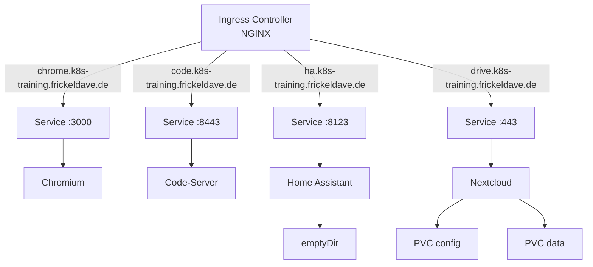

> ⚠️ **PREVIEW** – Dieser Inhalt befindet sich noch in Arbeit und kann noch Änderungen unterliegen.

## Workloads & Networking

Am zweiten Tag machen wir unsere Deployments produktionsreif. Wir fügen Resource Limits, Health
Checks und Deployment-Strategien hinzu, lagern Konfiguration in ConfigMaps und Secrets aus, deployen
Home Assistant und Nextcloud mit persistentem Speicher und richten schließlich Ingress-Routing für
alle vier Anwendungen ein.

## Zeitplan

| Zeit           | Dauer  | Block                | Inhalt                                     |
| -------------- | ------ | -------------------- | ------------------------------------------ |
| 09:00 -- 09:15 | 15 min | Recap                | Status-Check Tag 1                         |
| 09:15 -- 10:00 | 45 min | Theorie              | Pods: Multi-Container, Resources           |
| 10:00 -- 10:45 | 45 min | Resource Limits      | Auf Chromium + Code-Server anwenden        |
| 10:45 -- 11:00 | 15 min | **Pause**            |                                            |
| 11:00 -- 11:30 | 30 min | Theorie              | Health Checks                              |
| 11:30 -- 12:15 | 45 min | Probes konfigurieren | Chromium + Code-Server                     |
| 12:15 -- 12:30 | 15 min | Theorie              | Deployment-Strategien                      |
| 12:30 -- 13:30 | 60 min | **Mittagspause**     |                                            |
| 13:30 -- 14:00 | 30 min | Rolling Updates      | Update + Rollback Code-Server              |
| 14:00 -- 14:45 | 45 min | ConfigMaps & Secrets | Konfiguration auslagern                    |
| 14:45 -- 15:15 | 30 min | Security             | SecurityContext, Best Practices            |
| 15:15 -- 15:30 | 15 min | **Pause**            |                                            |
| 15:30 -- 16:15 | 45 min | Persistent Volumes   | PVCs + Home Assistant + Nextcloud deployen |
| 16:15 -- 17:15 | 60 min | Ingress              | Services, DNS, Host-basiertes Routing      |
| 17:15 -- 17:30 | 15 min | Abschluss            | Zusammenfassung + Ausblick                 |

---

## Recap

Tag 1 ist vorbei -- aber unsere Deployments laufen noch. Bevor wir sie produktionsreif machen,
stellen wir sicher, dass alles noch läuft und die Services erreichbar sind. Hier ein kurzer
Status-Check, dann beginnen wir mit Resource Limits, Health Checks und Deployment-Strategien.

Kurzer Status-Check:

```bash
kubectl get all -n k8s-training
```

Prüfpunkte:

- Sind alle Pods im Status `Running`?
- Chromium im Browser erreichbar? (NodePort)
- Code-Server im Browser erreichbar? (NodePort)

Falls ein Pod nicht läuft:

```bash
kubectl describe pod <pod-name> -n k8s-training
kubectl logs <pod-name> -n k8s-training
```

---

## Pods im Detail

Bisher haben wir Pods nur als einfache Container-Wrapper kennengelernt. Tatsächlich können Pods
mehrere Container enthalten, die denselben Netzwerk-Namespace und dieselben Volumes teilen. Dieses
Konzept wird genutzt, um eng gekoppelte Prozesse gemeinsam zu deployen und zu verwalten.

### Container-Typen

| Typ                   | Zweck                                   | Lebensdauer                   |
| --------------------- | --------------------------------------- | ----------------------------- |
| [**App-Container**](/docs/kubernetes-basis/90-glossar#app-container)     | Hauptanwendung                          | Läuft dauerhaft               |
| [**Init-Container**](/docs/kubernetes-basis/90-glossar#init-container)    | Initialisierung vor dem App-Start       | Läuft einmalig bis Abschluss  |
| [**Sidecar-Container**](/docs/kubernetes-basis/90-glossar#sidecar-container) | Unterstützende Dienste (Logging, Proxy) | Läuft dauerhaft neben der App |

**Regel:** Mehrere Container im selben Pod nur, wenn sie eng gekoppelt sind. Ansonsten separate Pods
verwenden.

### Init-Container

Init-Container laufen sequenziell, bevor die App-Container starten. Jeder muss erfolgreich
abschließen.

```yaml
apiVersion: v1
kind: Pod
metadata:
  name: app-mit-init
  namespace: k8s-training
spec:
  initContainers:
    - name: wait-for-db
      image: busybox:1.28
      command:
        - sh
        - -c
        - 'until nslookup my-database.k8s-training.svc.cluster.local; do echo "Warte auf DB...";
          sleep 2; done'
  containers:
    - name: app
      image: nginx:1.27
      ports:
        - containerPort: 80
```

Typische Anwendungsfälle:

- Warten auf eine Datenbank oder einen externen Service
- Konfigurationsdateien vorbereiten
- Schema-Migrationen ausführen

### Sidecar-Container

Sidecar-Container laufen dauerhaft neben der Hauptanwendung und teilen sich Netzwerk und Volumes.

```yaml
apiVersion: apps/v1
kind: Deployment
metadata:
  name: app-mit-sidecar
  namespace: k8s-training
spec:
  replicas: 1
  selector:
    matchLabels:
      app: sidecar-demo
  template:
    metadata:
      labels:
        app: sidecar-demo
    spec:
      containers:
        - name: app
          image: busybox:1.28
          command:
            - sh
            - -c
            - 'while true; do echo "$(date) Log-Eintrag" >> /var/log/app.log; sleep 5; done'
          volumeMounts:
            - name: log-volume
              mountPath: /var/log
        - name: log-shipper      # Sidecar: zweiter Container im selben Pod
          image: busybox:1.28
          command:
            - sh
            - -c
            - "tail -F /var/log/app.log"
          volumeMounts:
            - name: log-volume   # Dasselbe Volume wie der App-Container
              mountPath: /var/log
      volumes:
        - name: log-volume
          emptyDir: {}
```

### Requests & Limits

| Konzept      | Beschreibung                                                                     |
| ------------ | -------------------------------------------------------------------------------- |
| [**requests**](/docs/kubernetes-basis/90-glossar#resource-limits) | Mindestgarantie -- Scheduler platziert Pod nur auf Nodes mit genügend Ressourcen |
| [**limits**](/docs/kubernetes-basis/90-glossar#resource-limits)   | Obergrenze -- CPU wird gedrosselt, bei Speicherüberschreitung OOM-Kill           |

**CPU-Einheiten:** `1` = 1 Kern, `500m` = 0,5 Kerne, `250m` = 0,25 Kerne.

**Speicher-Einheiten:** `128Mi` = 128 Mebibyte, `1Gi` = 1 Gibibyte.

### QoS-Klassen

| [QoS-Klasse](/docs/kubernetes-basis/90-glossar#qos-klassen)     | Bedingung                               | Eviction-Priorität           |
| -------------- | --------------------------------------- | ---------------------------- |
| **Guaranteed** | requests == limits (für CPU und Memory) | Niedrigste (zuletzt evicted) |
| **Burstable**  | requests < limits                       | Mittel                       |
| **BestEffort** | Keine requests/limits gesetzt           | Höchste (zuerst evicted)     |

---

## Resource Limits

Die Deployments von Chromium und Code-Server aus Tag 1 laufen noch ohne Resource-Angaben. Das ändern
wir jetzt.

### Chromium

Datei `chromium-deployment.yaml` aktualisieren -- den `resources`-Block in die Container-Spec
einfügen:

```yaml
apiVersion: apps/v1
kind: Deployment
metadata:
  name: chromium
  namespace: k8s-training
  labels:
    app: chromium
spec:
  replicas: 1
  selector:
    matchLabels:
      app: chromium
  template:
    metadata:
      labels:
        app: chromium
    spec:
      containers:
        - name: chromium
          image: lscr.io/linuxserver/chromium:latest
          ports:
            - containerPort: 3000
          env:
            - name: PUID
              value: "1000"
            - name: PGID
              value: "1000"
            - name: TZ
              value: "Europe/Berlin"
          resources:
            requests:
              cpu: "250m"
              memory: "512Mi"
            limits:
              cpu: "1000m"
              memory: "1Gi"
```

```bash
kubectl apply -f chromium-deployment.yaml
```

### Code-Server

Datei `code-server-deployment.yaml` aktualisieren:

```yaml
apiVersion: apps/v1
kind: Deployment
metadata:
  name: code-server
  namespace: k8s-training
  labels:
    app: code-server
spec:
  replicas: 1
  selector:
    matchLabels:
      app: code-server
  template:
    metadata:
      labels:
        app: code-server
    spec:
      containers:
        - name: code-server
          image: lscr.io/linuxserver/code-server:latest
          ports:
            - containerPort: 8443
          env:
            - name: PUID
              value: "1000"
            - name: PGID
              value: "1000"
            - name: TZ
              value: "Europe/Berlin"
          resources:
            requests:
              cpu: "250m"
              memory: "256Mi"
            limits:
              cpu: "500m"
              memory: "512Mi"
```

```bash
kubectl apply -f code-server-deployment.yaml
```

### LimitRange

Eine [LimitRange](/docs/kubernetes-basis/90-glossar#limitrange) setzt Standardwerte für alle Container, die keine eigenen Resources angeben.

Datei `limitrange.yaml`:

```yaml
apiVersion: v1
kind: LimitRange
metadata:
  name: standard-limits
  namespace: k8s-training
spec:
  limits:
    - default:
        cpu: "500m"
        memory: "256Mi"
      defaultRequest:
        cpu: "100m"
        memory: "64Mi"
      max:
        cpu: "2"
        memory: "2Gi"
      min:
        cpu: "50m"
        memory: "32Mi"
      type: Container
```

```bash
kubectl apply -f limitrange.yaml
```

### Übung

1. Wende die Resource-Limits auf Chromium und Code-Server an.
2. Prüfe die QoS-Klasse beider Deployments:

```bash
kubectl describe pod -l app=chromium -n k8s-training | grep "QoS Class"
kubectl describe pod -l app=code-server -n k8s-training | grep "QoS Class"
```

3. Zeige den Ressourcenverbrauch:

```bash
kubectl top pods -n k8s-training
```

4. Wende die LimitRange an. Erstelle einen Test-Pod ohne Resource-Angaben und prüfe, welche Defaults
   gesetzt werden:

```bash
kubectl run test-pod --image=nginx:1.27 -n k8s-training
kubectl describe pod test-pod -n k8s-training | grep -A 6 "Limits"
kubectl delete pod test-pod -n k8s-training
```

---

## Health Checks

Kubernetes weiß nicht automatisch, ob eine Anwendung wirklich funktioniert -- nur ob ein Container
läuft. Health Checks (Probes) geben Kubernetes diese Intelligenz: Sie prüfen regelmäßig den Zustand
eines Containers und lösen automatische Aktionen aus, wenn etwas nicht stimmt.

### Probe-Typen

| Probe               | Frage                                 | Aktion bei Fehlschlag                      |
| ------------------- | ------------------------------------- | ------------------------------------------ |
| [**Liveness Probe**](/docs/kubernetes-basis/90-glossar#liveness-probe)  | Läuft die Anwendung noch?             | Container wird neu gestartet               |
| [**Readiness Probe**](/docs/kubernetes-basis/90-glossar#readiness-probe) | Kann die Anwendung Traffic empfangen? | Pod wird aus Service-Endpoints entfernt    |
| [**Startup Probe**](/docs/kubernetes-basis/90-glossar#startup-probe)   | Ist die Anwendung fertig gestartet?   | Liveness/Readiness pausiert bis Startup OK |

### Probe-Mechanismen

| Mechanismus | Beschreibung                                   |
| ----------- | ---------------------------------------------- |
| `httpGet`   | HTTP GET an Pfad+Port; Status 200-399 = gesund |
| `exec`      | Befehl im Container; Exit-Code 0 = gesund      |
| `tcpSocket` | Prüft ob TCP-Port offen ist                    |

### Parameter

| Parameter             | Beschreibung                 | Standard |
| --------------------- | ---------------------------- | -------- |
| `initialDelaySeconds` | Wartezeit vor erster Prüfung | 0        |
| `periodSeconds`       | Intervall zwischen Prüfungen | 10       |
| `timeoutSeconds`      | Timeout pro Prüfung          | 1        |
| `successThreshold`    | Erfolge bis "gesund"         | 1        |
| `failureThreshold`    | Fehlschläge bis "ungesund"   | 3        |

### Liveness Demo

Klassische Demo: Ein Container erstellt eine Health-Datei, löscht sie nach 30 Sekunden. Die Probe
schlägt fehl und Kubernetes startet den Container neu.

```yaml
apiVersion: v1
kind: Pod
metadata:
  name: liveness-demo
  namespace: k8s-training
spec:
  containers:
    - name: app
      image: busybox:1.28
      args:
        - /bin/sh
        - -c
        - "touch /tmp/healthy; sleep 30; rm -f /tmp/healthy; sleep 600"
      livenessProbe:
        exec:
          command:
            - cat
            - /tmp/healthy
        initialDelaySeconds: 5
        periodSeconds: 5
```

```bash
kubectl apply -f liveness-demo.yaml
kubectl get pod liveness-demo -n k8s-training -w
```

Nach ca. 35 Sekunden wird der Container automatisch neu gestartet. Prüfe die Events:

```bash
kubectl describe pod liveness-demo -n k8s-training
```

Aufräumen:

```bash
kubectl delete pod liveness-demo -n k8s-training
```

---

## Probes anwenden

Jetzt konfigurieren wir Probes für unsere beiden Anwendungen. Chromium und Code-Server haben
unterschiedliche Startzeiten -- Chromium ist speicher- und renderingintensiv und braucht beim Start
deutlich länger als Code-Server. Die Probe-Konfiguration muss das berücksichtigen, sonst markiert
Kubernetes neue Container zu früh als "ungesund" und startet sie endlos neu. Wir erweitern die
bestehenden YAML-Manifeste um `startupProbe`, `livenessProbe` und `readinessProbe`.

### Chromium Probes

<Notice type="warning">
  **HTTP vs. HTTPS in Probes:** Chromium läuft auf HTTP (Port 3000) -- kein `scheme: HTTPS`
  erforderlich. Code-Server hingegen läuft auf HTTPS (Port 8443) und benötigt `scheme: HTTPS`
  explizit. Fehlt das Schema, schlägt die Probe **still fehl** -- kein Fehlermeldung, nur ein
  Pod, der nie `Ready` wird. Typische Fehlerquelle beim ersten Aufsetzen!
</Notice>

Datei `chromium-deployment.yaml` erweitern (Resources + Probes):

```yaml
apiVersion: apps/v1
kind: Deployment
metadata:
  name: chromium
  namespace: k8s-training
  labels:
    app: chromium
spec:
  replicas: 1
  selector:
    matchLabels:
      app: chromium
  template:
    metadata:
      labels:
        app: chromium
    spec:
      containers:
        - name: chromium
          image: lscr.io/linuxserver/chromium:latest
          ports:
            - containerPort: 3000
          env:
            - name: PUID
              value: "1000"
            - name: PGID
              value: "1000"
            - name: TZ
              value: "Europe/Berlin"
          resources:
            requests:
              cpu: "250m"
              memory: "512Mi"
            limits:
              cpu: "1000m"
              memory: "1Gi"
          startupProbe:
            httpGet:
              path: /
              port: 3000
            failureThreshold: 30
            periodSeconds: 10
          livenessProbe:
            httpGet:
              path: /
              port: 3000
            periodSeconds: 15
            failureThreshold: 3
          readinessProbe:
            httpGet:
              path: /
              port: 3000
            periodSeconds: 5
            failureThreshold: 1
```

### Code-Server Probes

Datei `code-server-deployment.yaml` erweitern (Resources + Probes):

```yaml
apiVersion: apps/v1
kind: Deployment
metadata:
  name: code-server
  namespace: k8s-training
  labels:
    app: code-server
spec:
  replicas: 1
  selector:
    matchLabels:
      app: code-server
  template:
    metadata:
      labels:
        app: code-server
    spec:
      containers:
        - name: code-server
          image: lscr.io/linuxserver/code-server:latest
          ports:
            - containerPort: 8443
          env:
            - name: PUID
              value: "1000"
            - name: PGID
              value: "1000"
            - name: TZ
              value: "Europe/Berlin"
          resources:
            requests:
              cpu: "250m"
              memory: "256Mi"
            limits:
              cpu: "500m"
              memory: "512Mi"
          startupProbe:
            httpGet:
              path: /
              port: 8443
              scheme: HTTPS
            failureThreshold: 30
            periodSeconds: 10
          livenessProbe:
            httpGet:
              path: /
              port: 8443
              scheme: HTTPS
            periodSeconds: 15
            failureThreshold: 3
          readinessProbe:
            httpGet:
              path: /
              port: 8443
              scheme: HTTPS
            periodSeconds: 5
            failureThreshold: 1
```

```bash
kubectl apply -f chromium-deployment.yaml
kubectl apply -f code-server-deployment.yaml
```

### Übung

1. Wende die Probes an und beobachte den Startup:

```bash
kubectl get pods -n k8s-training -w
```

2. Prüfe die Endpoints der Services:

```bash
kubectl get endpoints -n k8s-training
```

3. Teste, was passiert, wenn die Readiness Probe fehlschlägt -- ändere den Pfad auf `/nonexistent`
   und wende das Manifest erneut an:

```bash
kubectl get endpoints -n k8s-training -w
```

Der Pod verschwindet aus den Endpoints und bekommt keinen Traffic mehr. Setze den Pfad zurück auf
`/`.

---

## Deploy-Strategien

Wie Kubernetes alte Pods durch neue ersetzt, ist keine Kleinigkeit -- falsch konfiguriert entstehen
Ausfallzeiten oder Datenkonflikte. Kubernetes bietet zwei Strategien, zwischen denen du je nach
Anwendungstyp wählen kannst.

### Vergleich

| Strategie         | Verhalten                                    | Ausfallzeit | Einsatz                                               |
| ----------------- | -------------------------------------------- | ----------- | ----------------------------------------------------- |
| [**RollingUpdate**](/docs/kubernetes-basis/90-glossar#rollingupdate) | Pods werden schrittweise ersetzt             | Keine       | Standard, Produktion                                  |
| **Recreate**      | Alle alten Pods beendet, dann neue gestartet | Kurz        | Wenn alte + neue Version nicht parallel laufen können |

### Konfiguration

```yaml
spec:
  strategy:
    type: RollingUpdate
    rollingUpdate:
      maxSurge: 1 # Wie viele zusätzliche Pods während des Updates erlaubt
      maxUnavailable: 0 # Wie viele Pods gleichzeitig fehlen dürfen
```

- `maxSurge: 1` -- während des Updates darf 1 Pod mehr als `replicas` laufen
- `maxUnavailable: 0` -- es darf kein Pod fehlen (kein Traffic-Verlust)

### Komplett-Manifest

Hier das vollständige Deployment mit Resources, Probes und Strategie:

```yaml
apiVersion: apps/v1
kind: Deployment
metadata:
  name: code-server
  namespace: k8s-training
  labels:
    app: code-server
spec:
  replicas: 1
  strategy:
    type: RollingUpdate
    rollingUpdate:
      maxSurge: 1
      maxUnavailable: 0
  selector:
    matchLabels:
      app: code-server
  template:
    metadata:
      labels:
        app: code-server
    spec:
      containers:
        - name: code-server
          image: lscr.io/linuxserver/code-server:latest
          ports:
            - containerPort: 8443
          env:
            - name: PUID
              value: "1000"
            - name: PGID
              value: "1000"
            - name: TZ
              value: "Europe/Berlin"
          resources:
            requests:
              cpu: "250m"
              memory: "256Mi"
            limits:
              cpu: "500m"
              memory: "512Mi"
          startupProbe:
            httpGet:
              path: /
              port: 8443
              scheme: HTTPS
            failureThreshold: 30
            periodSeconds: 10
          livenessProbe:
            httpGet:
              path: /
              port: 8443
              scheme: HTTPS
            periodSeconds: 15
            failureThreshold: 3
          readinessProbe:
            httpGet:
              path: /
              port: 8443
              scheme: HTTPS
            periodSeconds: 5
            failureThreshold: 1
```

---

## Rolling Updates

Mit der konfigurierten RollingUpdate-Strategie führen wir jetzt ein echtes Update durch -- und
lernen, im Fehlerfall sofort zurückzurollen. Als Beispiel aktualisieren wir den Code-Server auf
eine neuere Version und beobachten den Prozess live.

### Image-Update

```bash
kubectl set image deployment/code-server code-server=lscr.io/linuxserver/code-server:4.96.4 -n k8s-training
```

### Rollout-Status

```bash
kubectl rollout status deployment/code-server -n k8s-training
```

### ReplicaSets

```bash
kubectl get replicasets -l app=code-server -n k8s-training
```

Es gibt jetzt zwei ReplicaSets -- das alte (0 Replicas) und das neue (1 Replica). Das alte wird für
Rollbacks aufbewahrt.

### Fehlerfall

Ein fehlerhaftes Image setzen:

```bash
kubectl set image deployment/code-server code-server=lscr.io/linuxserver/code-server:nicht-existent -n k8s-training
```

Beobachten:

```bash
kubectl get pods -l app=code-server -n k8s-training
```

Der neue Pod bleibt in `ImagePullBackOff` hängen. Das alte ReplicaSet hält den bisherigen Pod noch
am Laufen (dank `maxUnavailable: 0`).

### Rollback

```bash
kubectl rollout undo deployment/code-server -n k8s-training
kubectl rollout status deployment/code-server -n k8s-training
```

### Rollout-Historie

```bash
kubectl rollout history deployment/code-server -n k8s-training
```

Zu einer bestimmten Revision zurückrollen:

```bash
kubectl rollout undo deployment/code-server --to-revision=1 -n k8s-training
```

### Skalierung

```bash
# Hochskalieren
kubectl scale deployment/code-server --replicas=3 -n k8s-training
kubectl get pods -l app=code-server -n k8s-training

# Runterskalieren
kubectl scale deployment/code-server --replicas=1 -n k8s-training
kubectl get pods -l app=code-server -n k8s-training
```

### Übung

Führe den kompletten Lebenszyklus durch:

1. Update auf `4.96.4`
2. Beobachte den Rollout
3. Prüfe die ReplicaSets
4. Setze ein fehlerhaftes Image
5. Beobachte den Fehler
6. Rollback
7. Skaliere auf 3 Replicas und wieder zurück auf 1

---

## ConfigMaps & Secrets

### Warum?

Bisher stehen Konfigurationswerte wie `PUID`, `PGID`, `TZ` und das Code-Server-Passwort direkt im
Deployment-YAML. Das hat Nachteile:

- **Dopplung** -- die gleichen Werte in jedem Deployment
- **Sicherheit** -- Passwörter im Klartext in YAML-Dateien (und damit in Git)
- **Flexibilität** -- bei Änderungen muss jedes Deployment einzeln angepasst werden

### ConfigMap

Eine [ConfigMap](/docs/kubernetes-basis/90-glossar#configmap) speichert nicht-sensible Konfigurationsdaten als Key-Value-Paare.

Datei `app-configmap.yaml`:

```yaml
apiVersion: v1
kind: ConfigMap
metadata:
  name: app-config
  namespace: k8s-training
data:
  PUID: "1000"
  PGID: "1000"
  TZ: "Europe/Berlin"
```

```bash
kubectl apply -f app-configmap.yaml
```

### Secret

Ein [Secret](/docs/kubernetes-basis/90-glossar#secret) speichert sensible Daten (Passwörter, Tokens, Zertifikate). Werte werden Base64-kodiert
gespeichert. **Wichtig:** Base64 ist keine Verschlüsselung, sondern nur eine Kodierung -- die Daten
sind im Cluster im Klartext lesbar. Für echte Produktions-Sicherheit braucht ihr Encryption at Rest
oder ein externes Secret-Management (z.B. HashiCorp Vault).

```bash
# Das sieht aus wie Verschlüsselung:
kubectl get secret code-server-secret -n k8s-training -o yaml
# data:
#   PASSWORD: dHJhaW5pbmcyMDI0

# Aber Base64 ist trivial dekodierbar:
echo "dHJhaW5pbmcyMDI0" | base64 -d
# Ausgabe: training2024
```

Datei `code-server-secret.yaml` mit `stringData` (Klartext, wird automatisch kodiert):

```yaml
apiVersion: v1
kind: Secret
metadata:
  name: code-server-secret
  namespace: k8s-training
type: Opaque
stringData:
  PASSWORD: "training2024"
```

```bash
kubectl apply -f code-server-secret.yaml
```

Secret prüfen:

```bash
kubectl get secret code-server-secret -n k8s-training -o yaml
```

Die Werte sind Base64-kodiert. Dekodieren:

```bash
kubectl get secret code-server-secret -n k8s-training -o jsonpath='{.data.PASSWORD}' | base64 -d
```

### Deployments anpassen

Die Deployments referenzieren nun ConfigMap und Secret statt hardcodierter Werte.

**Code-Server** mit `envFrom` (ConfigMap) und `secretKeyRef` (Secret):

```yaml
apiVersion: apps/v1
kind: Deployment
metadata:
  name: code-server
  namespace: k8s-training
  labels:
    app: code-server
spec:
  replicas: 1
  strategy:
    type: RollingUpdate
    rollingUpdate:
      maxSurge: 1
      maxUnavailable: 0
  selector:
    matchLabels:
      app: code-server
  template:
    metadata:
      labels:
        app: code-server
    spec:
      containers:
        - name: code-server
          image: lscr.io/linuxserver/code-server:latest
          ports:
            - containerPort: 8443
          envFrom:
            - configMapRef:
                name: app-config
          env:
            - name: PASSWORD
              valueFrom:
                secretKeyRef:
                  name: code-server-secret
                  key: PASSWORD
            - name: DEFAULT_WORKSPACE
              value: "/config/workspace"
          resources:
            requests:
              cpu: "250m"
              memory: "256Mi"
            limits:
              cpu: "500m"
              memory: "512Mi"
          startupProbe:
            httpGet:
              path: /
              port: 8443
              scheme: HTTPS
            failureThreshold: 30
            periodSeconds: 10
          livenessProbe:
            httpGet:
              path: /
              port: 8443
              scheme: HTTPS
            periodSeconds: 15
            failureThreshold: 3
          readinessProbe:
            httpGet:
              path: /
              port: 8443
              scheme: HTTPS
            periodSeconds: 5
            failureThreshold: 1
```

**Chromium** mit `envFrom`:

```yaml
apiVersion: apps/v1
kind: Deployment
metadata:
  name: chromium
  namespace: k8s-training
  labels:
    app: chromium
spec:
  replicas: 1
  selector:
    matchLabels:
      app: chromium
  template:
    metadata:
      labels:
        app: chromium
    spec:
      containers:
        - name: chromium
          image: lscr.io/linuxserver/chromium:latest
          ports:
            - containerPort: 3000
          envFrom:
            - configMapRef:
                name: app-config
          resources:
            requests:
              cpu: "250m"
              memory: "512Mi"
            limits:
              cpu: "1000m"
              memory: "1Gi"
          startupProbe:
            httpGet:
              path: /
              port: 3000
            failureThreshold: 30
            periodSeconds: 10
          livenessProbe:
            httpGet:
              path: /
              port: 3000
            periodSeconds: 15
            failureThreshold: 3
          readinessProbe:
            httpGet:
              path: /
              port: 3000
            periodSeconds: 5
            failureThreshold: 1
          volumeMounts:
            - name: shm
              mountPath: /dev/shm
            - name: config
              mountPath: /config
      volumes:
        - name: shm
          emptyDir:
            medium: Memory
            sizeLimit: 1Gi
        - name: config
          emptyDir: {}
```

```bash
kubectl apply -f chromium-deployment.yaml
kubectl apply -f code-server-deployment.yaml
```

### Weitere Möglichkeiten

| Methode                     | Beschreibung                                       |
| --------------------------- | -------------------------------------------------- |
| `envFrom`                   | Alle Keys einer ConfigMap/Secret als Env-Variablen |
| `valueFrom.configMapKeyRef` | Einzelnen Key als Env-Variable                     |
| `valueFrom.secretKeyRef`    | Einzelnen Secret-Key als Env-Variable              |
| Volume-Mount                | ConfigMap/Secret als Dateien mounten               |

ConfigMap als Volume (z.B. für Konfigurationsdateien):

```yaml
volumes:
  - name: config-volume
    configMap:
      name: app-config
```

### Übung

1. Erstelle die ConfigMap `app-config` und das Secret `code-server-secret`.
2. Passe die Deployments an, sodass sie ConfigMap und Secret verwenden.
3. Prüfe, ob das Code-Server-Passwort noch funktioniert.
4. Ändere das Passwort im Secret und wende es erneut an:

```bash
kubectl create secret generic code-server-secret \
  --from-literal=PASSWORD=neuesPasswort \
  --namespace=k8s-training \
  --dry-run=client -o yaml | kubectl apply -f -
```

5. Lösche den Code-Server-Pod, damit er das neue Secret lädt. Teste den Login mit dem neuen
   Passwort.

---

## Security

Bisher laufen unsere Deployments ohne Sicherheitsrichtlinien -- Container starten standardmäßig mit
mehr Rechten als nötig. Das Prinzip "Least Privilege" besagt: Ein Prozess bekommt nur genau die
Rechte, die er wirklich braucht. `SecurityContext` setzt dieses Prinzip in Kubernetes um und schützt
den Cluster vor Angriffen, die auf übermäßige Container-Berechtigungen setzen.

### SecurityContext

Ein [SecurityContext](/docs/kubernetes-basis/90-glossar#securitycontext) definiert Sicherheitseinstellungen für Pods und Container.

| Einstellung                | Beschreibung                              |
| -------------------------- | ----------------------------------------- |
| `runAsNonRoot`             | Container muss als nicht-root User laufen |
| `allowPrivilegeEscalation` | Verhindert Privilege Escalation (setuid)  |
| `readOnlyRootFilesystem`   | Root-Filesystem wird read-only gemountet  |
| `capabilities.drop`        | Linux Capabilities entfernen              |

### Pod-Level vs Container-Level

```yaml
apiVersion: v1
kind: Pod
metadata:
  name: secure-pod
  namespace: k8s-training
spec:
  securityContext: # Pod-Level: gilt für alle Container
    runAsNonRoot: true
    fsGroup: 1000
  containers:
    - name: app
      image: nginx:1.27
      securityContext: # Container-Level: überschreibt Pod-Level
        allowPrivilegeEscalation: false
        readOnlyRootFilesystem: true
        capabilities:
          drop:
            - ALL
```

### Praxis-Beispiel

Sicheren nginx-Pod erstellen und testen:

```yaml
apiVersion: v1
kind: Pod
metadata:
  name: secure-nginx
  namespace: k8s-training
spec:
  securityContext:
    runAsNonRoot: true
    runAsUser: 1000
    fsGroup: 1000
  containers:
    - name: nginx
      image: nginxinc/nginx-unprivileged:1.27
      ports:
        - containerPort: 8080
      securityContext:
        allowPrivilegeEscalation: false
        readOnlyRootFilesystem: true
        capabilities:
          drop:
            - ALL
      volumeMounts:
        - name: tmp
          mountPath: /tmp
        - name: cache
          mountPath: /var/cache/nginx
        - name: pid
          mountPath: /var/run
  volumes:
    - name: tmp
      emptyDir: {}
    - name: cache
      emptyDir: {}
    - name: pid
      emptyDir: {}
```

```bash
kubectl apply -f secure-nginx.yaml
kubectl get pod secure-nginx -n k8s-training
```

**Hinweis:** Die linuxserver.io-Container verwenden ein eigenes User-Management (s6-overlay mit
PUID/PGID) und benötigen Schreibzugriff auf das Root-Filesystem. Daher sind `readOnlyRootFilesystem`
und `runAsNonRoot` dort nicht direkt anwendbar. Das Beispiel zeigt das Prinzip an einem
Standard-Image.

Aufräumen:

```bash
kubectl delete pod secure-nginx -n k8s-training
```

### Best Practices

- **Principle of Least Privilege** -- nur die nötigsten Rechte vergeben
- **Secrets statt Env-Variablen** -- sensible Daten nie im Klartext in YAMLs
- **Image-Tags pinnen** -- `:latest` vermeiden, konkrete Versionen verwenden (z.B. `:4.96.4`)
- **Nicht als root laufen** -- wenn das Image es unterstützt
- **Capabilities droppen** -- `drop: [ALL]` und nur benötigte explizit hinzufügen
- **Network Policies** -- Traffic zwischen Pods einschränken (weiterführend)
- **RBAC** -- Benutzer und ServiceAccounts mit minimalen Rechten (weiterführend)

### Übung

1. Erstelle den `secure-nginx`-Pod und prüfe, ob er läuft.
2. Versuche, eine Datei im Root-Filesystem zu erstellen:

```bash
kubectl exec secure-nginx -n k8s-training -- touch /test.txt
```

3. Was passiert? Warum?
4. Lösche den Pod und erkläre, welche Security-Einstellungen den Schreibzugriff verhindern.

---

## PVs & PVCs

Container-Dateisysteme sind flüchtig -- stirbt ein Pod, sind alle Daten weg. Wie wir in Übung 4
gesehen haben, verschwindet selbst eine einfache Textdatei nach einem Pod-Neustart. Für Anwendungen
wie Home Assistant oder Nextcloud ist das keine Option. Persistent Volumes (PVs) und Persistent
Volume Claims (PVCs) entkoppeln Storage von der Pod-Lebensdauer.

### Konzepte

| Konzept                         | Beschreibung                                                          |
| ------------------------------- | --------------------------------------------------------------------- |
| [**PersistentVolume (PV)**](/docs/kubernetes-basis/90-glossar#persistentvolume)       | Ein Stück Storage im Cluster, bereitgestellt von Admin oder dynamisch |
| [**PersistentVolumeClaim (PVC)**](/docs/kubernetes-basis/90-glossar#persistentvolumeclaim) | Anforderung eines Pods an Storage (Größe, Zugriffsart)                |
| [**StorageClass**](/docs/kubernetes-basis/90-glossar#storageclass)                | Definiert, wie PVs dynamisch erstellt werden (Provisioner, Parameter) |

### Lifecycle

```
PVC-Anforderung → StorageClass erstellt PV → Pod mountet PVC
```

1. Ein PVC wird erstellt mit gewünschter Größe und Zugriffsart
2. Die StorageClass provisioniert automatisch ein passendes PV
3. Der Pod referenziert den PVC als Volume und mountet ihn

**Erinnerung an Tag 1:** Beim Löschen des Code-Server Pods war die erstellte Datei weg. Das liegt
daran, dass `emptyDir`-Volumes mit dem Pod sterben. PVCs überleben Pod-Neustarts und sogar
Pod-Löschungen.

### Home Assistant

Home Assistant wird zunächst mit `emptyDir` deployt -- als Vergleich zu Nextcloud mit PVCs.

Datei `homeassistant-deployment.yaml`:

```yaml
apiVersion: apps/v1
kind: Deployment
metadata:
  name: homeassistant
  namespace: k8s-training
  labels:
    app: homeassistant
spec:
  replicas: 1
  selector:
    matchLabels:
      app: homeassistant
  template:
    metadata:
      labels:
        app: homeassistant
    spec:
      containers:
        - name: homeassistant
          image: lscr.io/linuxserver/homeassistant:latest
          ports:
            - containerPort: 8123
          envFrom:
            - configMapRef:
                name: app-config
          resources:
            requests:
              cpu: "250m"
              memory: "256Mi"
            limits:
              cpu: "1000m"
              memory: "1Gi"
          startupProbe:
            httpGet:
              path: /
              port: 8123
            failureThreshold: 30
            periodSeconds: 10
          livenessProbe:
            httpGet:
              path: /
              port: 8123
            periodSeconds: 15
            failureThreshold: 3
          readinessProbe:
            httpGet:
              path: /
              port: 8123
            periodSeconds: 5
            failureThreshold: 1
          volumeMounts:
            - name: config
              mountPath: /config
      volumes:
        - name: config
          emptyDir: {}
```

Datei `homeassistant-service.yaml`:

```yaml
apiVersion: v1
kind: Service
metadata:
  name: homeassistant
  namespace: k8s-training
spec:
  type: ClusterIP
  selector:
    app: homeassistant
  ports:
    - protocol: TCP
      port: 8123
      targetPort: 8123
```

```bash
kubectl apply -f homeassistant-deployment.yaml
kubectl apply -f homeassistant-service.yaml
```

### Nextcloud + PVCs

Nextcloud bekommt persistenten Storage für Konfiguration und Daten.

Datei `nextcloud-pvc.yaml`:

```yaml
apiVersion: v1
kind: PersistentVolumeClaim
metadata:
  name: nextcloud-config
  namespace: k8s-training
spec:
  accessModes:
    - ReadWriteOnce
  resources:
    requests:
      storage: 1Gi
---
apiVersion: v1
kind: PersistentVolumeClaim
metadata:
  name: nextcloud-data
  namespace: k8s-training
spec:
  accessModes:
    - ReadWriteOnce
  resources:
    requests:
      storage: 5Gi
```

Datei `nextcloud-deployment.yaml`:

```yaml
apiVersion: apps/v1
kind: Deployment
metadata:
  name: nextcloud
  namespace: k8s-training
  labels:
    app: nextcloud
spec:
  replicas: 1
  selector:
    matchLabels:
      app: nextcloud
  template:
    metadata:
      labels:
        app: nextcloud
    spec:
      containers:
        - name: nextcloud
          image: lscr.io/linuxserver/nextcloud:latest
          ports:
            - containerPort: 443
          envFrom:
            - configMapRef:
                name: app-config
          resources:
            requests:
              cpu: "250m"
              memory: "256Mi"
            limits:
              cpu: "1000m"
              memory: "1Gi"
          startupProbe:
            httpGet:
              path: /
              port: 443
              scheme: HTTPS
            failureThreshold: 30
            periodSeconds: 10
          livenessProbe:
            httpGet:
              path: /
              port: 443
              scheme: HTTPS
            periodSeconds: 15
            failureThreshold: 3
          readinessProbe:
            httpGet:
              path: /
              port: 443
              scheme: HTTPS
            periodSeconds: 5
            failureThreshold: 1
          volumeMounts:
            - name: config
              mountPath: /config
            - name: data
              mountPath: /data
      volumes:
        - name: config
          persistentVolumeClaim:
            claimName: nextcloud-config
        - name: data
          persistentVolumeClaim:
            claimName: nextcloud-data
```

Datei `nextcloud-service.yaml`:

```yaml
apiVersion: v1
kind: Service
metadata:
  name: nextcloud
  namespace: k8s-training
spec:
  type: ClusterIP
  selector:
    app: nextcloud
  ports:
    - protocol: TCP
      port: 443
      targetPort: 443
```

```bash
kubectl apply -f nextcloud-pvc.yaml
kubectl apply -f nextcloud-deployment.yaml
kubectl apply -f nextcloud-service.yaml
```

### Persistenz-Test

PVC-Status prüfen:

```bash
kubectl get pvc -n k8s-training
```

Beide PVCs sollten den Status `Bound` haben.

Datei erstellen und Pod löschen:

```bash
# Datei im persistenten Volume erstellen
kubectl exec $(kubectl get pod -l app=nextcloud -n k8s-training -o jsonpath='{.items[0].metadata.name}') -n k8s-training -- touch /data/test.txt

# Pod löschen (Deployment erstellt neuen)
kubectl delete pod -l app=nextcloud -n k8s-training

# Warten bis neuer Pod läuft
kubectl get pods -l app=nextcloud -n k8s-training -w

# Datei prüfen -- sie überlebt!
kubectl exec $(kubectl get pod -l app=nextcloud -n k8s-training -o jsonpath='{.items[0].metadata.name}') -n k8s-training -- ls /data/test.txt
```

Zum Vergleich -- Home Assistant mit emptyDir:

```bash
# Datei erstellen
kubectl exec $(kubectl get pod -l app=homeassistant -n k8s-training -o jsonpath='{.items[0].metadata.name}') -n k8s-training -- touch /config/test.txt

# Pod löschen
kubectl delete pod -l app=homeassistant -n k8s-training

# Datei prüfen -- sie ist weg!
kubectl exec $(kubectl get pod -l app=homeassistant -n k8s-training -o jsonpath='{.items[0].metadata.name}') -n k8s-training -- ls /config/test.txt
```

### Übung

1. Deploye Home Assistant und Nextcloud.
2. Prüfe den PVC-Status mit `kubectl get pvc -n k8s-training`.
3. Teste die Persistenz bei Nextcloud (Datei erstellen, Pod löschen, Datei prüfen).
4. Teste das Gleiche bei Home Assistant -- was passiert mit der Datei?
5. Erkläre den Unterschied zwischen `emptyDir` und `PersistentVolumeClaim`.

---

## Services & DNS

Vor dem Ingress-Setup stellen wir alle Services auf ClusterIP um und verstehen, wie
Kubernetes-internes DNS funktioniert. Das ist die Grundlage dafür, dass der Ingress Controller die
Services intern ansprechen kann -- ohne NodePorts nach außen zu exponieren.

### Service-Typen

| Typ              | Zugriff                                    | Beispiel aus dem Projekt      |
| ---------------- | ------------------------------------------ | ----------------------------- |
| **ClusterIP**    | Nur cluster-intern                         | homeassistant, nextcloud      |
| **NodePort**     | Von außen über `NodeIP:Port` (30000-32767) | Chromium, Code-Server (Tag 1) |
| **LoadBalancer** | Externe IP über Cloud-LB                   | Produktion in der Cloud       |
| **ExternalName** | DNS-CNAME auf externen Dienst              | Externe APIs                  |

### DNS-Namensformat

Kubernetes richtet automatisch DNS-Einträge für Services ein (über CoreDNS):

```
<service>.<namespace>.svc.cluster.local
```

Beispiele aus unserem Namespace:

- `chromium.k8s-training.svc.cluster.local`
- `code-server.k8s-training.svc.cluster.local`
- `homeassistant.k8s-training.svc.cluster.local`
- `nextcloud.k8s-training.svc.cluster.local`

### DNS testen

```bash
kubectl run dns-test --rm -it --image=busybox:1.28 --restart=Never -n k8s-training -- nslookup chromium.k8s-training.svc.cluster.local
```

Innerhalb des gleichen Namespaces reicht der Kurzname:

```bash
kubectl run dns-test2 --rm -it --image=busybox:1.28 --restart=Never -n k8s-training -- nslookup chromium
```

---

## Ingress

### Was ist Ingress?

[Ingress](/docs/kubernetes-basis/90-glossar#ingress) stellt HTTP/HTTPS-Routing von außen in den Cluster bereit. Statt jeden Service über einen
eigenen NodePort zu exponieren, wird ein zentraler [Ingress Controller](/docs/kubernetes-basis/90-glossar#ingress-controller) verwendet.

**Host-basiertes Routing:** Verschiedene Hostnamen werden auf verschiedene Services geroutet:

```
chrome.k8s-training.frickeldave.de  → chromium:3000
code.k8s-training.frickeldave.de    → code-server:8443
ha.k8s-training.frickeldave.de      → homeassistant:8123
drive.k8s-training.frickeldave.de   → nextcloud:443
```

**Voraussetzung:** Ein NGINX Ingress Controller muss im Cluster installiert sein.

### ClusterIP umstellen

Die Services von Chromium und Code-Server wurden in Tag 1 als NodePort erstellt. Für Ingress
brauchen wir ClusterIP.

Datei `chromium-service.yaml`:

```yaml
apiVersion: v1
kind: Service
metadata:
  name: chromium
  namespace: k8s-training
spec:
  type: ClusterIP
  selector:
    app: chromium
  ports:
    - protocol: TCP
      port: 3000
      targetPort: 3000
```

Datei `code-server-service.yaml`:

```yaml
apiVersion: v1
kind: Service
metadata:
  name: code-server
  namespace: k8s-training
spec:
  type: ClusterIP
  selector:
    app: code-server
  ports:
    - protocol: TCP
      port: 8443
      targetPort: 8443
```

```bash
kubectl apply -f chromium-service.yaml
kubectl apply -f code-server-service.yaml
```

### Haupt-Ingress

Datei `k8s-training-ingress.yaml`:

```yaml
apiVersion: networking.k8s.io/v1
kind: Ingress
metadata:
  name: k8s-training-ingress
  namespace: k8s-training
  annotations:
    nginx.ingress.kubernetes.io/proxy-body-size: "0"
spec:
  ingressClassName: nginx
  rules:
    - host: chrome.k8s-training.frickeldave.de
      http:
        paths:
          - path: /
            pathType: Prefix
            backend:
              service:
                name: chromium
                port:
                  number: 3000
    - host: code.k8s-training.frickeldave.de
      http:
        paths:
          - path: /
            pathType: Prefix
            backend:
              service:
                name: code-server
                port:
                  number: 8443
    - host: ha.k8s-training.frickeldave.de
      http:
        paths:
          - path: /
            pathType: Prefix
            backend:
              service:
                name: homeassistant
                port:
                  number: 8123
```

```bash
kubectl apply -f k8s-training-ingress.yaml
```

### Nextcloud Ingress

Nextcloud lauscht auf HTTPS (Port 443). Der Ingress muss daher die Annotation
`backend-protocol: HTTPS` verwenden.

Datei `nextcloud-ingress.yaml`:

```yaml
apiVersion: networking.k8s.io/v1
kind: Ingress
metadata:
  name: nextcloud-ingress
  namespace: k8s-training
  annotations:
    nginx.ingress.kubernetes.io/backend-protocol: "HTTPS"
    nginx.ingress.kubernetes.io/proxy-body-size: "0"
spec:
  ingressClassName: nginx
  rules:
    - host: drive.k8s-training.frickeldave.de
      http:
        paths:
          - path: /
            pathType: Prefix
            backend:
              service:
                name: nextcloud
                port:
                  number: 443
```

```bash
kubectl apply -f nextcloud-ingress.yaml
```

### DNS / hosts

Die Ingress-IP ermitteln:

```bash
kubectl get ingress -n k8s-training
```

Die angezeigte `ADDRESS` in die lokale hosts-Datei eintragen:

**Linux/macOS:** `/etc/hosts` **Windows:** `C:\Windows\System32\drivers\etc\hosts`

```
<INGRESS-IP> chrome.k8s-training.frickeldave.de
<INGRESS-IP> code.k8s-training.frickeldave.de
<INGRESS-IP> ha.k8s-training.frickeldave.de
<INGRESS-IP> drive.k8s-training.frickeldave.de
```

### Verifikation

| URL                                  | Erwartetes Ergebnis     |
| ------------------------------------ | ----------------------- |
| `chrome.k8s-training.frickeldave.de` | Chromium Browser Web-UI |
| `code.k8s-training.frickeldave.de`   | Code-Server Login       |
| `ha.k8s-training.frickeldave.de`     | Home Assistant Setup    |
| `drive.k8s-training.frickeldave.de`  | Nextcloud Setup         |

### Status-Check

```bash
kubectl get all,ingress,pvc -n k8s-training
```

### Übung

1. Stelle die Chromium- und Code-Server-Services auf ClusterIP um.
2. Erstelle beide Ingress-Ressourcen.
3. Konfiguriere die DNS-Einträge in der hosts-Datei.
4. Teste alle 4 URLs im Browser.
5. Lade eine Datei in Nextcloud hoch -- bleibt sie nach einem Pod-Neustart erhalten?
6. **Bonus:** Richte TLS mit cert-manager ein, damit alle URLs über HTTPS erreichbar sind.

---

## Zusammenfassung

| Thema                 | Gelernt                                          | Praktischer Kontext                          |
| --------------------- | ------------------------------------------------ | -------------------------------------------- |
| Pods im Detail        | Multi-Container, Init-Container, Sidecar-Pattern | Container-Typen und wann man sie einsetzt    |
| Resources             | Requests, Limits, QoS-Klassen, LimitRange        | Chromium + Code-Server mit Resource-Limits   |
| Probes                | Liveness, Readiness, Startup                     | Health Checks für alle 4 Anwendungen         |
| Deployment-Strategien | RollingUpdate, Recreate, maxSurge/maxUnavailable | Code-Server Update + Rollback                |
| ConfigMaps & Secrets  | Konfiguration auslagern, sensible Daten schützen | Shared Env-Variablen + Code-Server-Passwort  |
| Security              | SecurityContext, Least Privilege, Best Practices | Sichere Container-Konfiguration              |
| Persistent Volumes    | PV, PVC, StorageClass, emptyDir vs. PVC          | Nextcloud mit persistentem Storage           |
| Services & DNS        | ClusterIP, NodePort, DNS-Format                  | Service Discovery im Cluster                 |
| Ingress               | Host-basiertes Routing, NGINX Ingress Controller | Alle 4 Apps über eigene Hostnamen erreichbar |

### Architektur



### Ausblick

- Helm Charts -- Paketmanagement für Kubernetes
- Monitoring mit Prometheus und Grafana
- GitOps mit ArgoCD oder Flux
- cert-manager für automatische TLS-Zertifikate
- RBAC vertiefen -- Rollen und Berechtigungen im Detail
- Network Policies -- Netzwerk-Segmentierung zwischen Pods
- Horizontal Pod Autoscaler (HPA)
