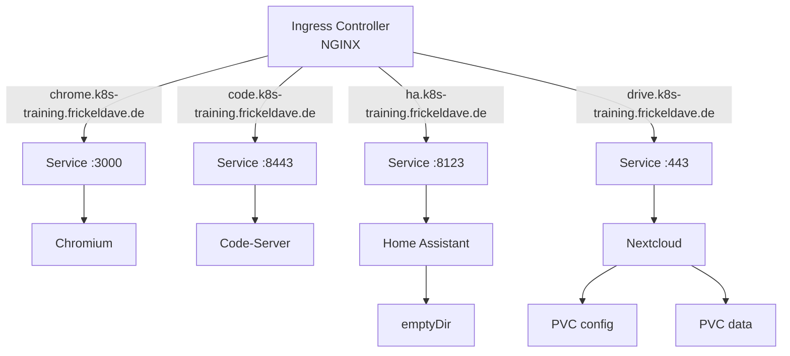

import Notice from "@shortcodes/Notice";
import { Image } from "astro:assets";
import knba20002 from "@assets/docs/kubernetes-basis/knba-20-002.png";

## Workloads & Networking

Am zweiten Tag machen wir unsere Deployments produktionsreif. Wir fügen Resource Limits, Health
Checks und Deployment-Strategien hinzu, lagern Konfiguration in ConfigMaps und Secrets aus, deployen
Home Assistant und Nextcloud mit persistentem Speicher.

## Zeitplan

| Zeit / Schedule         | Block                | Inhalt                                     |
| -------------- | -------------------- | ------------------------------------------ |
| 09:00 – 09:15  | Recap                | Status-Check Tag 1                         |
| 09:15 – 09:45  | Theorie              | Pods: Multi-Container, Resources           |
| 09:45 – 10:15  | ConfigMaps           | Konfiguration auslagern (Code-Server)      |
| 10:15 – 11:00  | Resource Limits      | Auf Chromium + Code-Server anwenden        |
| 11:00 – 11:15  | **Pause**            |                                            |
| 11:15 – 11:45  | Theorie              | Health Checks                              |
| 11:45 – 12:15  | Probes konfigurieren | Chromium + Code-Server                     |
| 12:15 – 12:30  | Theorie              | Deployment-Strategien                      |
| 12:30 – 13:30  | **Mittagspause**     |                                            |
| 13:30 – 14:00  | Rolling Updates      | Update + Rollback Code-Server              |
| 14:00 – 14:45  | Secrets & Security   | Passwörter auslagern, SecurityContext      |
| 15:15 – 15:30  | **Pause**            |                                            |
| 15:30 – 16:15  | Persistent Volumes   | PVCs + Home Assistant + Nextcloud deployen |
| 16:15 – 17:15  | Ingress              | Services, DNS, Host-basiertes Routing      |
| 17:15 – 17:30  | Abschluss            | Zusammenfassung + Ausblick                 |

---

## Recap

Tag 1 ist vorbei -- aber unsere Deployments laufen noch. Bevor wir sie produktionsreif machen,
stellen wir sicher, dass alles noch läuft und die Services erreichbar sind. Hier ein kurzer
Status-Check, dann beginnen wir mit Resource Limits, Health Checks und Deployment-Strategien.

Vielleicht erinnerst du dich nicht mehr ganz an die Befehle von gestern, bevor du jetzt in das [Glossar](./90-glossar) abtauchst,
hier ist dein all-in-one command für alle Zwecke: 

```bash
kubectl get all
```

Prüfpunkte:

- Sind alle Pods im Status `Running`?
- Chromium im Browser erreichbar?
- Code-Server im Browser erreichbar?

Falls ein Pod nicht läuft:

```bash
kubectl describe pod <pod-name>
kubectl logs <pod-name>
```

## ConfigMaps

Bisher stehen Konfigurationswerte wie `PUID`, `PGID`, `TZ` und das Code-Server-Passwort direkt
in den Deployment-YAMLs aus Tag 1. Das ist wartbar, solange es nur ein Deployment betrifft --
aber spätestens beim zweiten Deployment wiederholen sich die Werte.

Eine **ConfigMap** ist ein Kubernetes-Objekt, das Konfigurationsdaten als Key-Value-Paare
speichert und an Container weitergibt -- entweder als **Umgebungsvariable** oder als **Datei**
(über ein Volume).

### Beispiel: Code-Server-Workspace auslagern

Der Code-Server aus Tag 1 hat die Umgebungsvariable `DEFAULT_WORKSPACE` hart im YAML stehen:

```yaml
env:
  - name: DEFAULT_WORKSPACE
    value: "/config/workspace"
```

Das lagern wir jetzt in eine ConfigMap aus.

**1. ConfigMap erstellen**

Datei `code-server-config-map.yaml`:

```yaml
apiVersion: v1
kind: ConfigMap
metadata:
  name: code-server-config
  namespace: k8s-training
data:
  DEFAULT_WORKSPACE: "/config/workspace"
  PUID: "1000"
  PGID: "1000"
  TZ: "Europe/Berlin"
```

```bash
kubectl apply -f code-server-config-map.yaml
```

**2. ConfigMap im Deployment verwenden**

Statt einzelner `env`-Einträge binden wir die gesamte ConfigMap mit `envFrom` ein:

```yaml
envFrom:
  - configMapRef:
      name: code-server-config
```

Das Deployment sieht dann so aus (Auszug):

```yaml
apiVersion: apps/v1
kind: Deployment
metadata:
  name: code-server
  namespace: k8s-training
spec:
  # ... selector, template etc. ...
  template:
    spec:
      containers:
        - name: code-server
          image: lscr.io/linuxserver/code-server:latest
          ports:
            - containerPort: 8443
          envFrom:                          # ConfigMap als Umgebungsvariablen
            - configMapRef:
                name: code-server-config
          env:
            - name: PASSWORD                # Secret bleibt vorerst hart codiert
              value: "training2024"
```

```bash
kubectl apply -f code-server-deployment.yaml
```

**Wichtig:** `envFrom` importiert **alle** Keys der ConfigMap als Umgebungsvariablen.
Der Key `DEFAULT_WORKSPACE` wird zur Variable `DEFAULT_WORKSPACE` mit Wert `/config/workspace`.

### ConfigMap als Volume (Datei)

Neben Umgebungsvariablen kann eine ConfigMap auch als **Volume** in den Container eingebunden
werden. Jeder Key wird dann zu einer eigenen Datei. Das ist praktisch für Konfigurationsdateien
wie `nginx.conf`, `prometheus.yml` oder `vector.toml`.

```yaml
volumes:
  - name: config-volume
    configMap:
      name: app-config
```

Im Container erscheint dann z. B. die Datei `/etc/config/DEFAULT_WORKSPACE` mit dem Inhalt
`/config/workspace`. Dieses Pattern werden wir in der Sidecar-Übung direkt anwenden.

**Zusammenfassung**

| Methode | Beschreibung | Einsatz |
|---------|-------------|---------|
| `envFrom` + `configMapRef` | Alle Keys als Umgebungsvariablen | Mehrere Deployments teilen sich Konfiguration |
| `valueFrom.configMapKeyRef` | Einzelner Key als Umgebungsvariable | Selektives Einbinden |
| Volume-Mount | ConfigMap als Dateien im Dateisystem | Konfigurationsdateien für Tools (Vector, nginx, ...) |

**Merke:** ConfigMaps sind für **nicht-sensitive** Daten. Für Passwörter, Tokens und
Zertifikate gibt es Secrets.

### Secret: Code-Server-Passwort auslagern

Das Code-Server-Passwort steht noch hart codiert im Deployment. Das lagern wir jetzt in ein
[Secret](/docs/kubernetes-basis/90-glossar#secret) aus.

**1. Secret erstellen**

Datei `code-server-secret.yaml`:

```yaml
apiVersion: v1
kind: Secret
metadata:
  name: code-server-secret
  namespace: k8s-training
type: Opaque
stringData:
  PASSWORD: "trainingk8s"
```

```bash
kubectl apply -f code-server-secret.yaml
```

**2. Secret prüfen**

```bash
kubectl get secret code-server-secret -n k8s-training -o yaml
```

Die Ausgabe zeigt `PASSWORD: dHJhaW5pbmcya3M=` – das ist Base64-kodiert, nicht verschlüsselt:

```bash
echo "dHJhaW5pbmcya3M=" | base64 -d
# Ausgabe: trainingk8s
```

```powershell
[System.Text.Encoding]::UTF8.GetString([System.Convert]::FromBase64String("dHJhaW5pbmcya3M="))
# Ausgabe: trainingk8s
```
<br/>

<Notice type="info">

**💡 Die häufigste Frage: "Warum ist Base64 dann keine Sicherheitskatastrophe?"**

Base64 ist keine Verschlüsselung, sondern nur eine Kodierung – wie eine andere Schreibweise.
Das ist Absicht: Secrets müssen maschinenlesbar sein und dürfen keine Sonderzeichen enthalten,
die YAML oder Env-Variablen kaputtmachen.

Die echte Sicherheit liegt nicht in der Kodierung, sondern in diesen Mechanismen:

| Mechanismus | Wirkung |
|-------------|---------|
| **RBAC** | Nur berechtigte Personen/Systeme dürfen `kubectl get secret` ausführen |
| **Encryption at Rest** | Der Cluster verschlüsselt Secrets auf der Festplatte (seit Kubernetes 1.13+ standardmäßig aktiviert) |
| **Encryption in Transit** | Die API-Kommunikation läuft über TLS – niemand kann den Traffic mitlesen |
| **Kein Git** | Secrets werden nicht in YAML-Dateien committed, sondern nur im Cluster gespeichert |
| **stringData** | Du gibst das Passwort im Klartext an – nur Kubernetes selbst kodiert es nach Base64 |

**Zusammengefasst:** Der Base64-"Schutz" ist eine Kodierung für den Datentransport, kein
Sicherheitsfeature. Die Absicherung kommt von RBAC, TLS und Verschlüsselung im Cluster.
Wer `kubectl get secret` ausführen darf, kommt auch an die Werte – und genau das muss
über Berechtigungen gesteuert werden.

</Notice>
<br/>

**3. Secret im Deployment verwenden**

Statt `value: "training2024"` referenzieren wir den Wert aus dem Secret:

```yaml
env:
  - name: PASSWORD
    valueFrom:
      secretKeyRef:
        name: code-server-secret
        key: PASSWORD
```

```bash
kubectl apply -f code-server-deployment.yaml
```

**Wichtig:** Das Secret muss **im gleichen Namespace** wie der Pod erstellt werden. Bei
Namespace-Abweichung (z. B. `k8s-prod` statt `k8s-training`) entsprechend anpassen.

---

## Pods und Container-Typen

Bisher haben wir Pods nur als einfache Container-Wrapper kennengelernt. Tatsächlich können Pods
mehrere Container enthalten, die denselben Netzwerk-Namespace und dieselben Volumes teilen. Dieses
Konzept wird genutzt, um eng gekoppelte Prozesse gemeinsam zu deployen und zu verwalten.

### Container-Typen

| Typ                   | Zweck                                   | Lebensdauer                   |
| --------------------- | --------------------------------------- | ----------------------------- |
| [**App-Container**](/docs/kubernetes-basis/90-glossar#app-container)     | Hauptanwendung                          | Läuft dauerhaft               |
| [**Init-Container**](/docs/kubernetes-basis/90-glossar#init-container)    | Initialisierung vor dem App-Start       | Läuft einmalig bis Abschluss  |
| [**Sidecar-Container**](/docs/kubernetes-basis/90-glossar#sidecar-container) | Unterstützende Dienste (Logging, Proxy) | Läuft dauerhaft neben der App |

**Regel:** Mehrere Container im selben Pod nur, wenn sie eng gekoppelt sind. Ansonsten separate Pods
verwenden. Die Container EINER App sind hier NICHT eng gekoppelt, sondern nur lose verbunden über Services und Ingress. Daher deployen wir sie in separaten Pods.

<Image src={knba20002} alt="Multiple container pro Pod * Erstellt mit Microsoft Copilot" />


### Init-Container

Init-Container laufen sequenziell, bevor die App-Container starten. Jeder muss erfolgreich
abschließen. Dies dient nur zur Voranschau, dieses Konzept werden wir später verwenden. 

```yaml
apiVersion: v1
kind: Pod
metadata:
  name: app-mit-init
  namespace: k8s-training
spec:
  initContainers:
    - name: wait-for-db
      image: busybox:1.28
      command:
        - sh
        - -c
        - 'until nslookup my-database.k8s-training.svc.cluster.local; do echo "Warte auf DB...";
          sleep 2; done'
  containers:
    - name: app
      image: nginx:1.27
      ports:
        - containerPort: 80
```

Typische Anwendungsfälle:

- Warten auf eine Datenbank oder einen externen Service
- Konfigurationsdateien vorbereiten
- Schema-Migrationen ausführen

### Sidecar-Container

Sidecar-Container laufen dauerhaft neben der Hauptanwendung und teilen sich Netzwerk und Volumes.
Typische Einsatzmuster:

| Pattern | Beschreibung | Beispiel |
|---------|-------------|----------|
| **Log-Shipper** | Liest Logs der App und sendet sie an eine zentrale Logging-Plattform | Vector, Fluent Bit, Promtail |
| **Reverse-Proxy** | Übernimmt SSL-Terminierung, Auth oder Raten-Limiting für die App | nginx, Envoy, oauth2-proxy |
| **Metrics-Exporter** | Sammelt Metriken der App und exponiert sie für Prometheus | nginx-prometheus-exporter, node-exporter |
| **Service Mesh** | Übernimmt gesamte Netzwerk-Kommunikation (TLS, Tracing, Retries) | Envoy (Istio), Linkerd-proxy |

#### Übung: Chromium mit Vector als Sidecar

> **Vertiefung:** Im ConfigMap-Kapitel oben hast du gelernt, wie ConfigMaps als Umgebungsvariablen
> funktionieren (`envFrom`). Hier kommt die zweite Variante: **ConfigMap als Volume** -- der Key
> `vector.toml` wird zur Datei `/etc/vector/vector.toml` im Container.

In dieser Übung statten wir **unser Chromium** mit einem Vector-Sidecar aus.
Chromium (linuxserver.io) schreibt Logs nach `/config/log/` -- der Sidecar liest diese Logs
und gibt sie als JSON auf der Konsole aus. Beide Container teilen sich ein `emptyDir`-Volume.

<br/>

**1. ConfigMap für Vector-Konfiguration erstellen**

Datei `vector-config.yaml`:

```yaml
apiVersion: v1
kind: ConfigMap
metadata:
  name: vector-config
  namespace: k8s-training
data:
  vector.toml: |
    [sources.chromium_logs]
      type = "file"
      include = ["/config/log/*.log"]
      read_from = "beginning"

    [sinks.console]
      type = "console"
      inputs = ["chromium_logs"]
      encoding.codec = "json"
```

```bash
kubectl apply -f vector-config.yaml
```
<br/>

**2. Chromium-Deployment um Sidecar erweitern**

Das bestehende Deployment aus Tag 1 (`chromium-deployment.yaml`) bekommt einen zweiten Container
und ein gemeinsames Volume. Die Änderungen sind mit `# NEU` markiert:

```yaml
apiVersion: apps/v1
kind: Deployment
metadata:
  name: chromium
  namespace: k8s-training
  labels:
    app: chromium
spec:
  replicas: 1
  selector:
    matchLabels:
      app: chromium
  template:
    metadata:
      labels:
        app: chromium
    spec:
      containers:
        - name: chromium
          image: lscr.io/linuxserver/chromium:latest
          ports:
            - containerPort: 3000
            - containerPort: 3001
          env:
            - name: PUID
              value: "1000"
            - name: PGID
              value: "1000"
            - name: TZ
              value: "Europe/Berlin"
          volumeMounts:
            - name: shm
              mountPath: /dev/shm
            - name: chromium-logs          # NEU: gemeinsames Log-Volume
              mountPath: /config/log
        - name: vector                     # NEU: Sidecar-Container
          image: timberio/vector:0.42.0-alpine
          command:
            - vector
            - --config
            - /etc/vector/vector.toml
          volumeMounts:
            - name: chromium-logs          # NEU: gleiches Volume wie Chromium
              mountPath: /config/log
            - name: vector-config
              mountPath: /etc/vector
      volumes:
        - name: shm
          emptyDir:
            medium: Memory
            sizeLimit: 1Gi
        - name: chromium-logs              # NEU: shared emptyDir für Logs
          emptyDir: {}
        - name: vector-config              # NEU: ConfigMap als Volume
          configMap:
            name: vector-config
```
<br/>
```bash
kubectl apply -f chromium-deployment.yaml
```
<br/>

**3. Funktion prüfen**

```bash
# Warten, bis der neue Pod läuft
kubectl get pods -l app=chromium -w

# Logs des Sidecars anzeigen
kubectl logs -l app=chromium -c vector

# Logs von Chromium anzeigen (Vergleich)
kubectl logs -l app=chromium -c chromium

# Chromium im Browser öffnen und ein paar Seiten besuchen,
# dann erneut Sidecar-Logs prüfen:
kubectl logs -l app=chromium -c vector --tail=10
```
<br/>

**4. Was passiert hier?**

- Chromium soltle die Logs nach `/config/log/` (z. B. `chromium.log`, `Xorg.log`) schreiben
- Der Sidecar (`vector`) liest **dieselben Dateien** über das gemeinsame `emptyDir`-Volume
- Vector parst die Logs und gibt sie als JSON auf der Konsole aus
- **Wichtig:** Beide Container laufen im selben Pod -- teilen sich Netzwerk (`localhost`) und Volume
- Der Sidecar wurde **nachträglich** in ein bestehendes Deployment eingefügt -- Kubernetes startet
  den Pod automatisch neu mit beiden Containern

<br/>

**5. Typische Beobachtung: Vector läuft, aber keine Logs?**

```bash
kubectl logs -l app=chromium -c vector
```

Du siehst, dass Vector startet und der Healthcheck erfolgreich ist:

```
INFO vector::app: Vector has started.
INFO vector::topology::builder: Healthcheck passed.
INFO vector::sources::file: Starting file server. include=["/config/log/*.log"] exclude=[]
```

Aber es kommen **keine JSON-Logs**. Das ist **kein** Fehler in deiner Konfiguration – es liegt
daran, wie das Chromium-Image seine Logs behandelt.

**Warum?** Das linuxserver/chromium-Image startet Chromium über das Script
`/usr/bin/wrapped-chromium`. Die letzte Zeile dort leitet **alle** Ausgaben nach `/dev/null` um:

```bash
${BIN} \
  --no-sandbox \
  --password-store=basic \
  --simulate-outdated-no-au='Tue, 31 Dec 2099 23:59:59 GMT' \
  --start-maximized \
  --test-type \
  --user-data-dir \
  ${WAYLAND} \
   "$@" > /dev/null 2>&1
```

Chromium schreibt also **nie** Logs in Dateien – weder nach `/config/log/` noch sonst wohin.
Die Container-Logs, die du mit `kubectl logs -c chromium` siehst, stammen von s6-overlay,
nicht von Chromium selbst.

**Lösung:** Wir ersetzen das `wrapped-chromium`-Script durch eine eigene Version, die Logs
sowohl nach `/config/log/chromium.log` als auch nach stdout schreibt. Dazu mounten wir das
angepasste Script per ConfigMap mit `subPath` über das originale Script.
<br/>

**6. Logging aktivieren: Custom Startup-Script**

Datei `chromium-logging-configmap.yaml`:

```yaml
apiVersion: v1
kind: ConfigMap
metadata:
  name: chromium-logging
  namespace: k8s-training
data:
  wrapped-chromium: |
    #!/bin/bash

    BIN=/usr/bin/chromium
    LOGFILE=/config/log/chromium.log

    # Cleanup
    if ! pgrep chromium > /dev/null;then
      rm -f $HOME/.config/chromium/Singleton*
    fi

    # Wayland check
    WAYLAND=""
    if ls -l /dev/dri/* > /dev/null 2>&1; then
      if pgrep labwc > /dev/null 2>&1; then
        WAYLAND="--ozone-platform=wayland"
      fi
    fi

    # Chromium starten mit Logs in Datei UND stdout
    ${BIN} \
      --no-sandbox \
      --password-store=basic \
      --simulate-outdated-no-au='Tue, 31 Dec 2099 23:59:59 GMT' \
      --start-maximized \
      --test-type \
      --user-data-dir \
      ${WAYLAND} \
       "$@" > >(tee -a ${LOGFILE}) 2>&1
```

```bash
kubectl apply -f chromium-logging-configmap.yaml
```
<br/>

**7. Deployment aktualisieren**

Das Chromium-Deployment bekommt einen zusätzlichen Volume-Mount, der das ConfigMap-Script
über das originale `wrapped-chromium` legt. Wichtig: `subPath` mountet nur die einzelne Datei,
ohne den Rest des Verzeichnisses zu überdecken. `defaultMode: 0755` macht das Script ausführbar.

Datei `chromium-deployment-sidecar-wrapped.yaml`

```yaml
apiVersion: apps/v1
kind: Deployment
      ...
      volumes:
        - name: shm
          ...
        - name: chromium-logging-script         # NEU: ConfigMap mit Script
          configMap:
            name: chromium-logging
            defaultMode: 0755
```

```bash
kubectl apply -f chromium-deployment.yaml
```
<br/>

**8. Funktion prüfen**

```bash
# Warten, bis der neue Pod läuft
kubectl get pods -l app=chromium -w

# Logs des Sidecars anzeigen – jetzt sollten JSON-Logs kommen!
kubectl logs -l app=chromium -c vector --tail=10

# Prüfen, ob die Log-Datei im Container existiert
kubectl exec -c chromium deploy/chromium -- ls -la /config/log/

# Chromium-Logs live verfolgen
kubectl logs -l app=chromium -c vector -f
```

**Erwartete Ausgabe von Vector:**

```json
{"file":"/config/log/chromium.log","host":"chromium-...","message":"[381:411:0719/...:ERROR:...] Registration response error message: DEPRECATED_ENDPOINT","source_type":"file","timestamp":"2026-07-19T..."}
{"file":"/config/log/chromium.log","host":"chromium-...","message":"DevTools listening on ws://...","source_type":"file","timestamp":"2026-07-19T..."}
```

Jetzt streamt Vector die Chromium-Logs als strukturiertes JSON – bereit für die
Weiterverarbeitung durch Elasticsearch, Loki oder eine andere Logging-Plattform.

**Hinweis:** Die Logs enthalten jetzt auch Chromium-Internals wie `ERROR`, `WARNING` und
`INFO`-Meldungen. Das ist normal – Chromium loggt viele interne Vorgänge (GPU, Netzwerk,
Extensions). In Produktion könnte man mit Vector-Filtern (`[transforms]`) bestimmte
Log-Level oder Komponenten herausfiltern.

#### Produktiv-Alternativen

Vector ist nur ein Beispiel. In Produktivumgebungen werden häufig diese Tools als Sidecar eingesetzt:

| Tool | Größe | Besonderheit |
|------|-------|-------------|
| [Vector](https://vector.dev/) | ~10 MB | Rust, extrem performant, viele Outputs |
| [Fluent Bit](https://fluentbit.io/) | ~5 MB | C, Standard in vielen Cloud-Setups |
| [Promtail](https://grafana.com/docs/loki/latest/clients/promtail/) | ~20 MB | Speziell für Grafana Loki optimiert |
| [Fluentd](https://www.fluentd.org/) | ~50 MB | Ruby, sehr flexibel, viele Plugins |

## Requests & Limits


Stell dir vor, im Logistikzentrum arbeiten mehrere Abteilungen nebeneinander.
Jede Abteilung hat einen bestimmten Platzbedarf und bestimmte Maschinen.

- **Ohne Absprache** würde eine Abteilung einfach den ganzen Lagerplatz blockieren,
  die Gabelstapler dauerhaft belegen und den Strom für alle anderen verbrauchen.
  Chromium ist so eine Abteilung – ein Speicherfresser, der sich ohne Limits
  die ganze Node vollsaugt, bis andere Pods verhungern.

- **`requests`** ist die **Mindestgarantie**: "Diese Abteilung bekommt mindestens
  3 Regalreihen und 1 Gabelstapler – das darf ihr keiner wegnehmen." Der
  Lagerleiter (Scheduler) platziert die Abteilung nur, wenn genug Platz frei ist.

- **`limits`** ist die **Obergrenze**: "Mehr als 6 Regalreihen und 2 Gabelstapler
  darf diese Abteilung nicht nutzen – auch wenn noch Platz wäre." So bleibt
  für alle anderen genug übrig.

**Zusammengefasst:** Ohne `requests` kann eine Abteilung verhungern, weil eine
andere alles blockiert. Ohne `limits` kann eine Abteilung das ganze Lager lahmlegen.
Requests und Limits sorgen für **Fairness und Stabilität** im Logistikzentrum.

- **`requests`** – Mindestgarantie. Der Scheduler platziert den Pod nur auf einer Node,
  die diese Menge garantiert frei hat.
- **`limits`** – Obergrenze. CPU wird bei Überschreitung gedrosselt, bei Memory gibt's
  einen OOM-Kill.

> **OOM = Out Of Memory.** Überschreitet ein Container sein `limits.memory`, schickt der
> Linux-Kernel das Signal `SIGKILL` (Exit Code 137). Der Container wird sofort beendet und
> vom Deployment automatisch neu gestartet. Passiert das immer wieder, landet er im
> `CrashLoopBackOff`.

Der Abstand zwischen requests und limits bestimmt die [QoS-Klasse](#qos-klassen) und damit,
wie prioritär der Pod behandelt wird, wenn die Node unter Druck gerät.

| Konzept      | Beschreibung                                                                     |
| ------------ | -------------------------------------------------------------------------------- |
| [**requests**](/docs/kubernetes-basis/90-glossar#resource-limits) | Mindestgarantie -- Scheduler platziert Pod nur auf Nodes mit genügend Ressourcen |
| [**limits**](/docs/kubernetes-basis/90-glossar#resource-limits)   | Obergrenze -- CPU wird gedrosselt, bei Speicherüberschreitung OOM-Kill           |

**CPU-Einheiten:** `1` = 1 Kern, `500m` = 0,5 Kerne, `250m` = 0,25 Kerne.

<Notice type="info">

**💡 Das `m` steht für "Milli"** – ein Tausendstel eines Kerns. `1000m` = 1 voller Kern.
Ein Container kann maximal so viele Millicores bekommen, wie die Node an Kernen hat.
Werte über `1000m` (z. B. `2000m`) ergeben nur Sinn auf einer Node mit mindestens 2 Kernen.

</Notice>

**Speicher-Einheiten:** `128Mi` = 128 Mebibyte, `1Gi` = 1 Gibibyte.

<Notice type="info">

**💡 Das `Mi` und `Gi` steht für "Mebi" und "Gibi"** – binäre Einheiten (Basis 1024).
`1 Mi` = 1024 × 1024 Byte = 1.048.576 Byte (im Gegensatz zu `1 MB` = 1.000.000 Byte).
Kubernetes rechnet immer binär. Merkregel:

- `i` = binär (Mi, Gi, Ti) – das ist der Kubernetes-Standard
- Nur Buchstabe = dezimal (M, G, T) – wird von Kubernetes auch akzeptiert, aber binär interpretiert

| Einheit | Bytes | Gerundet |
|---------|-------|----------|
| `128Mi` | 134.217.728 | ~128 MB |
| `256Mi` | 268.435.456 | ~256 MB |
| `512Mi` | 536.870.912 | ~512 MB |
| `1Gi`   | 1.073.741.824 | ~1 GB |
| `5Gi`   | 5.368.709.120 | ~5 GB |

</Notice>

### QoS-Klassen

**Analogie zum Logistikzentrum:**

Die QoS-Klasse sagt: "Wie wichtig ist diese Abteilung, wenn der Platz knapp wird?"

- **BestEffort** – eine Abteilung, die nie angemeldet hat, wie viel Platz sie braucht.
  Wenn das Lager voll wird, fliegt sie als Erste raus.
- **Burstable** – eine Abteilung, die 3 Regalreihen reserviert hat, aber bis zu 6 nutzen
  darf. Solange Platz ist, bekommt sie die Extrereihen. Wird es eng, muss sie auf ihre
  reservierten 3 zurück.
- **Guaranteed** – eine Abteilung, die genau 3 Regalreihen reserviert und auch nicht mehr
  nutzen darf. Sie ist planbar und wird als Letzte angerührt.

| [QoS-Klasse](/docs/kubernetes-basis/90-glossar#qos-klassen)     | Bedingung                               | Eviction-Priorität           | Analogie |
| -------------- | --------------------------------------- | ---------------------------- | -------- |
| **Guaranteed** | requests == limits (für CPU und Memory) | Niedrigste (zuletzt evicted) | Feste Zusage: genau 3 Regalreihen |
| **Burstable**  | requests < limits                       | Mittel                       | Flexibel: 3 reserviert, bis zu 6 |
| **BestEffort** | Keine requests/limits gesetzt           | Höchste (zuerst evicted)     | Keine Reservierung, wird zuerst geräumt |

**Merke:** Je genauer du requests und limits kennst, desto planbarer ist dein Pod.
`Guaranteed` ist der Königsweg für produktive Workloads – der Pod wird nur evicted,
wenn es absolut keinen anderen Ausweg mehr gibt.

---

### Resource Limits

Das Deployment von Chromium läuft noch ohne Resource-Angaben. Das ändern wir jetzt.

**Beachte:** Die QoS-Klasse wird nicht direkt konfiguriert – sie ergibt sich automatisch
aus dem Verhältnis von `requests` und `limits`:

| Konstellation | QoS-Klasse |
|---|---|
| `requests` < `limits` | **Burstable** |
| `requests` == `limits` | **Guaranteed** |
| Keine `resources` | **BestEffort** |

Datei `chromium-deployment-res.yaml` -- ergänze den `resources`-Block im Container.
Der Rest des Deployments bleibt:

```yaml
apiVersion: apps/v1
kind: Deployment
metadata:
  name: chromium
  namespace: k8s-training    # ⬅️ Namespace ggf. anpassen
  labels:
    app: chromium
spec:
  # ... replicas, selector, template (unverändert) ...
  template:
    spec:
      containers:
        - name: chromium
          # ... image, ports, env, volumeMounts (unverändert) ...
          resources:                          # ⬅️ NEU
            requests:
              cpu: "250m"
              memory: "512Mi"
            limits:
              cpu: "1000m"
              memory: "1Gi"
```
<br/>

```bash
kubectl apply -f chromium-deployment-res.yaml
```


### Resources prüfen

Nach dem Apply kannst du kontrollieren, ob der Container die gesetzten Limits auch wirklich
einhält. Drei Befehle geben dir Einblick:

**1. Gesetzte Resources im laufenden Pod anzeigen:**

```bash
kubectl describe pod -l app=chromium -n k8s-training
```

Suche im Output nach dem Abschnitt `Containers.chromium` – dort stehen `Limits` und `Requests`.

**2. QoS-Klasse prüfen** – sie zeigt, ob `requests == limits` (Guaranteed) oder nicht (Burstable):

```bash
kubectl describe pod -l app=chromium -n k8s-training | grep "QoS Class"
```

```powershell
kubectl describe pod -l app=chromium -n k8s-training | Select-String "QoS Class"
```

**3. Tatsächlichen Ressourcenverbrauch live anzeigen:**

```bash
kubectl top pod -l app=chromium -n k8s-training
```

**Merke:** `kubectl top` zeigt den **echten** Verbrauch – der liegt oft unter den Limits.
Erst wenn Chromium mehr CPU oder RAM will als im `limits`-Block erlaubt, greift Kubernetes ein:
CPU wird gedrosselt, bei Memory-Überschreitung gibt es einen OOM-Kill.

### LimitRange

Eine [LimitRange](/docs/kubernetes-basis/90-glossar#limitrange) setzt Standardwerte für alle Container, die keine eigenen Resources angeben.

<Notice type="warning">

**⚠️ Achtung:** `LimitRange` ist eine administrative Ressource und benötigt **Cluster-Admin-Rechte**.
In vielen Trainings-Clustern hast du nur Readonly-Zugriff – dann schlägt `kubectl apply` mit
`Forbidden` fehl. Kein Problem: Die LimitRange ist optional. Du kannst Resources auch direkt
in jedem Deployment setzen, wie wir es bei Chromium gemacht haben.

</Notice>

Datei `limitrange.yaml`:

```yaml
apiVersion: v1
kind: LimitRange
metadata:
  name: standard-limits
  namespace: k8s-training
spec:
  limits:
    - default:
        cpu: "500m"
        memory: "256Mi"
      defaultRequest:
        cpu: "100m"
        memory: "64Mi"
      max:
        cpu: "2"
        memory: "2Gi"
      min:
        cpu: "50m"
        memory: "32Mi"
      type: Container
```
<br/>
```bash
kubectl apply -f limitrange.yaml
```

```powershell
kubectl apply -f limitrange.yaml
```

### Übung

1. Wende die Resource-Limits auf Chromium und Code-Server an.
2. Prüfe die QoS-Klasse beider Deployments:

```bash
kubectl describe pod -l app=chromium -n k8s-training | grep "QoS Class"
kubectl describe pod -l app=code-server -n k8s-training | grep "QoS Class"
```

3. Zeige den Ressourcenverbrauch:

```bash
kubectl top pods -n k8s-training
```

4. Wende die LimitRange an. Erstelle einen Test-Pod ohne Resource-Angaben und prüfe, welche Defaults
   gesetzt werden:

```bash
kubectl run test-pod --image=nginx:1.27 -n k8s-training
kubectl describe pod test-pod -n k8s-training | grep -A 6 "Limits"
kubectl delete pod test-pod -n k8s-training
```


## Health Checks

Kubernetes weiß nicht automatisch, ob eine Anwendung wirklich funktioniert -- nur ob ein Container
läuft. Health Checks (Probes) geben Kubernetes diese Intelligenz: Sie prüfen regelmäßig den Zustand
eines Containers und lösen automatische Aktionen aus, wenn etwas nicht stimmt.

### Probe-Typen

| Probe               | Frage                                 | Aktion bei Fehlschlag                      |
| ------------------- | ------------------------------------- | ------------------------------------------ |
| [**Liveness Probe**](/docs/kubernetes-basis/90-glossar#liveness-probe)  | Läuft die Anwendung noch?             | Container wird neu gestartet               |
| [**Readiness Probe**](/docs/kubernetes-basis/90-glossar#readiness-probe) | Kann die Anwendung Traffic empfangen? | Pod wird aus Service-Endpoints entfernt    |
| [**Startup Probe**](/docs/kubernetes-basis/90-glossar#startup-probe)   | Ist die Anwendung fertig gestartet?   | Liveness/Readiness pausiert bis Startup OK |

### Probe-Mechanismen

| Mechanismus | Beschreibung                                   |
| ----------- | ---------------------------------------------- |
| `httpGet`   | HTTP GET an Pfad+Port; Status 200-399 = gesund |
| `exec`      | Befehl im Container; Exit-Code 0 = gesund      |
| `tcpSocket` | Prüft ob TCP-Port offen ist                    |

### Parameter

| Parameter             | Beschreibung                 | Standard |
| --------------------- | ---------------------------- | -------- |
| `initialDelaySeconds` | Wartezeit vor erster Prüfung | 0        |
| `periodSeconds`       | Intervall zwischen Prüfungen | 10       |
| `timeoutSeconds`      | Timeout pro Prüfung          | 1        |
| `successThreshold`    | Erfolge bis "gesund"         | 1        |
| `failureThreshold`    | Fehlschläge bis "ungesund"   | 3        |

### Liveness Demo

Klassische Demo: Ein Container erstellt eine Health-Datei, löscht sie nach 30 Sekunden. Die Probe
schlägt fehl und Kubernetes startet den Container neu.

```yaml
apiVersion: v1
kind: Pod
metadata:
  name: liveness-demo
  namespace: k8s-training
spec:
  containers:
    - name: app
      image: busybox:1.28
      args:
        - /bin/sh
        - -c
        - "touch /tmp/healthy; sleep 30; rm -f /tmp/healthy; sleep 600"
      livenessProbe:
        exec:
          command:
            - cat
            - /tmp/healthy
        initialDelaySeconds: 5
        periodSeconds: 5
```

```bash
kubectl apply -f liveness-demo.yaml
kubectl get pod liveness-demo -n k8s-training -w
```

Nach ca. 35 Sekunden wird der Container automatisch neu gestartet. Prüfe die Events:

```bash
kubectl describe pod liveness-demo -n k8s-training
```

Aufräumen:

```bash
kubectl delete pod liveness-demo -n k8s-training
```

---

## Probes anwenden

Jetzt konfigurieren wir Probes für unsere beiden Anwendungen. Chromium und Code-Server haben
unterschiedliche Startzeiten -- Chromium ist speicher- und renderingintensiv und braucht beim Start
deutlich länger als Code-Server. Die Probe-Konfiguration muss das berücksichtigen, sonst markiert
Kubernetes neue Container zu früh als "ungesund" und startet sie endlos neu. Wir erweitern die
bestehenden YAML-Manifeste um `startupProbe`, `livenessProbe` und `readinessProbe`.

### Chromium Probes

> **Hinweis zu HTTP vs. HTTPS in Probes:** Chromium läuft auf HTTP (Port 3000) -- kein
> `scheme: HTTPS` erforderlich. Code-Server hingegen läuft auf HTTPS (Port 8443) und benötigt
> `scheme: HTTPS` explizit. Fehlt das Schema, schlägt die Probe **still fehl** -- keine
> Fehlermeldung, nur ein Pod, der nie `Ready` wird. Typische Fehlerquelle beim ersten Aufsetzen!

Datei `chromium-deployment.yaml` erweitern (Resources + Probes):

```yaml
apiVersion: apps/v1
kind: Deployment
metadata:
  name: chromium
  namespace: k8s-training
  labels:
    app: chromium
spec:
  replicas: 1
  selector:
    matchLabels:
      app: chromium
  template:
    metadata:
      labels:
        app: chromium
    spec:
      containers:
        - name: chromium
          image: lscr.io/linuxserver/chromium:latest
          ports:
            - containerPort: 3000
          env:
            - name: PUID
              value: "1000"
            - name: PGID
              value: "1000"
            - name: TZ
              value: "Europe/Berlin"
          resources:
            requests:
              cpu: "250m"
              memory: "512Mi"
            limits:
              cpu: "1000m"
              memory: "1Gi"
          startupProbe:
            httpGet:
              path: /
              port: 3000
            failureThreshold: 30
            periodSeconds: 10
          livenessProbe:
            httpGet:
              path: /
              port: 3000
            periodSeconds: 15
            failureThreshold: 3
          readinessProbe:
            httpGet:
              path: /
              port: 3000
            periodSeconds: 5
            failureThreshold: 1
```

### Code-Server Probes

Datei `code-server-deployment.yaml` erweitern (Resources + Probes):

```yaml
apiVersion: apps/v1
kind: Deployment
metadata:
  name: code-server
  namespace: k8s-training
  labels:
    app: code-server
spec:
  replicas: 1
  selector:
    matchLabels:
      app: code-server
  template:
    metadata:
      labels:
        app: code-server
    spec:
      containers:
        - name: code-server
          image: lscr.io/linuxserver/code-server:latest
          ports:
            - containerPort: 8443
          env:
            - name: PUID
              value: "1000"
            - name: PGID
              value: "1000"
            - name: TZ
              value: "Europe/Berlin"
          resources:
            requests:
              cpu: "250m"
              memory: "256Mi"
            limits:
              cpu: "500m"
              memory: "512Mi"
          startupProbe:
            httpGet:
              path: /
              port: 8443
              scheme: HTTPS
            failureThreshold: 30
            periodSeconds: 10
          livenessProbe:
            httpGet:
              path: /
              port: 8443
              scheme: HTTPS
            periodSeconds: 15
            failureThreshold: 3
          readinessProbe:
            httpGet:
              path: /
              port: 8443
              scheme: HTTPS
            periodSeconds: 5
            failureThreshold: 1
```

```bash
kubectl apply -f chromium-deployment.yaml
kubectl apply -f code-server-deployment.yaml
```

### Übung

1. Wende die Probes an und beobachte den Startup:

```bash
kubectl get pods -n k8s-training -w
```

2. Prüfe die Endpoints der Services:

```bash
kubectl get endpoints -n k8s-training
```

3. Teste, was passiert, wenn die Readiness Probe fehlschlägt -- ändere den Pfad auf `/nonexistent`
   und wende das Manifest erneut an:

```bash
kubectl get endpoints -n k8s-training -w
```

Der Pod verschwindet aus den Endpoints und bekommt keinen Traffic mehr. Setze den Pfad zurück auf
`/`.

---

## Deploy-Strategien

Wie Kubernetes alte Pods durch neue ersetzt, ist keine Kleinigkeit -- falsch konfiguriert entstehen
Ausfallzeiten oder Datenkonflikte. Kubernetes bietet zwei Strategien, zwischen denen du je nach
Anwendungstyp wählen kannst.

### Vergleich

| Strategie         | Verhalten                                    | Ausfallzeit | Einsatz                                               |
| ----------------- | -------------------------------------------- | ----------- | ----------------------------------------------------- |
| [**RollingUpdate**](/docs/kubernetes-basis/90-glossar#rollingupdate) | Pods werden schrittweise ersetzt             | Keine       | Standard, Produktion                                  |
| **Recreate**      | Alle alten Pods beendet, dann neue gestartet | Kurz        | Wenn alte + neue Version nicht parallel laufen können |

### Konfiguration

```yaml
spec:
  strategy:
    type: RollingUpdate
    rollingUpdate:
      maxSurge: 1 # Wie viele zusätzliche Pods während des Updates erlaubt
      maxUnavailable: 0 # Wie viele Pods gleichzeitig fehlen dürfen
```

- `maxSurge: 1` -- während des Updates darf 1 Pod mehr als `replicas` laufen
- `maxUnavailable: 0` -- es darf kein Pod fehlen (kein Traffic-Verlust)

### Komplett-Manifest

Hier das vollständige Deployment mit Resources, Probes und Strategie:

```yaml
apiVersion: apps/v1
kind: Deployment
metadata:
  name: code-server
  namespace: k8s-training
  labels:
    app: code-server
spec:
  replicas: 1
  strategy:
    type: RollingUpdate
    rollingUpdate:
      maxSurge: 1
      maxUnavailable: 0
  selector:
    matchLabels:
      app: code-server
  template:
    metadata:
      labels:
        app: code-server
    spec:
      containers:
        - name: code-server
          image: lscr.io/linuxserver/code-server:latest
          ports:
            - containerPort: 8443
          env:
            - name: PUID
              value: "1000"
            - name: PGID
              value: "1000"
            - name: TZ
              value: "Europe/Berlin"
          resources:
            requests:
              cpu: "250m"
              memory: "256Mi"
            limits:
              cpu: "500m"
              memory: "512Mi"
          startupProbe:
            httpGet:
              path: /
              port: 8443
              scheme: HTTPS
            failureThreshold: 30
            periodSeconds: 10
          livenessProbe:
            httpGet:
              path: /
              port: 8443
              scheme: HTTPS
            periodSeconds: 15
            failureThreshold: 3
          readinessProbe:
            httpGet:
              path: /
              port: 8443
              scheme: HTTPS
            periodSeconds: 5
            failureThreshold: 1
```

---

## Rolling Updates

Mit der konfigurierten RollingUpdate-Strategie führen wir jetzt ein echtes Update durch -- und
lernen, im Fehlerfall sofort zurückzurollen. Als Beispiel aktualisieren wir den Code-Server auf
eine neuere Version und beobachten den Prozess live.

### Image-Update

```bash
kubectl set image deployment/code-server code-server=lscr.io/linuxserver/code-server:4.96.4 -n k8s-training
```

### Rollout-Status

```bash
kubectl rollout status deployment/code-server -n k8s-training
```

### ReplicaSets

```bash
kubectl get replicasets -l app=code-server -n k8s-training
```

Es gibt jetzt zwei ReplicaSets -- das alte (0 Replicas) und das neue (1 Replica). Das alte wird für
Rollbacks aufbewahrt.

### Fehlerfall

Ein fehlerhaftes Image setzen:

```bash
kubectl set image deployment/code-server code-server=lscr.io/linuxserver/code-server:nicht-existent -n k8s-training
```

Beobachten:

```bash
kubectl get pods -l app=code-server -n k8s-training
```

Der neue Pod bleibt in `ImagePullBackOff` hängen. Das alte ReplicaSet hält den bisherigen Pod noch
am Laufen (dank `maxUnavailable: 0`).

### Rollback

```bash
kubectl rollout undo deployment/code-server -n k8s-training
kubectl rollout status deployment/code-server -n k8s-training
```

### Rollout-Historie

```bash
kubectl rollout history deployment/code-server -n k8s-training
```

Zu einer bestimmten Revision zurückrollen:

```bash
kubectl rollout undo deployment/code-server --to-revision=1 -n k8s-training
```

### Skalierung

```bash
# Hochskalieren
kubectl scale deployment/code-server --replicas=3 -n k8s-training
kubectl get pods -l app=code-server -n k8s-training

# Runterskalieren
kubectl scale deployment/code-server --replicas=1 -n k8s-training
kubectl get pods -l app=code-server -n k8s-training
```

### Übung

Führe den kompletten Lebenszyklus durch:

1. Update auf `4.96.4`
2. Beobachte den Rollout
3. Prüfe die ReplicaSets
4. Setze ein fehlerhaftes Image
5. Beobachte den Fehler
6. Rollback
7. Skaliere auf 3 Replicas und wieder zurück auf 1

---


## Security

Bisher laufen unsere Deployments ohne Sicherheitsrichtlinien -- Container starten standardmäßig mit
mehr Rechten als nötig. Das Prinzip "Least Privilege" besagt: Ein Prozess bekommt nur genau die
Rechte, die er wirklich braucht. `SecurityContext` setzt dieses Prinzip in Kubernetes um und schützt
den Cluster vor Angriffen, die auf übermäßige Container-Berechtigungen setzen.

### SecurityContext

Ein [SecurityContext](/docs/kubernetes-basis/90-glossar#securitycontext) definiert Sicherheitseinstellungen für Pods und Container.

| Einstellung                | Beschreibung                              |
| -------------------------- | ----------------------------------------- |
| `runAsNonRoot`             | Container muss als nicht-root User laufen |
| `allowPrivilegeEscalation` | Verhindert Privilege Escalation (setuid)  |
| `readOnlyRootFilesystem`   | Root-Filesystem wird read-only gemountet  |
| `capabilities.drop`        | Linux Capabilities entfernen              |

### Pod-Level vs Container-Level

```yaml
apiVersion: v1
kind: Pod
metadata:
  name: secure-pod
  namespace: k8s-training
spec:
  securityContext: # Pod-Level: gilt für alle Container
    runAsNonRoot: true
    fsGroup: 1000
  containers:
    - name: app
      image: nginx:1.27
      securityContext: # Container-Level: überschreibt Pod-Level
        allowPrivilegeEscalation: false
        readOnlyRootFilesystem: true
        capabilities:
          drop:
            - ALL
```

### Praxis-Beispiel

Sicheren nginx-Pod erstellen und testen:

```yaml
apiVersion: v1
kind: Pod
metadata:
  name: secure-nginx
  namespace: k8s-training
spec:
  securityContext:
    runAsNonRoot: true
    runAsUser: 1000
    fsGroup: 1000
  containers:
    - name: nginx
      image: nginxinc/nginx-unprivileged:1.27
      ports:
        - containerPort: 8080
      securityContext:
        allowPrivilegeEscalation: false
        readOnlyRootFilesystem: true
        capabilities:
          drop:
            - ALL
      volumeMounts:
        - name: tmp
          mountPath: /tmp
        - name: cache
          mountPath: /var/cache/nginx
        - name: pid
          mountPath: /var/run
  volumes:
    - name: tmp
      emptyDir: {}
    - name: cache
      emptyDir: {}
    - name: pid
      emptyDir: {}
```

```bash
kubectl apply -f secure-nginx.yaml
kubectl get pod secure-nginx -n k8s-training
```

**Hinweis:** Die linuxserver.io-Container verwenden ein eigenes User-Management (s6-overlay mit
PUID/PGID) und benötigen Schreibzugriff auf das Root-Filesystem. Daher sind `readOnlyRootFilesystem`
und `runAsNonRoot` dort nicht direkt anwendbar. Das Beispiel zeigt das Prinzip an einem
Standard-Image.

Aufräumen:

```bash
kubectl delete pod secure-nginx -n k8s-training
```

### Best Practices

- **Principle of Least Privilege** -- nur die nötigsten Rechte vergeben
- **Secrets statt Env-Variablen** -- sensible Daten nie im Klartext in YAMLs
- **Image-Tags pinnen** -- `:latest` vermeiden, konkrete Versionen verwenden (z. B. `:4.96.4`)
- **Nicht als root laufen** -- wenn das Image es unterstützt
- **Capabilities droppen** -- `drop: [ALL]` und nur benötigte explizit hinzufügen
- **Network Policies** -- Traffic zwischen Pods einschränken (weiterführend)
- **RBAC** -- Benutzer und ServiceAccounts mit minimalen Rechten (weiterführend)

### Übung

1. Erstelle den `secure-nginx`-Pod und prüfe, ob er läuft.
2. Versuche, eine Datei im Root-Filesystem zu erstellen:

```bash
kubectl exec secure-nginx -n k8s-training -- touch /test.txt
```

3. Was passiert? Warum?
4. Lösche den Pod und erkläre, welche Security-Einstellungen den Schreibzugriff verhindern.

---

## PVs & PVCs

Container-Dateisysteme sind flüchtig -- stirbt ein Pod, sind alle Daten weg. Wie wir in Übung 4
gesehen haben, verschwindet selbst eine einfache Textdatei nach einem Pod-Neustart. Für Anwendungen
wie Home Assistant oder Nextcloud ist das keine Option. Persistent Volumes (PVs) und Persistent
Volume Claims (PVCs) entkoppeln Storage von der Pod-Lebensdauer.


### Konzepte

| Konzept                         | Beschreibung                                                          |
| ------------------------------- | --------------------------------------------------------------------- |
| [**PersistentVolume (PV)**](/docs/kubernetes-basis/90-glossar#persistentvolume)       | Ein Stück Storage im Cluster, bereitgestellt von Admin oder dynamisch |
| [**PersistentVolumeClaim (PVC)**](/docs/kubernetes-basis/90-glossar#persistentvolumeclaim) | Anforderung eines Pods an Storage (Größe, Zugriffsart)                |
| [**StorageClass**](/docs/kubernetes-basis/90-glossar#storageclass)                | Definiert, wie PVs dynamisch erstellt werden (Provisioner, Parameter) |

### Lifecycle

```
PVC-Anforderung → StorageClass erstellt PV → Pod mountet PVC
```

1. Ein PVC wird erstellt mit gewünschter Größe und Zugriffsart
2. Die StorageClass provisioniert automatisch ein passendes PV
3. Der Pod referenziert den PVC als Volume und mountet ihn

**Erinnerung an Tag 1:** Beim Löschen des Code-Server Pods war die erstellte Datei weg. Das liegt
daran, dass `emptyDir`-Volumes mit dem Pod sterben. PVCs überleben Pod-Neustarts und sogar
Pod-Löschungen.

### Home Assistant

Home Assistant wird zunächst mit `emptyDir` deployt -- als Vergleich zu Nextcloud mit PVCs.

Datei `homeassistant-deployment.yaml`:

```yaml
apiVersion: apps/v1
kind: Deployment
metadata:
  name: homeassistant
  namespace: k8s-training
  labels:
    app: homeassistant
spec:
  replicas: 1
  selector:
    matchLabels:
      app: homeassistant
  template:
    metadata:
      labels:
        app: homeassistant
    spec:
      containers:
        - name: homeassistant
          image: lscr.io/linuxserver/homeassistant:latest
          ports:
            - containerPort: 8123
          envFrom:
            - configMapRef:
                name: app-config
          resources:
            requests:
              cpu: "250m"
              memory: "256Mi"
            limits:
              cpu: "1000m"
              memory: "1Gi"
          startupProbe:
            httpGet:
              path: /
              port: 8123
            failureThreshold: 30
            periodSeconds: 10
          livenessProbe:
            httpGet:
              path: /
              port: 8123
            periodSeconds: 15
            failureThreshold: 3
          readinessProbe:
            httpGet:
              path: /
              port: 8123
            periodSeconds: 5
            failureThreshold: 1
          volumeMounts:
            - name: config
              mountPath: /config
      volumes:
        - name: config
          emptyDir: {}
```

Datei `homeassistant-service.yaml`:

```yaml
apiVersion: v1
kind: Service
metadata:
  name: homeassistant
  namespace: k8s-training
spec:
  type: ClusterIP
  selector:
    app: homeassistant
  ports:
    - protocol: TCP
      port: 8123
      targetPort: 8123
```

```bash
kubectl apply -f homeassistant-deployment.yaml
kubectl apply -f homeassistant-service.yaml
```

### Nextcloud + PVCs

Nextcloud bekommt persistenten Storage für Konfiguration und Daten.

Datei `nextcloud-pvc.yaml`:

```yaml
apiVersion: v1
kind: PersistentVolumeClaim
metadata:
  name: nextcloud-config
  namespace: k8s-training
spec:
  accessModes:
    - ReadWriteOnce
  resources:
    requests:
      storage: 1Gi
---
apiVersion: v1
kind: PersistentVolumeClaim
metadata:
  name: nextcloud-data
  namespace: k8s-training
spec:
  accessModes:
    - ReadWriteOnce
  resources:
    requests:
      storage: 5Gi
```

Datei `nextcloud-deployment.yaml`:

```yaml
apiVersion: apps/v1
kind: Deployment
metadata:
  name: nextcloud
  namespace: k8s-training
  labels:
    app: nextcloud
spec:
  replicas: 1
  selector:
    matchLabels:
      app: nextcloud
  template:
    metadata:
      labels:
        app: nextcloud
    spec:
      containers:
        - name: nextcloud
          image: lscr.io/linuxserver/nextcloud:latest
          ports:
            - containerPort: 443
          envFrom:
            - configMapRef:
                name: app-config
          resources:
            requests:
              cpu: "250m"
              memory: "256Mi"
            limits:
              cpu: "1000m"
              memory: "1Gi"
          startupProbe:
            httpGet:
              path: /
              port: 443
              scheme: HTTPS
            failureThreshold: 30
            periodSeconds: 10
          livenessProbe:
            httpGet:
              path: /
              port: 443
              scheme: HTTPS
            periodSeconds: 15
            failureThreshold: 3
          readinessProbe:
            httpGet:
              path: /
              port: 443
              scheme: HTTPS
            periodSeconds: 5
            failureThreshold: 1
          volumeMounts:
            - name: config
              mountPath: /config
            - name: data
              mountPath: /data
      volumes:
        - name: config
          persistentVolumeClaim:
            claimName: nextcloud-config
        - name: data
          persistentVolumeClaim:
            claimName: nextcloud-data
```

Datei `nextcloud-service.yaml`:

```yaml
apiVersion: v1
kind: Service
metadata:
  name: nextcloud
  namespace: k8s-training
spec:
  type: ClusterIP
  selector:
    app: nextcloud
  ports:
    - protocol: TCP
      port: 443
      targetPort: 443
```

```bash
kubectl apply -f nextcloud-pvc.yaml
kubectl apply -f nextcloud-deployment.yaml
kubectl apply -f nextcloud-service.yaml
```

### Persistenz-Test

PVC-Status prüfen:

```bash
kubectl get pvc -n k8s-training
```

Beide PVCs sollten den Status `Bound` haben.

Datei erstellen und Pod löschen:

```bash
# Datei im persistenten Volume erstellen
kubectl exec $(kubectl get pod -l app=nextcloud -n k8s-training -o jsonpath='{.items[0].metadata.name}') -n k8s-training -- touch /data/test.txt

# Pod löschen (Deployment erstellt neuen)
kubectl delete pod -l app=nextcloud -n k8s-training

# Warten bis neuer Pod läuft
kubectl get pods -l app=nextcloud -n k8s-training -w

# Datei prüfen -- sie überlebt!
kubectl exec $(kubectl get pod -l app=nextcloud -n k8s-training -o jsonpath='{.items[0].metadata.name}') -n k8s-training -- ls /data/test.txt
```

Zum Vergleich -- Home Assistant mit emptyDir:

```bash
# Datei erstellen
kubectl exec $(kubectl get pod -l app=homeassistant -n k8s-training -o jsonpath='{.items[0].metadata.name}') -n k8s-training -- touch /config/test.txt

# Pod löschen
kubectl delete pod -l app=homeassistant -n k8s-training

# Datei prüfen -- sie ist weg!
kubectl exec $(kubectl get pod -l app=homeassistant -n k8s-training -o jsonpath='{.items[0].metadata.name}') -n k8s-training -- ls /config/test.txt
```

### Übung

1. Deploye Home Assistant und Nextcloud.
2. Prüfe den PVC-Status mit `kubectl get pvc -n k8s-training`.
3. Teste die Persistenz bei Nextcloud (Datei erstellen, Pod löschen, Datei prüfen).
4. Teste das Gleiche bei Home Assistant -- was passiert mit der Datei?
5. Erkläre den Unterschied zwischen `emptyDir` und `PersistentVolumeClaim`.

---

## Services & DNS

Vor dem Ingress-Setup stellen wir alle Services auf ClusterIP um und verstehen, wie
Kubernetes-internes DNS funktioniert. Das ist die Grundlage dafür, dass der Ingress Controller die
Services intern ansprechen kann -- ohne NodePorts nach außen zu exponieren.

### Service-Typen

| Typ              | Zugriff                                    | Beispiel aus dem Projekt      |
| ---------------- | ------------------------------------------ | ----------------------------- |
| **ClusterIP**    | Nur cluster-intern                         | homeassistant, nextcloud      |
| **NodePort**     | Von außen über `NodeIP:Port` (30000-32767) | Chromium, Code-Server (Tag 1) |
| **LoadBalancer** | Externe IP über Cloud-LB                   | Produktion in der Cloud       |
| **ExternalName** | DNS-CNAME auf externen Dienst              | Externe APIs                  |

### DNS-Namensformat

Kubernetes richtet automatisch DNS-Einträge für Services ein (über CoreDNS):

```
<service>.<namespace>.svc.cluster.local
```

Beispiele aus unserem Namespace:

- `chromium.k8s-training.svc.cluster.local`
- `code-server.k8s-training.svc.cluster.local`
- `homeassistant.k8s-training.svc.cluster.local`
- `nextcloud.k8s-training.svc.cluster.local`

### DNS testen

```bash
kubectl run dns-test --rm -it --image=busybox:1.28 --restart=Never -n k8s-training -- nslookup chromium.k8s-training.svc.cluster.local
```

Innerhalb des gleichen Namespaces reicht der Kurzname:

```bash
kubectl run dns-test2 --rm -it --image=busybox:1.28 --restart=Never -n k8s-training -- nslookup chromium
```

---

## Ingress

### Was ist Ingress?

[Ingress](/docs/kubernetes-basis/90-glossar#ingress) stellt HTTP/HTTPS-Routing von außen in den Cluster bereit. Statt jeden Service über einen
eigenen NodePort zu exponieren, wird ein zentraler [Ingress Controller](/docs/kubernetes-basis/90-glossar#ingress-controller) verwendet.

**Host-basiertes Routing:** Verschiedene Hostnamen werden auf verschiedene Services geroutet:

```
chrome.k8s-training.frickeldave.de  → chromium:3000
code.k8s-training.frickeldave.de    → code-server:8443
ha.k8s-training.frickeldave.de      → homeassistant:8123
drive.k8s-training.frickeldave.de   → nextcloud:443
```

**Voraussetzung:** Ein NGINX Ingress Controller muss im Cluster installiert sein.

### ClusterIP umstellen

Die Services von Chromium und Code-Server wurden in Tag 1 als NodePort erstellt. Für Ingress
brauchen wir ClusterIP.

Datei `chromium-service.yaml`:

```yaml
apiVersion: v1
kind: Service
metadata:
  name: chromium
  namespace: k8s-training
spec:
  type: ClusterIP
  selector:
    app: chromium
  ports:
    - protocol: TCP
      port: 3000
      targetPort: 3000
```

Datei `code-server-service.yaml`:

```yaml
apiVersion: v1
kind: Service
metadata:
  name: code-server
  namespace: k8s-training
spec:
  type: ClusterIP
  selector:
    app: code-server
  ports:
    - protocol: TCP
      port: 8443
      targetPort: 8443
```

```bash
kubectl apply -f chromium-service.yaml
kubectl apply -f code-server-service.yaml
```

### Haupt-Ingress

Datei `k8s-training-ingress.yaml`:

```yaml
apiVersion: networking.k8s.io/v1
kind: Ingress
metadata:
  name: k8s-training-ingress
  namespace: k8s-training
  annotations:
    nginx.ingress.kubernetes.io/proxy-body-size: "0"
spec:
  ingressClassName: nginx
  rules:
    - host: chrome.k8s-training.frickeldave.de
      http:
        paths:
          - path: /
            pathType: Prefix
            backend:
              service:
                name: chromium
                port:
                  number: 3000
    - host: code.k8s-training.frickeldave.de
      http:
        paths:
          - path: /
            pathType: Prefix
            backend:
              service:
                name: code-server
                port:
                  number: 8443
    - host: ha.k8s-training.frickeldave.de
      http:
        paths:
          - path: /
            pathType: Prefix
            backend:
              service:
                name: homeassistant
                port:
                  number: 8123
```

```bash
kubectl apply -f k8s-training-ingress.yaml
```

### Nextcloud Ingress

Nextcloud lauscht auf HTTPS (Port 443). Der Ingress muss daher die Annotation
`backend-protocol: HTTPS` verwenden.

Datei `nextcloud-ingress.yaml`:

```yaml
apiVersion: networking.k8s.io/v1
kind: Ingress
metadata:
  name: nextcloud-ingress
  namespace: k8s-training
  annotations:
    nginx.ingress.kubernetes.io/backend-protocol: "HTTPS"
    nginx.ingress.kubernetes.io/proxy-body-size: "0"
spec:
  ingressClassName: nginx
  rules:
    - host: drive.k8s-training.frickeldave.de
      http:
        paths:
          - path: /
            pathType: Prefix
            backend:
              service:
                name: nextcloud
                port:
                  number: 443
```

```bash
kubectl apply -f nextcloud-ingress.yaml
```

### DNS / hosts

Die Ingress-IP ermitteln:

```bash
kubectl get ingress -n k8s-training
```

Die angezeigte `ADDRESS` in die lokale hosts-Datei eintragen:

**Linux/macOS:** `/etc/hosts` **Windows:** `C:\Windows\System32\drivers\etc\hosts`

```
<INGRESS-IP> chrome.k8s-training.frickeldave.de
<INGRESS-IP> code.k8s-training.frickeldave.de
<INGRESS-IP> ha.k8s-training.frickeldave.de
<INGRESS-IP> drive.k8s-training.frickeldave.de
```

### Verifikation

| URL                                  | Erwartetes Ergebnis     |
| ------------------------------------ | ----------------------- |
| `chrome.k8s-training.frickeldave.de` | Chromium Browser Web-UI |
| `code.k8s-training.frickeldave.de`   | Code-Server Login       |
| `ha.k8s-training.frickeldave.de`     | Home Assistant Setup    |
| `drive.k8s-training.frickeldave.de`  | Nextcloud Setup         |

### Status-Check

```bash
kubectl get all,ingress,pvc -n k8s-training
```

### Übung

1. Stelle die Chromium- und Code-Server-Services auf ClusterIP um.
2. Erstelle beide Ingress-Ressourcen.
3. Konfiguriere die DNS-Einträge in der hosts-Datei.
4. Teste alle 4 URLs im Browser.
5. Lade eine Datei in Nextcloud hoch -- bleibt sie nach einem Pod-Neustart erhalten?
6. **Bonus:** Richte TLS mit cert-manager ein, damit alle URLs über HTTPS erreichbar sind.

---

## Zusammenfassung

| Thema                 | Gelernt                                          | Praktischer Kontext                          |
| --------------------- | ------------------------------------------------ | -------------------------------------------- |
| Pods im Detail        | Multi-Container, Init-Container, Sidecar-Pattern | Container-Typen und wann man sie einsetzt    |
| Resources             | Requests, Limits, QoS-Klassen, LimitRange        | Chromium + Code-Server mit Resource-Limits   |
| Probes                | Liveness, Readiness, Startup                     | Health Checks für alle 4 Anwendungen         |
| Deployment-Strategien | RollingUpdate, Recreate, maxSurge/maxUnavailable | Code-Server Update + Rollback                |
| ConfigMaps & Secrets  | Konfiguration auslagern, sensible Daten schützen | Shared Env-Variablen + Code-Server-Passwort  |
| Security              | SecurityContext, Least Privilege, Best Practices | Sichere Container-Konfiguration              |
| Persistent Volumes    | PV, PVC, StorageClass, emptyDir vs. PVC          | Nextcloud mit persistentem Storage           |
| Services & DNS        | ClusterIP, NodePort, DNS-Format                  | Service Discovery im Cluster                 |
| Ingress               | Host-basiertes Routing, NGINX Ingress Controller | Alle 4 Apps über eigene Hostnamen erreichbar |

### Architektur


```mermaid
graph TD
    IC["Ingress Controller<br/>NGINX"]
    IC -->|"chrome.k8s-training.frickeldave.de"| SVC1["Service :3000"]
    IC -->|"code.k8s-training.frickeldave.de"| SVC2["Service :8443"]
    IC -->|"ha.k8s-training.frickeldave.de"| SVC3["Service :8123"]
    IC -->|"drive.k8s-training.frickeldave.de"| SVC4["Service :443"]
    SVC1 --> CHR["Chromium"]
    SVC2 --> CS["Code-Server"]
    SVC3 --> HA["Home Assistant"]
    SVC4 --> NC["Nextcloud"]
    HA --> ED["emptyDir"]
    NC --> PVC1["PVC config"]
    NC --> PVC2["PVC data"]
```

### Ausblick

- Helm Charts -- Paketmanagement für Kubernetes
- Monitoring mit Prometheus und Grafana
- GitOps mit ArgoCD oder Flux
- cert-manager für automatische TLS-Zertifikate
- RBAC vertiefen -- Rollen und Berechtigungen im Detail
- Network Policies -- Netzwerk-Segmentierung zwischen Pods
- Horizontal Pod Autoscaler (HPA)

<br />
Weiter: [Glossar](/docs/kubernetes-basis/90-glossar)