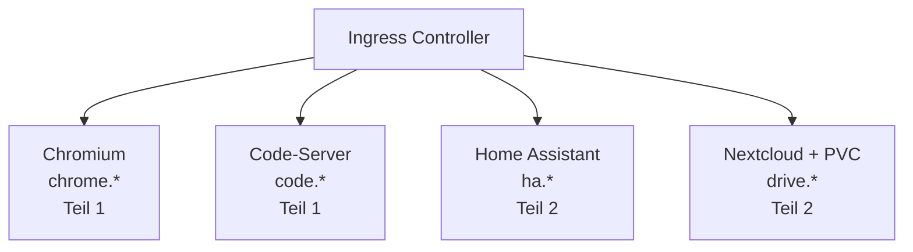

## Vorbereitung

### Voraussetzungen

- Grundlegende Linux-Kommandozeile (cd, ls, cat, vi/nano)
- Grundverständnis von Containern (Docker-Basics)
- Texteditor-Grundlagen (YAML-Dateien bearbeiten)

### Hardware

| Komponente     | Minimum        | Empfohlen      |
| -------------- | -------------- | -------------- |
| RAM pro Worker | 8 GB           | 16 GB          |
| CPU pro Worker | 4 Kerne        | 8 Kerne        |
| Festplatte     | 50 GB frei     | 100 GB frei    |
| Netzwerk       | Internetzugang | Internetzugang |

Die höheren Anforderungen ergeben sich aus den linuxserver.io-Containern (Chromium ist
speicherintensiv).

## Schulungsprojekt

Am Ende der Schulung laufen vier Anwendungen in eurem Kubernetes-Cluster:

| Anwendung        | Image                             | URL                                |
| ---------------- | --------------------------------- | ---------------------------------- |
| Chromium Browser | lscr.io/linuxserver/chromium      | chrome.k8s-training.frickeldave.de |
| Code-Server      | lscr.io/linuxserver/code-server   | code.k8s-training.frickeldave.de   |
| Home Assistant   | lscr.io/linuxserver/homeassistant | ha.k8s-training.frickeldave.de     |
| Nextcloud        | lscr.io/linuxserver/nextcloud     | drive.k8s-training.frickeldave.de  |



### Was ist linuxserver.io?

[linuxserver.io](https://www.linuxserver.io/) ist eine Community, die standardisierte Docker-Images
pflegt. Alle Images folgen dem gleichen Pattern: PUID/PGID für Berechtigungen, einheitliche
Volume-Struktur, Web-UIs für sofortiges visuelles Feedback. Ideal für Schulungen, weil jeder Schritt
sofort im Browser sichtbar ist.

## Trainings-Cluster

Für die Schulung steht ein **3-Knoten-Cluster** bereit:

| Node   | Rolle         | Beschreibung                                    |
| ------ | ------------- | ----------------------------------------------- |
| node-1 | Control Plane | API-Server, etcd, Scheduler, Controller Manager |
| node-2 | Worker        | Workload-Ausführung                             |
| node-3 | Worker        | Workload-Ausführung                             |

Der Cluster-Zugang wird vom Trainer zu Beginn der Schulung bereitgestellt (kubeconfig-Datei).

## Tools installieren

### kubectl (erforderlich)

**Windows (winget):**

```bash
winget install Kubernetes.kubectl
```

**macOS (Homebrew):**

```bash
brew install kubectl
```

**Linux (apt):**

```bash
sudo apt-get update && sudo apt-get install -y kubectl
```

**Installation prüfen:**

```bash
kubectl version --client
```

### Editor (empfohlen)

**VS Code** mit Extensions:

- **Kubernetes** (ms-kubernetes-tools.vscode-kubernetes-tools)
- **YAML** (redhat.vscode-yaml)

### Optionale Tools

| Tool                 | Zweck                               | Installation                             |
| -------------------- | ----------------------------------- | ---------------------------------------- |
| **k9s**              | Terminal-Cluster-Dashboard          | `brew install k9s` / `choco install k9s` |
| **kubectx + kubens** | Schneller Kontext/Namespace-Wechsel | `brew install kubectx`                   |

## kubeconfig einrichten

```bash
mkdir -p ~/.kube
cp kubeconfig-training.yaml ~/.kube/config
```

### Zugang testen

```bash
kubectl cluster-info
kubectl get nodes
```

**Erwartete Ausgabe:**

```
NAME     STATUS   ROLES           AGE   VERSION
node-1   Ready    control-plane   1d    v1.31.x
node-2   Ready    <none>          1d    v1.31.x
node-3   Ready    <none>          1d    v1.31.x
```

## Checkliste

- [ ] kubectl installiert (`kubectl version --client`)
- [ ] kubeconfig abgelegt
- [ ] `kubectl get nodes` zeigt 3 Nodes im Status `Ready`
- [ ] Editor/IDE eingerichtet
- [ ] Internetzugang vorhanden (für Image-Downloads)
- [ ] Browser bereit für NodePort-Zugriff
- [ ] hosts-Datei vorbereitet (wird am Ende von Tag 2 benötigt)
- [ ] Default StorageClass im Cluster vorhanden (`kubectl get storageclass`)
