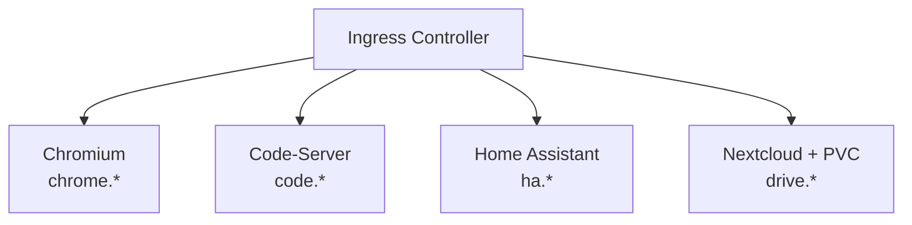

> ⚠️ **PREVIEW** – Dieser Inhalt befindet sich noch in Arbeit und kann noch Änderungen unterliegen.

## Vorbereitung

### Voraussetzungen

- Grundlegende Linux-Kommandozeile (cd, ls, cat, vi/nano)
- Grundverständnis von Containern (Docker-Basics)
- Texteditor-Grundlagen (YAML-Dateien bearbeiten)

### Hardware

| Komponente     | Minimum        | Empfohlen      |
| -------------- | -------------- | -------------- |
| RAM pro Worker | 8 GB           | 16 GB          |
| CPU pro Worker | 4 Kerne        | 8 Kerne        |
| Festplatte     | 50 GB frei     | 100 GB frei    |
| Netzwerk       | Internetzugang | Internetzugang |

Die höheren Anforderungen ergeben sich aus den linuxserver.io-Containern (Chromium ist
speicherintensiv).

## Schulungsprojekt

Am Ende der Schulung laufen vier Anwendungen in eurem Kubernetes-Cluster:

| Anwendung        | Image                             | URL                                |
| ---------------- | --------------------------------- | ---------------------------------- |
| Chromium Browser | lscr.io/linuxserver/chromium      | chrome.k8s-training.frickeldave.de |
| Code-Server      | lscr.io/linuxserver/code-server   | code.k8s-training.frickeldave.de   |
| Home Assistant   | lscr.io/linuxserver/homeassistant | ha.k8s-training.frickeldave.de     |
| Nextcloud        | lscr.io/linuxserver/nextcloud     | drive.k8s-training.frickeldave.de  |



### Was ist linuxserver.io?

[linuxserver.io](https://www.linuxserver.io/) ist eine Community, die standardisierte Docker-Images
pflegt. Alle Images folgen dem gleichen Pattern: PUID/PGID für Berechtigungen, einheitliche
Volume-Struktur, Web-UIs für sofortiges visuelles Feedback.

## Installation von kubectl

[kubectl](/docs/kubernetes-basis/glossar#kubectl) ist das Kommandozeilen-Tool zur Steuerung von Kubernetes-Clustern.

- **Windows (winget):** `winget install Kubernetes.kubectl`
- **macOS (Homebrew):** `brew install kubectl`
- **Linux (apt):** `sudo apt-get update && sudo apt-get install -y kubectl`
- **Installation prüfen:** `kubectl version --client`

## Editor (empfohlen)

**VS Code** mit Extensions:

- **Kubernetes** (ms-kubernetes-tools.vscode-kubernetes-tools)
- **YAML** (redhat.vscode-yaml)

## Trainings-Cluster

Für die Schulung wird ein **3-Knoten-Cluster** als Voraussetzung benötigt:

| Node   | Rolle         | Beschreibung                                    |
| ------ | ------------- | ----------------------------------------------- |
| node-1 | [Control Plane](/docs/kubernetes-basis/glossar#control-plane) | API-Server, etcd, Scheduler, Controller Manager |
| node-2 | [Worker Node](/docs/kubernetes-basis/glossar#worker-node)    | Workload-Ausführung                             |
| node-3 | [Worker Node](/docs/kubernetes-basis/glossar#worker-node)    | Workload-Ausführung                             |

Die folgenden Kapitel beschreiben mögliche Optionen zur Installation / Bereitstellung des Clusters.

### Installation als lokale WSL Umgebung

Mit dieser Option wird Kubernetes in Form einer k3d Installation in einer lokalen WSL (Windows Subsystem für Linux) installiert. k3d erzeugt dabei docker container für den Master-Node/Control-Node und 2 Worker-Nodes. Physikalische Systeme werden in dieser Konstellation also als docker-container simuliert. Wichtig: Dieses Setup ist für Schulungen und Experimentierumgebungen interessant, nicht aber für den produktiven Einsatz vorgesehen.

**Voraussetzung**

- Win11 24H2 oder später
- Administrationsberechtigungen

**WSL aktivieren / installieren**

Folgende Features installieren

- Windows Subsystem for Linux
- Virtual Maschine Platform
- Windows Hypervisor Platform (optional, but recommended for WSL2)

**In powershell**

- `wsl --install debian`
- WSL Fenster in Windows Terminal öffnen oder mit `wsl` in die Linux Umgebung wechseln

**Kubernetes in der WSL installieren**

Folgende Schritte geschehen in der wsl. Diese kann einfach mit `wsl` aufgerufen werden. 

- Auf aktuelle Stand bringen mit `sudo apt update && sudo apt upgrade -y` 
- Docker installieren `sudo apt install curl docker.io containerd` -y
- Docker enablen `sudo systemctl enable --now docker`
- User berechtigen `sudo usermod -aG docker $USER`
- Terminal session neu starten
- [k3d](/docs/kubernetes-basis/glossar#k3d) runterladen `curl -s https://raw.githubusercontent.com/k3d-io/k3d/main/install.sh | bash`
- kubctl runterladen: `curl -LO "https://dl.k8s.io/release/$(curl -Ls https://dl.k8s.io/release/stable.txt)/bin/linux/amd64/kubectl"`
- Rechte setzen für kubectl `chmod +x kubectl`
- Verschieben von kubectl `sudo mv kubectl /usr/local/bin/`
- Prüfen `kubectl version --client`
- Cluster hochfahren `k3d cluster create mycluster --servers 1 --agents 2 -p "443:443@loadbalancer" -p "80:80@loadbalancer"`
- Installation checken `kubectl get nodes`

**Blick auf docker**

`docker ps`

```bash
CONTAINER ID   IMAGE                            COMMAND                  CREATED        STATUS        PORTS                             NAMES 
b0eb80b8d8ba   ghcr.io/k3d-io/k3d-proxy:5.8.3   "/bin/sh -c nginx-pr…"   20 hours ago   Up 17 hours   80/tcp, 0.0.0.0:41597->6443/tcp   k3d-mycluster-serverlb 
eb207e4211cf   rancher/k3s:v1.31.5-k3s1         "/bin/k3d-entrypoint…"   20 hours ago   Up 17 hours                                     k3d-mycluster-agent-2 
246bc67def5d   rancher/k3s:v1.31.5-k3s1         "/bin/k3d-entrypoint…"   20 hours ago   Up 17 hours                                     k3d-mycluster-agent-1 
9520af54f61d   rancher/k3s:v1.31.5-k3s1         "/bin/k3d-entrypoint…"   20 hours ago   Up 17 hours                                     k3d-mycluster-agent-0 
20ce57831256   rancher/k3s:v1.31.5-k3s1         "/bin/k3d-entrypoint…"   20 hours ago   Up 17 hours                                     k3d-mycluster-server-0
```


**Vom host auf die Kubernetes Installation verbinden**

- Erzeugen der [kubeconfig](/docs/kubernetes-basis/glossar#kubeconfig): `wsl k3d kubeconfig get mycluster > $env:USERPROFILE\.kube\wsl`
- Aufruf mit neuer config: `kubectl --kubeconfig=$env:USERPROFILE\.kube\wsl get nodes`

### Welche Option ist die richtige?

| Aspekt | WSL-Option | Firmen-Cluster |
| --- | --- | --- |
| Setup-Aufwand | Mittel (ca. 30–60 Min.) | Niedrig (nur kubeconfig einrichten) |
| Realitätsnähe | Simulierte Umgebung | Echte Infrastruktur |
| Eigene Kontrolle | Volle Kontrolle | Begrenzt durch IT-Richtlinien |
| Internetzugang | Lokal vorhanden | Abhängig vom Firmennetz |
| Freigabe nötig | Nein | Ja (IT-Abteilung) |

**Wähle die WSL-Option, wenn** du keine Genehmigung benötigst, volle Kontrolle über die Umgebung
haben möchtest und dein Rechner mindestens 8 GB RAM hat.

**Wähle den Firmen-Cluster, wenn** du bereits Zugang hast, dieser genehmigt ist und du in einer
realen Infrastruktur lernen möchtest.

### Nutzung eines Firmen-Kubernetes-Clusters

Wer in der eigenen Firma bereits Zugang zu einem Kubernetes-Cluster hat, kann diesen grundsätzlich auch für die Schulung nutzen. Das spart den Aufwand für die lokale Einrichtung und ermöglicht gleichzeitig ein realistischeres Umfeld.

<Notice type="warning">
  Kläre vorab mit deiner IT-Abteilung oder dem Cluster-Administrator, ob die Nutzung des
  Firmen-Clusters für Schulungszwecke erlaubt ist. Nicht alle Unternehmen gestatten das Deployment
  von Test-Workloads in produktionsnahen Umgebungen.
</Notice>

**Voraussetzungen für die Schulungsteilnahme mit einem Firmen-Cluster**

| Anforderung | Details |
| --- | --- |
| [Namespace](/docs/kubernetes-basis/glossar#namespace)-Zugriff | Du benötigst einen eigenen Namespace mit vollen Rechten (create, delete, patch für Pods, Services, Deployments, Ingress, PVC) |
| [kubectl](/docs/kubernetes-basis/glossar#kubectl)-Zugriff | Eine gültige [kubeconfig](/docs/kubernetes-basis/glossar#kubeconfig) muss lokal vorliegen (`kubectl get nodes` funktioniert) |
| Mindestens 2 [Worker Nodes](/docs/kubernetes-basis/glossar#worker-node) | Für einige Übungen werden Pod-Scheduling-Entscheidungen auf mehreren Nodes demonstriert |
| [StorageClass](/docs/kubernetes-basis/glossar#storageclass) vorhanden | Für [PersistentVolumeClaims](/docs/kubernetes-basis/glossar#persistentvolumeclaim) wird eine Default-StorageClass benötigt (`kubectl get storageclass`) |
| [Ingress Controller](/docs/kubernetes-basis/glossar#ingress-controller) | Ein Ingress Controller muss im Cluster laufen (z. B. nginx), damit die Schulungsprojekte per URL erreichbar sind |
| Internetzugang des Clusters | Die Nodes müssen Images von externen Registries ziehen können (z. B. `lscr.io`, `ghcr.io`) – oder ein lokaler Mirror ist konfiguriert |
| DNS / Hostnamen | Entweder ein echter DNS-Eintrag für deine Schulungs-URLs oder die Nutzung von `/etc/hosts` auf deinem lokalen Rechner |

**Was du nicht benötigst**

- Cluster-Admin-Rechte – Namespace-Admin-Rechte reichen für alle Schulungsübungen
- Eine eigene Control Plane – der bestehende Cluster wird genutzt

**Einschränkungen und Hinweise**

- Firmen-Cluster haben oft eingeschränkte NetworkPolicies oder Pod Security Standards. Sollten einzelne Übungen daran scheitern, kann lokal auf die WSL-Variante gewechselt werden.
- Image-Pull-Secrets für private Registries sind in Firmen-Umgebungen häufig notwendig – das Setup wird in diesen Fällen kurz abweichen.
- Produktions-Namespaces sind tabu. Nutze ausschließlich einen dedizierten Schulungs-Namespace.

**Kubeconfig prüfen**

```bash
kubectl config current-context   # aktiven Kontext anzeigen
kubectl get nodes                # Nodes des Clusters prüfen
kubectl get storageclass         # StorageClass prüfen
kubectl get ingressclass         # Ingress Controller prüfen
kubectl api-resources | grep -E "(pods|services|deployments|ingress)"  # Berechtigungen prüfen
```

**Häufige Probleme bei Firmen-Clustern**

| Problem | Mögliche Ursache | Lösung |
| --- | --- | --- |
| `pods is forbidden` | Fehlende RBAC-Rechte im Namespace | Administrator um Namespace-Admin-Rechte bitten |
| Image-Pull schlägt fehl | Externes Internet gesperrt | Image-Pull-Secret für interne Registry oder Mirror konfigurieren |
| PVC bleibt in `Pending` | Keine Default-StorageClass | Administrator nach der verfügbaren StorageClass fragen |
| Ingress antwortet nicht | Kein Ingress Controller installiert | `kubectl get ingressclass` prüfen; ggf. eigenen Nginx-Ingress deployen |
| NetworkPolicy blockiert | Restriktive Netzwerkregeln | Administrator kontaktieren oder auf WSL-Option wechseln |

<Notice type="info">
  Wenn einzelne Übungen im Firmen-Cluster scheitern, kannst du jederzeit auf die WSL-Option
  wechseln. Die Schulungsinhalte sind mit beiden Umgebungen identisch.
</Notice>

## Checkliste

**Allgemein (alle Optionen)**

- [ ] Kubernetes Cluster verfügbar (WSL/k3d oder Firmen-Cluster)
- [ ] kubectl installiert (`kubectl version --client`)
- [ ] kubeconfig abgelegt und aktiver Kontext gesetzt (`kubectl config current-context`)
- [ ] `kubectl get nodes` zeigt 2–3 Nodes im Status `Ready`
- [ ] Editor/IDE eingerichtet
- [ ] Internetzugang vorhanden (für Image-Downloads)
- [ ] Default StorageClass im Cluster vorhanden (`kubectl get storageclass`)

**Zusätzlich bei Firmen-Cluster**

- [ ] Namespace mit ausreichenden Rechten vorhanden (`kubectl get pods -n <namespace>` fehlerfrei)
- [ ] Ingress Controller verfügbar (`kubectl get ingressclass`)
- [ ] DNS-Einträge oder `/etc/hosts`-Einträge für Schulungs-URLs konfiguriert
