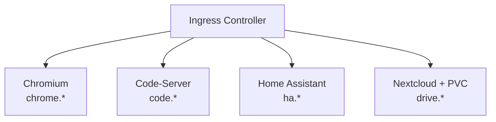

> ⚠️ **PREVIEW** – Dieser Inhalt befindet sich noch in Arbeit und kann noch Änderungen unterliegen.

## Vorbereitung

### Voraussetzungen

- Grundlegende Linux-Kommandozeile (cd, ls, cat, vi/nano)
- Grundverständnis von Containern (Docker-Basics)
- Texteditor-Grundlagen (YAML-Dateien bearbeiten)

### Hardware

| Komponente     | Minimum        | Empfohlen      |
| -------------- | -------------- | -------------- |
| RAM pro Worker | 8 GB           | 16 GB          |
| CPU pro Worker | 4 Kerne        | 8 Kerne        |
| Festplatte     | 50 GB frei     | 100 GB frei    |
| Netzwerk       | Internetzugang | Internetzugang |

Die höheren Anforderungen ergeben sich aus den linuxserver.io-Containern (Chromium ist
speicherintensiv).

## Schulungsprojekt

Am Ende der Schulung laufen vier Anwendungen in eurem Kubernetes-Cluster:

| Anwendung        | Image                             | URL                                |
| ---------------- | --------------------------------- | ---------------------------------- |
| Chromium Browser | lscr.io/linuxserver/chromium      | chrome.k8s-training.frickeldave.de |
| Code-Server      | lscr.io/linuxserver/code-server   | code.k8s-training.frickeldave.de   |
| Home Assistant   | lscr.io/linuxserver/homeassistant | ha.k8s-training.frickeldave.de     |
| Nextcloud        | lscr.io/linuxserver/nextcloud     | drive.k8s-training.frickeldave.de  |



### Was ist linuxserver.io?

[linuxserver.io](https://www.linuxserver.io/) ist eine Community, die standardisierte Docker-Images
pflegt. Alle Images folgen dem gleichen Pattern: PUID/PGID für Berechtigungen, einheitliche
Volume-Struktur, Web-UIs für sofortiges visuelles Feedback.

## Installation von kubectl

- **Windows (winget):** `winget install Kubernetes.kubectl`
- **macOS (Homebrew):** `brew install kubectl`
- **Linux (apt):** `sudo apt-get update && sudo apt-get install -y kubectl`
- **Installation prüfen:** `kubectl version --client`

## Editor (empfohlen)

**VS Code** mit Extensions:

- **Kubernetes** (ms-kubernetes-tools.vscode-kubernetes-tools)
- **YAML** (redhat.vscode-yaml)

## Trainings-Cluster

Für die Schulung wird ein **3-Knoten-Cluster** als Voraussetzung benötigt:

| Node   | Rolle         | Beschreibung                                    |
| ------ | ------------- | ----------------------------------------------- |
| node-1 | Control Plane | API-Server, etcd, Scheduler, Controller Manager |
| node-2 | Worker        | Workload-Ausführung                             |
| node-3 | Worker        | Workload-Ausführung                             |

Die folgenden Kapitel beschreiben mögliche Optionen zur Installation / Bereitstellung des Clusters.

### Installation als lokale WSL Umgebung

Mit dieser Option wird Kubernetes in Form einer k3d Installation in einer lokalen WSL (Windows Subsystem für Linux) installiert. k3d erzeugt dabei docker container für den Master-Node/Control-Node und 2 Worker-Nodes. Physikalische Systeme werden in dieser Konstellation also als docker-container simuliert. Wichtig: Dieses Setup ist für Schulungen und Eperimentierumgebungen interessant, nicht aber für eine produktiven Einsatz vorgesehen.  

**Voraussetzung**

- Win11 24H2 oder später
- Administrationsberechtigungen

**WSL aktivieren / installieren**

Folgende Features installieren

- Windows Subsystem for Linux
- Virtual Maschine Platform
- Windows Hypervisor Platform (optional, but recommended for WSL2)

**In powershell**

- `wsl --install debian`
- WSL Fenster in Windows Terminal öffnen oder mit `wsl` in die Linux Umgebung wechseln

**Kubernetes in der WSL installieren**

Folgende Schritte geschehen in der wsl. Diese kann einfach mit `wsl` aufgerufen werden. 

- Auf aktuelle Stand bringen mit `sudo apt update && sudo apt upgrade -y` 
- Docker installieren `sudo apt install curl docker.io containerd` -y
- Docker enablen `sudo systemctl enable --now docker`
- User berechtigen `sudo usermod -aG docker $USER`
- Terminal session neu starten
- k3d runterladen `curl -s https://raw.githubusercontent.com/k3d-io/k3d/main/install.sh | bash`
- kubctl runterladen: `curl -LO "https://dl.k8s.io/release/$(curl -Ls https://dl.k8s.io/release/stable.txt)/bin/linux/amd64/kubectl"`
- Rechte setzen für kubectl `chmod +x kubectl`
- Verschieben von kubectl `sudo mv kubectl /usr/local/bin/`
- Prüfen `kubectl version --client`
- Cluster hochfahren `k3d cluster create mycluster --servers 1 --agents 2 -p "443:443@loadbalancer" -p "80:80@loadbalancer"`
- Installation checken `kubectl get nodes`

**Blick auf docker**

`docker ps`

```bash
CONTAINER ID   IMAGE                            COMMAND                  CREATED        STATUS        PORTS                             NAMES 
b0eb80b8d8ba   ghcr.io/k3d-io/k3d-proxy:5.8.3   "/bin/sh -c nginx-pr…"   20 hours ago   Up 17 hours   80/tcp, 0.0.0.0:41597->6443/tcp   k3d-mycluster-serverlb 
eb207e4211cf   rancher/k3s:v1.31.5-k3s1         "/bin/k3d-entrypoint…"   20 hours ago   Up 17 hours                                     k3d-mycluster-agent-2 
246bc67def5d   rancher/k3s:v1.31.5-k3s1         "/bin/k3d-entrypoint…"   20 hours ago   Up 17 hours                                     k3d-mycluster-agent-1 
9520af54f61d   rancher/k3s:v1.31.5-k3s1         "/bin/k3d-entrypoint…"   20 hours ago   Up 17 hours                                     k3d-mycluster-agent-0 
20ce57831256   rancher/k3s:v1.31.5-k3s1         "/bin/k3d-entrypoint…"   20 hours ago   Up 17 hours                                     k3d-mycluster-server-0
```


**Vom host auf die Kubernetes Installation verbinden**

- Erzeugen der Config: `wsl k3d kubeconfig get mycluster > $env:USERPROFILE\.kube\wsl`
- Aufruf mit neuer config: `kubectl --kubeconfig=$env:USERPROFILE\.kube\wsl get nodes`

## Checkliste

- [ ] Kubernetes Cluster verfügbar
- [ ] kubectl installiert (`kubectl version --client`)
- [ ] kubeconfig abgelegt
- [ ] `kubectl get nodes` zeigt 2-3 Nodes im Status `Ready`
- [ ] Editor/IDE eingerichtet
- [ ] Internetzugang vorhanden (für Image-Downloads)
- [ ] Default StorageClass im Cluster vorhanden (`kubectl get storageclass`)
