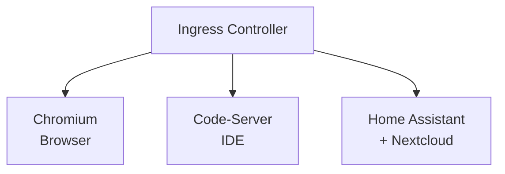
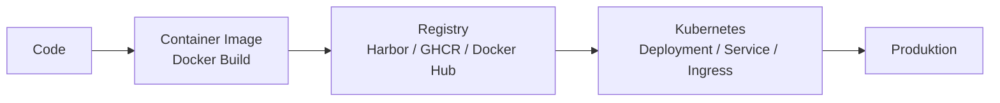
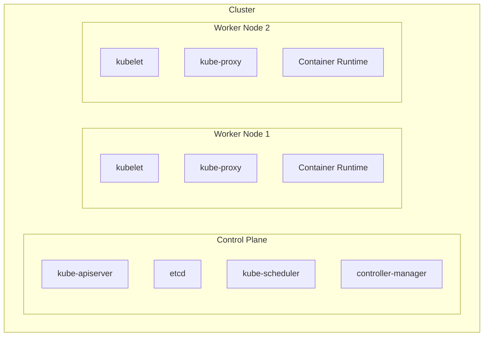

## Grundlagen & Einstieg

Willkommen zum ersten Tag der Kubernetes-Schulung. Heute legen wir das Fundament: Ihr lernt die
Architektur kennen, arbeitet euch in `kubectl` ein und deployt zwei echte Anwendungen -- einen
Browser (Chromium) und eine Entwicklungsumgebung (Code-Server) -- direkt im Cluster.

## Zeitplan

| Zeit          | Dauer  | Block                | Inhalt                                                  |
| ------------- | ------ | -------------------- | ------------------------------------------------------- |
| 09:00 – 09:30 | 30 min | Begrüßung            | Vorstellungsrunde, Ziele, Vorschau Endprodukt           |
| 09:30 – 10:30 | 60 min | Theorie              | Kubernetes Architektur & Komponenten                    |
| 10:30 – 10:45 | 15 min | **Pause**            |                                                         |
| 10:45 – 11:30 | 45 min | Theorie              | Kubernetes-Objekte: Pod, Deployment, Service, Namespace |
| 11:30 – 12:30 | 60 min | Erste Schritte       | Cluster erkunden, kubectl Basics, Namespace anlegen     |
| 12:30 – 13:30 | 60 min | **Mittagspause**     |                                                         |
| 13:30 – 14:30 | 60 min | Chromium deployen    | Erstes Deployment (imperativ), Pods beobachten          |
| 14:30 – 15:15 | 45 min | Theorie              | YAML-Grundlagen, Imperativ vs. Deklarativ               |
| 15:15 – 15:30 | 15 min | **Pause**            |                                                         |
| 15:30 – 16:30 | 60 min | Code-Server deployen | Deployment per YAML (deklarativ)                        |
| 16:30 – 17:15 | 45 min | Services             | NodePort für beide Anwendungen                          |
| 17:15 – 17:30 | 15 min | Abschluss            | Zusammenfassung, Ausblick Tag 2                         |

---

## Begrüßung

### Was ist Kubernetes?

Kubernetes (K8s) ist eine Open-Source-Plattform zur **Automatisierung von Deployment, Skalierung und
Verwaltung** von Container-Anwendungen. Ursprünglich von Google entwickelt, wird es heute von der
Cloud Native Computing Foundation (CNCF) gepflegt.

### Wozu K8s?

- **Container-Orchestrierung** -- Verwaltung hunderter Container über mehrere Server
- **Self-Healing** -- Automatischer Neustart ausgefallener Container
- **Skalierung** -- Hoch- und Runterskalieren per Befehl oder automatisch
- **Rolling Updates** -- Anwendungen ohne Ausfallzeit aktualisieren
- **Service Discovery** -- Automatische Namensauflösung zwischen Anwendungen

### Endprodukt

Am Ende der zwei Tage sieht unser Cluster so aus -- vier Anwendungen hinter einem Ingress:



### DevOps-Workflow



Kubernetes ist die Standard-Plattform für Cloud-native Anwendungen und bildet die Brücke zwischen
Entwicklung (Dev) und Betrieb (Ops).

---

## Grundkonzepte

### Analogie

| Kubernetes-Konzept | Analogie                 | Beschreibung                                                              |
| ------------------ | ------------------------ | ------------------------------------------------------------------------- |
| **Cluster**        | Gesamtes Logistikzentrum | Alle Maschinen und Ressourcen, die zusammenarbeiten                       |
| **Control Plane**  | Büro / Zentrale          | Trifft alle Entscheidungen: was läuft wo, was passiert bei Problemen      |
| **Worker Node**    | Arbeitsplatz / LKW       | Die Maschine, auf der Container tatsächlich laufen                        |
| **Pod**            | Paket / Liefereinheit    | Kleinste deploybare Einheit, enthält einen oder mehrere Container         |
| **Deployment**     | Arbeitsanweisung         | Beschreibt den gewünschten Zustand ("2 Chromium-Instanzen sollen laufen") |
| **Service**        | Telefonnummer            | Stabile Adresse, über die eine Anwendung erreichbar bleibt                |
| **Namespace**      | Abteilung                | Logische Trennung innerhalb eines Clusters                                |

### Cluster-Architektur



### Control Plane

| Komponente                  | Funktion                                                     |
| --------------------------- | ------------------------------------------------------------ |
| **kube-apiserver**          | Zentraler Einstiegspunkt. Jeder kubectl-Befehl geht hierhin. |
| **etcd**                    | Key-Value-Datenbank. Speichert den gesamten Cluster-Zustand. |
| **kube-scheduler**          | Entscheidet, auf welchem Node ein neuer Pod laufen soll.     |
| **kube-controller-manager** | Gleicht Ist-Zustand ständig mit Soll-Zustand ab.             |

### Worker Nodes

| Komponente            | Funktion                                                          |
| --------------------- | ----------------------------------------------------------------- |
| **kubelet**           | Agent auf jedem Node. Sorgt dafür, dass Container in Pods laufen. |
| **kube-proxy**        | Netzwerk-Proxy. Verwaltet Netzwerkregeln für Services.            |
| **Container Runtime** | Führt Container aus (z.B. containerd, CRI-O).                     |

---

## Erste Schritte

### Cluster erkunden

```bash
# Cluster-Verbindung prüfen
kubectl cluster-info

# Alle Nodes anzeigen
kubectl get nodes

# Detaillierte Node-Informationen
kubectl describe node <node-name>

# Kubernetes-Version
kubectl version

# Aktuelle Konfiguration anzeigen
kubectl config view
kubectl config current-context
```

### Namespaces

Namespaces sind logische Trennungen innerhalb eines Clusters.

```bash
# Vorhandene Namespaces anzeigen
kubectl get namespaces
```

Standard-Namespaces:

| Namespace         | Zweck                                                   |
| ----------------- | ------------------------------------------------------- |
| `default`         | Standard-Namespace für Objekte ohne explizite Zuordnung |
| `kube-system`     | Kubernetes-Systemkomponenten                            |
| `kube-public`     | Öffentlich lesbare Daten (z.B. Cluster-Info)            |
| `kube-node-lease` | Node-Heartbeat-Daten                                    |

**Eigenen Namespace erstellen (imperativ):**

```bash
kubectl create namespace k8s-training
```

**Eigenen Namespace erstellen (deklarativ):**

Datei `namespace.yaml`:

```yaml
apiVersion: v1
kind: Namespace
metadata:
  name: k8s-training
  labels:
    purpose: kubernetes-schulung
```

```bash
kubectl apply -f namespace.yaml
```

**Standard-Namespace setzen:**

```bash
kubectl config set-context --current --namespace=k8s-training
```

Ab jetzt arbeiten alle Befehle automatisch im Namespace `k8s-training`.

### Übung 1

1. Zeige alle Nodes des Clusters an. Welche Rollen haben sie?
2. Erstelle den Namespace `k8s-training`.
3. Setze `k8s-training` als Standard-Namespace.
4. Prüfe mit `kubectl get pods`, dass der Namespace leer ist.
5. Zeige alle System-Pods im Namespace `kube-system` an: `kubectl get pods -n kube-system`

---

## Chromium deployen

In diesem Block deployen wir einen vollständigen Browser (Chromium) im Cluster -- imperativ, also
direkt per Kommandozeile.

### Imperativ

```bash
kubectl create deployment chromium --image=lscr.io/linuxserver/chromium:latest --replicas=1
```

### Status prüfen

```bash
# Deployment-Status prüfen
kubectl get deployments

# Pods anzeigen
kubectl get pods
kubectl get pods -o wide

# Detaillierte Deployment-Informationen
kubectl describe deployment chromium

# Container-Logs lesen
kubectl logs <pod-name>
```

### Konfiguration

Container von [linuxserver.io](https://www.linuxserver.io/) erwarten bestimmte Umgebungsvariablen
für Benutzer-ID, Gruppen-ID und Zeitzone. Ohne diese laufen die Container zwar, aber mit
`root`-Rechten und falscher Zeitzone.

```bash
kubectl set env deployment/chromium PUID=1000 PGID=1000 TZ=Europe/Berlin
```

Nach dem Setzen der Umgebungsvariablen erstellt Kubernetes automatisch neue Pods mit der
aktualisierten Konfiguration.

### Self-Healing Demo

Kubernetes sorgt dafür, dass der gewünschte Zustand (1 Replica) immer eingehalten wird:

```bash
# Pods beobachten (in einem Terminal)
kubectl get pods -w

# In einem zweiten Terminal: Pod absichtlich löschen
kubectl delete pod <pod-name>

# Beobachten: Kubernetes erstellt automatisch einen neuen Pod!
```

### Übung 2

1. Prüfe den Status des Chromium-Deployments mit `kubectl get deployment chromium`.
2. Lies die Logs des Chromium-Pods: `kubectl logs <pod-name>`.
3. Lösche den Pod und beobachte, wie Kubernetes ihn automatisch neu erstellt.
4. Auf welchem Node läuft der neue Pod? (`kubectl get pods -o wide`)

---

## YAML & Deklarativ

### Vergleich

| Ansatz         | Beschreibung          | Beispiel                           |
| -------------- | --------------------- | ---------------------------------- |
| **Imperativ**  | "Tue dies jetzt"      | `kubectl create deployment ...`    |
| **Deklarativ** | "So soll es aussehen" | `kubectl apply -f deployment.yaml` |

In der Praxis wird fast ausschließlich deklarativ gearbeitet -- YAML-Manifeste werden in Git
versioniert und per `kubectl apply` angewendet.

### YAML-Beispiel

So würde unser imperativ erstelltes Chromium-Deployment als YAML aussehen:

```yaml
apiVersion: apps/v1
kind: Deployment
metadata:
  name: chromium
  namespace: k8s-training
  labels:
    app: chromium
spec:
  replicas: 1
  selector:
    matchLabels:
      app: chromium
  template:
    metadata:
      labels:
        app: chromium
    spec:
      containers:
        - name: chromium
          image: lscr.io/linuxserver/chromium:latest
          ports:
            - containerPort: 3000
            - containerPort: 3001
          env:
            - name: PUID
              value: "1000"
            - name: PGID
              value: "1000"
            - name: TZ
              value: "Europe/Berlin"
```

### YAML-Grundstruktur

Jedes Kubernetes-Manifest besteht aus vier Hauptteilen:

| Feld         | Bedeutung                                               |
| ------------ | ------------------------------------------------------- |
| `apiVersion` | API-Version der Ressource (z.B. `v1`, `apps/v1`)        |
| `kind`       | Art der Ressource (z.B. `Pod`, `Deployment`, `Service`) |
| `metadata`   | Metadaten: Name, Namespace, Labels                      |
| `spec`       | Spezifikation: der gewünschte Zustand                   |

### YAML-Regeln

- Einrückung mit **Leerzeichen** (keine Tabs!)
- Listen beginnen mit `-`
- Key-Value-Paare mit `:`
- Strings brauchen normalerweise keine Anführungszeichen

### kubectl explain

```bash
kubectl explain pod
kubectl explain pod.spec
kubectl explain pod.spec.containers
kubectl explain deployment.spec.strategy
```

---

## Code-Server deployen

Jetzt arbeiten wir deklarativ. Zuerst löschen wir das imperativ erstellte Chromium-Deployment und
erstellen es sauber per YAML neu -- zusammen mit dem Code-Server.

### Aufräumen

```bash
kubectl delete deployment chromium
```

### Chromium YAML

Datei `chromium-deployment.yaml`:

```yaml
apiVersion: apps/v1
kind: Deployment
metadata:
  name: chromium
  namespace: k8s-training
  labels:
    app: chromium
spec:
  replicas: 1
  selector:
    matchLabels:
      app: chromium
  template:
    metadata:
      labels:
        app: chromium
    spec:
      containers:
        - name: chromium
          image: lscr.io/linuxserver/chromium:latest
          ports:
            - containerPort: 3000
            - containerPort: 3001
          env:
            - name: PUID
              value: "1000"
            - name: PGID
              value: "1000"
            - name: TZ
              value: "Europe/Berlin"
          volumeMounts:
            - name: shm
              mountPath: /dev/shm
            - name: config
              mountPath: /config
      volumes:
        - name: shm
          emptyDir:
            medium: Memory
            sizeLimit: 1Gi
        - name: config
          emptyDir: {}
```

**Warum `/dev/shm`?** Chromium nutzt Shared Memory für das Rendering von Webseiten. Ohne ein
ausreichend großes `/dev/shm` stürzt der Browser ab oder zeigt leere Seiten. Durch `medium: Memory`
wird das Volume im RAM angelegt -- schnell und genau richtig für temporäre Rendering-Daten.

### Code-Server YAML

Datei `code-server-deployment.yaml`:

```yaml
apiVersion: apps/v1
kind: Deployment
metadata:
  name: code-server
  namespace: k8s-training
  labels:
    app: code-server
spec:
  replicas: 1
  selector:
    matchLabels:
      app: code-server
  template:
    metadata:
      labels:
        app: code-server
    spec:
      containers:
        - name: code-server
          image: lscr.io/linuxserver/code-server:latest
          ports:
            - containerPort: 8443
          env:
            - name: PUID
              value: "1000"
            - name: PGID
              value: "1000"
            - name: TZ
              value: "Europe/Berlin"
            - name: PASSWORD
              value: "training2024"
            - name: DEFAULT_WORKSPACE
              value: "/config/workspace"
          volumeMounts:
            - name: config
              mountPath: /config
      volumes:
        - name: config
          emptyDir: {}
```

### Anwenden

```bash
kubectl apply -f chromium-deployment.yaml
kubectl apply -f code-server-deployment.yaml

# Status prüfen
kubectl get deployments
kubectl get pods
```

### Übung 3

1. Prüfe, dass beide Deployments laufen: `kubectl get deployments`
2. Vergleiche die beiden YAML-Dateien: Welche Unterschiede gibt es bei Ports, Umgebungsvariablen und
   Volumes?
3. Ändere das Passwort des Code-Servers in der YAML-Datei (z.B. auf `meinPasswort`) und wende die
   Änderung an: `kubectl apply -f code-server-deployment.yaml`
4. Nutze `kubectl explain pod.spec.volumes` um herauszufinden, welche Volume-Typen es gibt.

---

## Services

### Was ist ein Service?

Ein Service gibt Pods eine **stabile Netzwerk-Adresse**. Pods sind vergänglich -- sie werden ständig
neu erstellt und bekommen dabei neue IP-Adressen. Ein Service bleibt bestehen und leitet Traffic an
die passenden Pods weiter.

| Service-Typ   | Erreichbarkeit                    | Anwendungsfall                  |
| ------------- | --------------------------------- | ------------------------------- |
| **ClusterIP** | Nur innerhalb des Clusters        | Standard, interne Kommunikation |
| **NodePort**  | Von außen über `<Node-IP>:<Port>` | Entwicklung, Tests, Schulungen  |

Wir verwenden heute **NodePort**, um unsere Anwendungen im Browser zu öffnen. In Tag 2 lernen wir
den eleganteren Weg über Ingress.

### Chromium-Service

Datei `chromium-service.yaml`:

```yaml
apiVersion: v1
kind: Service
metadata:
  name: chromium
  namespace: k8s-training
spec:
  type: NodePort
  selector:
    app: chromium
  ports:
    - name: http
      protocol: TCP
      port: 3000
      targetPort: 3000
      nodePort: 30000
    - name: https
      protocol: TCP
      port: 3001
      targetPort: 3001
      nodePort: 30001
```

### Code-Server-Service

Datei `code-server-service.yaml`:

```yaml
apiVersion: v1
kind: Service
metadata:
  name: code-server
  namespace: k8s-training
spec:
  type: NodePort
  selector:
    app: code-server
  ports:
    - name: http
      protocol: TCP
      port: 8443
      targetPort: 8443
      nodePort: 30443
```

### Anwenden & Testen

```bash
kubectl apply -f chromium-service.yaml
kubectl apply -f code-server-service.yaml

# Services prüfen
kubectl get services

# Endpoints prüfen (zeigt die Pods hinter dem Service)
kubectl get endpoints
```

### Browser-Test

Öffnet folgende Adressen im Browser:

- **Chromium:** `http://<Node-IP>:30000`
- **Code-Server:** `http://<Node-IP>:30443` (Passwort: `training2024`)

> **Ihr habt gerade einen Browser in einem Browser geöffnet, der in eurem Kubernetes-Cluster
> läuft!**

### Übung 4

1. Öffne Chromium im Browser unter `http://<Node-IP>:30000`.
2. Öffne Code-Server im Browser unter `http://<Node-IP>:30443` und melde dich mit dem Passwort
   `training2024` an.
3. Erstelle im Code-Server eine Datei unter `/config/workspace/test.txt` mit beliebigem Inhalt.
4. Lösche den Code-Server-Pod: `kubectl delete pod <code-server-pod-name>`
5. Warte, bis Kubernetes den Pod neu erstellt hat, und öffne Code-Server erneut.
6. **Ist die Datei `test.txt` noch da?** -- NEIN! Ein `emptyDir`-Volume wird gelöscht, wenn der Pod
   stirbt. In Tag 2 lösen wir das mit PersistentVolumeClaims (PVCs)!

```bash
# Endpoints prüfen -- zeigt die Pod-IPs hinter den Services
kubectl get endpoints
```

---

## Status-Check

Wir räumen heute bewusst **nicht** auf! Die Deployments bleiben für Tag 2 bestehen.

Aktueller Stand im Cluster:

```bash
kubectl get all -n k8s-training
```

Erwartete Ausgabe:

| Ressource   | Anzahl | Details                                     |
| ----------- | ------ | ------------------------------------------- |
| Deployments | 2      | chromium, code-server                       |
| ReplicaSets | 2      | je 1 pro Deployment                         |
| Pods        | 2      | je 1 Running pro Deployment                 |
| Services    | 2      | chromium (30000/30001), code-server (30443) |

---

## Zusammenfassung

| Thema                    | Gelernt                                         | Praktischer Kontext                              |
| ------------------------ | ----------------------------------------------- | ------------------------------------------------ |
| Architektur              | Control Plane, Worker Nodes, Komponenten        | Verstehen, wer im Cluster welche Aufgabe hat     |
| Objekte                  | Pod, Deployment, ReplicaSet, Service, Namespace | Die Bausteine jeder Kubernetes-Anwendung         |
| kubectl                  | get, describe, logs, apply, delete, set env     | Die wichtigsten Befehle für den täglichen Umgang |
| Imperativ vs. Deklarativ | Kommandos vs. YAML-Dateien                      | Warum YAML in der Praxis der Standard ist        |
| Volumes                  | emptyDir (normal und Memory-backed)             | Temporärer Speicher für Container-Daten          |
| Services                 | NodePort zum Erreichen von Anwendungen          | Pods von außen zugänglich machen                 |
| Self-Healing             | Pods werden automatisch neu erstellt            | Kubernetes sorgt für den gewünschten Zustand     |

### Spickzettel

```bash
kubectl get <ressource>                         # Auflisten
kubectl get <ressource> -o wide                 # Auflisten mit Details
kubectl describe <ressource> <name>             # Details anzeigen
kubectl logs <pod>                              # Logs lesen
kubectl logs -f <pod>                           # Logs live verfolgen
kubectl apply -f <datei.yaml>                   # Erstellen/Aktualisieren
kubectl delete -f <datei.yaml>                  # Löschen
kubectl delete <ressource> <name>               # Einzelne Ressource löschen
kubectl set env deployment/<name> KEY=VALUE     # Umgebungsvariable setzen
kubectl explain <ressource>                     # Dokumentation anzeigen
kubectl get pods -w                             # Pods live beobachten
kubectl get all -n <namespace>                  # Alle Ressourcen im Namespace
```

### Ausblick Tag 2

Morgen machen wir eure Deployments **produktionsreif**: Resource Limits, Health Checks und Rolling
Updates. Dann lagern wir Konfiguration in **ConfigMaps und Secrets** aus, schauen uns
**Security-Grundlagen** an, deployen Home Assistant und Nextcloud mit **persistentem Speicher**
(PVCs) und richten **Ingress-Routing** für alle vier Anwendungen ein.
